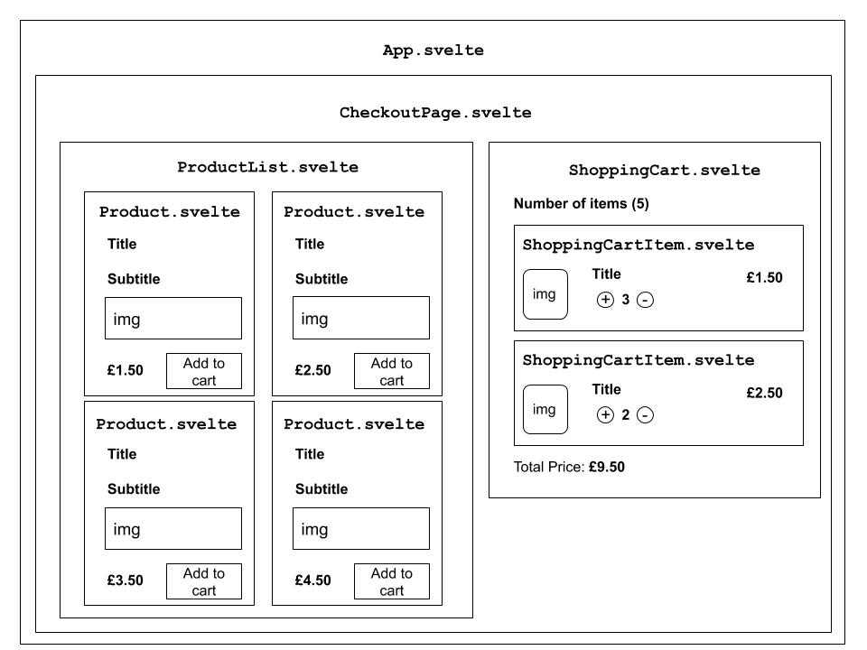

# Advanced Svelte - Stores and TypeScript with Snowpack

> Note: This workshop uses legacy [Snowpack builder](https://www.snowpack.dev) which is no longer supported. In the foreseeable future, I would like to migrate it to [Vite](https://vite.dev).

In this workshop, we are going to build an application in [**svelte**](https://svelte.dev) which extends our knowledge about this piece of technology by introducing a concept called [**svelte stores**](https://svelte.dev/docs#svelte_store).

The application is going to be a simple shopping cart app where we can add or remove product items to/from a shopping cart.

Apart from svelte itself, we are going to also utilize **TypeScript** and **Snowpack**. Styling itself will be handled with [**TailwindCSS**](https://tailwindcss.com) with snippets from [**Tailwind Components**](https://tailwindcomponents.com/) and processed via [**PostCSS**](https://postcss.org).

If you are new to **svelte**, please checkout the previous workshops first.

## Component Hierarchy

The structure of this project will be following similar structure as we created in the [previous workshop](https://github.com/ovotech/co_frontend/tree/master/svelte-notes-app).

Each component (expect **App.svelte**) will be placed in `components` folder and the `App.svelte` will be used as a _glue_ for connecting everything together.

A visual (high-level) representation of the component composition is shown in the diagram below.



## Installation

In this section, we are going to initialize the project and setup the tooling for the further development.

> Follow this step, if you would like to learn how to setup the project from scratch. If you would like to just start building the app, just skip this section and go to [**Creating static components**](#creating-static-components) section straight away.

### Installing external dependencies

Let's use **snowpack** for bootstrapping the initial structure. This would create a svelte project called `svelte-shopping-cart` with Typescript based on the already defined template.

> If you would like to use vanilla JavaScript, instead of TypeScript, just replace `@snowpack/app-template-svelte-typescript` by `@snowpack/app-template-svelte`

```bash
npx create-snowpack-app svelte-shopping-cart --template @snowpack/app-template-svelte-typescript
```

In the next step, we are going to install tailwind, postcss (including a postcss snowpack plugin) and two handy css utils. Make sure you are in the `svelte-shopping-cart` folder.

```bash
npm install --save-dev tailwindcss postcss autoprefixer cssnano postcss-cli @snowpack/plugin-postcss
```

Before we move forward, we need to init the tailwind config by typing the following command in your terminal.

```bash
npx tailwindcss init
```

### Creating/Updating config files

In the root directory of the project, please create a new `postcss.config.js` file and add the following content into it.

```javascript
// postcss.config.js

const tailwind = require('tailwindcss');
const autoprefixer = require('autoprefixer');
const cssnano = require('cssnano');

const plugins =
  process.env.NODE_ENV === 'production'
    ? [tailwind, autoprefixer, cssnano]
    : [tailwind, autoprefixer];

module.exports = { plugins };
```

We are going to setup **PurgeCSS** which help to handle unused CSS styles. In your root directory, there should be a file called `tailwind.config.js` which should look like the following snippet.

```javascript
// tailwind.config.js

module.exports = {
  purge: [],
  darkMode: false,
  theme: {
    extend: {},
  },
  variants: {
    extend: {},
  },
  plugins: [],
};
```

Let's specify the locations for the purge.

```diff
--- a/tailwind.config.js
+++ b/tailwind.config.js
// tailwind.config.js

module.exports = {
- purge: [],
+ purge: [ './src/**/*.svelte', './public/*.html' ],
  darkMode: false
  theme: {
    extend: {},
  },
  variants: {
    extend: {},
  },
  plugins: []
}
```

So, the latest version of our `tailwind.config.js` file should look like as the following now:

```javascript
// tailwind.config.js

module.exports = {
  purge: ['./src/**/*.svelte', './public/*.html'],
  darkMode: false,
  theme: {
    extend: {},
  },
  variants: {
    extend: {},
  },
  plugins: [],
};
```

We also need to extend the `snowpack.config.js` which initially looks like the code below:

```javascript
// snowpack.config.js

/** @type {import("snowpack").SnowpackUserConfig } */
module.exports = {
  mount: {
    public: { url: '/', static: true },
    src: { url: '/dist' },
  },
  plugins: [
    '@snowpack/plugin-svelte',
    '@snowpack/plugin-dotenv',
    '@snowpack/plugin-typescript',
  ],
  routes: [],
  optimize: {
    bundle: true,
  },
  packageOptions: {},
  devOptions: {},
  buildOptions: {},
};
```

Add the `@snowpack/plugin-postcss` into the plugins array.

```diff
+++ a/snowpack.config.js
// snowpack.config.js

/** @type {import("snowpack").SnowpackUserConfig } */
module.exports = {
  mount: {
    public: { url: '/', static: true },
    src: { url: '/dist' },
  },
  plugins: [
    '@snowpack/plugin-svelte',
    '@snowpack/plugin-dotenv',
    '@snowpack/plugin-typescript',
+   '@snowpack/plugin-postcss'
  ],
  routes: [],
  optimize: {
    bundle: true,
  },
  packageOptions: {},
  devOptions: {},
  buildOptions: {},
};
```

So the final version of the `@snowpack/plugin-postcss` looks like the following code now:

```javascript
// snowpack.config.js

/** @type {import("snowpack").SnowpackUserConfig } */
module.exports = {
  mount: {
    public: { url: '/', static: true },
    src: { url: '/dist' },
  },
  plugins: [
    '@snowpack/plugin-svelte',
    '@snowpack/plugin-dotenv',
    '@snowpack/plugin-typescript',
    '@snowpack/plugin-postcss',
  ],
  routes: [],
  optimize: {
    bundle: true,
  },
  packageOptions: {},
  devOptions: {},
  buildOptions: {},
};
```

The next step is about creating a base CSS with the initial tailwind configuration. In `src` folder, create a `global.css` file with the following content:

```css
/* src/global.css */

@tailwind base;

@tailwind components;

@tailwind utilities;
```

The last step of this section is replacing the content of the `App.svelte` by the code below.

It is worth mentioning the `lang="typescript"` attribute. It tells svelte you would like to use `TypeScript` instead of vanilla `JavaScript`

```html
<!-- src/App.svelte -->
<script lang="typescript">
  import './global.css'
</script>

<div class="app">
  <div class="px-1 bg-yellow-100">
    <p>Learn Svelte</p>
  </div>
</div>
```

Now we can run the project and see whether the project is initialized properly.

```bash
npm run start
```

The app should be available at `http://localhost:8080`.

## Creating static components

In this section, we are going to create static components/templates with minimum svelte functionality.

> Note: If you skipped the [previous section](#installation), make sure you install the **node_modules** by typing `npm install` first.

### Mocks data

We are going to work with plain static data without making any HTTP call. Before creating any component, let's create a static file with these mocks for later usage. In `src/` directory, please create `mocks` folder and a file `products.ts` and put the following code into it.

```typescript
// src/mocks/products.ts

export interface Product {
  id: string;
  title: string;
  description: string;
  price: number;
  image: string;
}

export const products: Product[] = [
  {
    id: 'qyq1b6',
    title: 'Croissants',
    description: 'Quality croissants from our bakery (1 pcs).',
    price: 1.5,
    image:
      'https://images.unsplash.com/photo-1565182363525-f95648bbeee0?ixid=MXwxMjA3fDB8MHxwaG90by1wYWdlfHx8fGVufDB8fHw%3D&ixlib=rb-1.2.1&auto=format&fit=crop&w=2550&q=80',
  },
  {
    id: 'jy117n',
    title: 'Sourdough bread',
    description: 'A sourdough bread from our bakery (1 loaf).',
    price: 5.25,
    image:
      'https://images.unsplash.com/photo-1509440159596-0249088772ff?ixid=MXwxMjA3fDB8MHxwaG90by1wYWdlfHx8fGVufDB8fHw%3D&ixlib=rb-1.2.1&auto=format&fit=crop&w=2552&q=80',
  },
  {
    id: 'f2wjt8',
    title: 'Donuts selection',
    description: 'A box of donuts for your whole family (8 pcs).',
    price: 2.3,
    image:
      'https://images.unsplash.com/photo-1527515545081-5db817172677?ixid=MXwxMjA3fDB8MHxwaG90by1wYWdlfHx8fGVufDB8fHw%3D&ixlib=rb-1.2.1&auto=format&fit=crop&w=2550&q=80',
  },
  {
    id: '6wadkq',
    title: 'Raspberry cups',
    description: 'Our popular option for every occasion (4 pcs).',
    price: 7.3,
    image:
      'https://images.unsplash.com/photo-1570145820404-cf22b115b06f?ixid=MXwxMjA3fDB8MHxwaG90by1wYWdlfHx8fGVufDB8fHw%3D&ixlib=rb-1.2.1&auto=format&fit=crop&w=2167&q=80',
  },
];
```

Let's also create a mock file handling the local cart selection. In `src/mocks`, please add `cartItems.ts` file with the following content.

```typescript
// src/mocks/cartItems.ts

export interface CartItem {
  id: string;
  title: string;
  image: string;
  price: number;
  quantity: number;
}

export const cartItems: CartItem[] = [
  {
    id: 'qyq1b6',
    title: 'Croissants',
    image:
      'https://images.unsplash.com/photo-1565182363525-f95648bbeee0?ixid=MXwxMjA3fDB8MHxwaG90by1wYWdlfHx8fGVufDB8fHw%3D&ixlib=rb-1.2.1&auto=format&fit=crop&w=2550&q=80',
    price: 1.5,
    quantity: 3,
  },
  {
    id: '6wadkq',
    title: 'Raspberry cups',
    image:
      'https://images.unsplash.com/photo-1570145820404-cf22b115b06f?ixid=MXwxMjA3fDB8MHxwaG90by1wYWdlfHx8fGVufDB8fHw%3D&ixlib=rb-1.2.1&auto=format&fit=crop&w=2167&q=80',
    price: 7.3,
    quantity: 2,
  },
];
```

### Components

Now, let's focus on the templates. In the `src` directory, please create a `components` directory first.

#### ShoppingCartItem.svelte

This component is going to represent an item which had been added in to your shopping cart.

In the `src/components` directory, please add a file called `ShoppingCartItem.svelte` with the following code:

```html
<!-- src/components/ShoppingCartItem.svelte -->
<script lang="typescript"></script>

<div class="flex justify-between my-6">
  <div class="flex">
    
    <div class="mx-3">
      <h3 class="text-sm text-gray-600">RASPBERRY CUPS</h3>
      <div class="flex items-center mt-2">
        <button class="text-gray-500 focus:outline-none focus:text-gray-600">
          <svg
            class="h-5 w-5"
            fill="none"
            stroke-linecap="round"
            stroke-linejoin="round"
            stroke-width="2"
            viewBox="0 0 24 24"
            stroke="currentColor"
          >
            <path
              d="M12 9v3m0 0v3m0-3h3m-3 0H9m12 0a9 9 0 11-18 0 9 9 0 0118 0z"
            ></path>
          </svg>
        </button>
        <span class="text-gray-700 mx-2">2</span>
        <button class="text-gray-500 focus:outline-none focus:text-gray-600">
          <svg
            class="h-5 w-5"
            fill="none"
            stroke-linecap="round"
            stroke-linejoin="round"
            stroke-width="2"
            viewBox="0 0 24 24"
            stroke="currentColor"
          >
            <path d="M15 12H9m12 0a9 9 0 11-18 0 9 9 0 0118 0z"></path>
          </svg>
        </button>
      </div>
    </div>
  </div>
  <span class="text-gray-600">£20</span>
</div>
```

#### ShoppingCart.svelte

Another component we are going to create is called `ShoppingCart.svelte`. This will show the whole shopping cart. There can be either a simple message of an empty cart or a list of single/multiple `ShoppingCartItem.svelte` components.

> Don't worry too much about the commented code. We will replace it by an actual logic once we have a svelte store ready to be used.

In the `src/components` folder, let's create `ShoppingCart.svelte` and put the following content into it.

```html
<!-- src/components/ShoppingCartItem.svelte -->
<script lang="typescript">
  import ShoppingCartItem from './ShoppingCartItem.svelte'
</script>

<div class="w-full order-1 mt-8 px-8">
  <div class="flex justify-start">
    <div class="border rounded-md max-w-md w-full px-4 py-3">
      <div class="flex items-center justify-between">
        <h3 class="text-gray-700 font-medium text-xl">Number of items (2)</h3>
      </div>

      <ShoppingCartItem />
      <hr />

      <div class="prod-info grid gap-10 mt-5">
        <div
          class="flex flex-col md:flex-row justify-between items-center text-gray-900"
        >
          <p class="text-xl">Total price: £<span class="font-bold">40</span></p>
        </div>
      </div>

      <!-- <div class="prod-info grid gap-10">
          <div class="flex flex-col md:flex-row justify-between items-center text-gray-900">
            <p class="text-xl">There is currently no item in your shopping cart</p>
          </div>
        </div> -->
    </div>
  </div>
</div>
```

#### Product.svelte

This component is going to be responsible for displaying a single product from our mock data which will be later used in a product list.

In the `src/components` folder, let's create `Product.svelte` and add the following code into it.

```html
<!-- src/components/Product.svelte --->
<script lang="typescript">
  import type { Product } from '../mocks/products'
  export let product: Product
</script>

<div class="bg-white overflow-hidden hover:bg-green-100 p-3">
  <div
    class="card flex flex-col justify-center p-10 bg-white rounded-lg border"
  >
    <div class="prod-title">
      <p class="text-2xl uppercase text-gray-900 font-bold">{product.title}</p>
      <p class="uppercase text-sm text-gray-400 mt-3">{product.description}</p>
    </div>
    <div class="prod-img mt-5">
      
    </div>
    <div class="prod-info grid gap-10 mt-5">
      <div
        class="flex flex-col md:flex-row justify-between items-center text-gray-900"
      >
        <p class="font-bold text-xl">£{product.price.toFixed(2)}</p>
        <button
          class="px-6 py-2 transition ease-in duration-200 uppercase rounded-full hover:bg-gray-800 hover:text-white border-2 border-gray-900 focus:outline-none"
        >
          Add to cart
        </button>
      </div>
    </div>
  </div>
</div>
```

#### ProductList.svelte

Another component is about iterating over the array of mocked products and displaying the whole list. If there is no element in the array, a static text will be shown instead.

Let's create `ProductList.svelte` in the `src/components` folder.

```html
<!-- src/components/ProductList.svelte -->
<script lang="typescript">
  import Product from './Product.svelte'
  import { products } from '../mocks/products'
</script>

<div class="grid w-full md:grid-cols-2 sm:grid-cols-1 lg:grid-cols-2 m-5 mb-10">
  {#each products as product (product.id)}
  <Product {product} />
  {:else}
  <p>No product available</p>
  {/each}
</div>
```

#### CheckoutPage.svelte

In `CheckoutPage` component we are going to combine the `ProductList` and `ShoppingCart` ones and display them side by side. Create a new file called `CheckoutPage.svelte` in the `src/components` with the following code.

```html
<!-- src/components/CheckoutPage.svelte -->
<script lang="typescript">
  import ProductList from './ProductList.svelte'
  import ShoppingCart from './ShoppingCart.svelte'
</script>

<main class="my-8">
  <div class="flex flex-col lg:flex-row mt-8">
    <ProductList />
    <ShoppingCart />
  </div>
</main>
```

#### App.svelte

This component is the main one for rendering all the children and we had already created and updated the initial code in the previous section. However, let's make a few more tweaks now that include our new component hierarchy.

```diff
--- a/App.svelte
+++ b/App.svelte
<!-- src/App.svelte -->
<script lang="typescript">
  import './global.css'
+ import CheckoutPage from "./components/CheckoutPage.svelte"
</script>

- <div class="app">
+ <div class="container">
- <div class="px-1 bg-yellow-100">
+   <h1 class="w-full text-gray-700 md:text-center text-5xl font-semibold mt-5 px-10">Frontend Group Bakery</h1>
-   <p>Learn Svelte</p>
+   <CheckoutPage />
 </div>
- </div>
```

The final version of the `App.svelte` component will look like as the following:

```html
<!-- src/App.svelte -->
<script lang="typescript">
  import "./global.css"
  import CheckoutPage from "./components/CheckoutPage.svelte"
</script>

<div class="container">
  <h1
    class="w-full text-gray-700 md:text-center text-5xl font-semibold mt-5 px-10"
  >
    Frontend Group Bakery
  </h1>
  <CheckoutPage />
</div>
```

## Svelte Stores - initialization

In Svelte there are two main types of stores - `writable` and `readable` ones.

> A Store is made by a subscribe method for making a connection between component and the store. This is mandatory. However, (in case of writable store) there are also `set` and `update` methods. If you need to replace the purge the old values and replace the stores data by a new one, you would use `set`. Otherwise, the `update` method is dedicated for updates whilst keeping the previously set values.

There is a lot of additional functionality related to them and we will cover some of it later during this workshop (`derived` stores, for instance), but the core principles are the same.

### Define a store

We are going to create a simple store which will emulate a shopping cart. In `src/` folder, let's create `stores` folder first and add a file called `cart.ts` with the following implementation:

```typescript
// src/stores.cart.ts

import { writable } from 'svelte/store';
import { cartItems } from '../mocks/cartItems';

export const cart = writable(cartItems);
```

### Connecting the defined store with a component

After we defined the store, we can use it in our components. In our case, the first component we are going to update is `ShoppingCart.svelte`. Change the code in the component as shown in the diff below.

```diff
--- a/ShoppingCart.svelte
+++ b/ShoppingCart.svelte
<!-- src/components/ShoppingCart.svelte -->
<script lang="typescript">
  import ShoppingCartItem from './ShoppingCartItem.svelte';
+ import type { CartItem } from '../mocks/cartItems';
+ import { onDestroy } from 'svelte';
+ import { cart } from '../stores/cart';
+
+ let localCart: CartItem[];
+
+  const unsubscribe = cart.subscribe(value => {
+    localCart = value;
+  })
+
+  onDestroy(unsubscribe)
</script>

<div class="w-full order-1 mt-8 px-8">
  <div class="flex justify-start">
      <div class="border rounded-md max-w-md w-full px-4 py-3">
+     {#if localCart.length > 0}
        <div class="flex items-center justify-between">
            <h3 class="text-gray-700 font-medium text-xl">Number of items (2)</h3>
        </div>
+
+       {#each localCart as cartItem (cartItem.id)}
-       <ShoppingCartItem />
+       <ShoppingCartItem {cartItem} />
        <hr />
+       {/each}
+
        <div class="prod-info grid gap-10 mt-5">
          <div class="flex flex-col md:flex-row justify-between items-center text-gray-900">
            <p class="text-xl">Total price: £<span class="font-bold">40</span></p>
          </div>
        </div>
+       {:else}
-       <!-- <div class="prod-info grid gap-10">
+       <div class="prod-info grid gap-10">
          <div class="flex flex-col md:flex-row justify-between items-center text-gray-900">
            <p class="text-xl">There is currently no item in your shopping cart</p>
          </div>
-       </div> -->
+       </div>
+       {/if}
      </div>
  </div>
</div>
```

After you make all the changes, the updated version of the `ShoppingCart.svelte` should look like as the following:

```html
<!-- src/components/ShoppingCart.svelte -->
<script lang="typescript">
  import ShoppingCartItem from './ShoppingCartItem.svelte';
  import type { CartItem, cartItems } from '../mocks/cartItems';
  import { onDestroy } from 'svelte';
  import { cart } from '../stores/cart';

  let localCart: CartItem[];

  const unsubscribe = cart.subscribe(value => {
    localCart = value;
  })

  onDestroy(unsubscribe)
</script>

<div class="w-full order-1 mt-8 px-8">
  <div class="flex justify-start">
    <div class="border rounded-md max-w-md w-full px-4 py-3">
      {#if localCart.length > 0}
      <div class="flex items-center justify-between">
        <h3 class="text-gray-700 font-medium text-xl">Number of items (2)</h3>
      </div>

      {#each localCart as cartItem (cartItem.id)}
      <ShoppingCartItem {cartItem} />
      <hr />
      {/each}

      <div class="prod-info grid gap-10 mt-5">
        <div
          class="flex flex-col md:flex-row justify-between items-center text-gray-900"
        >
          <p class="text-xl">Total price: £<span class="font-bold">40</span></p>
        </div>
      </div>
      {:else}
      <div class="prod-info grid gap-10">
        <div
          class="flex flex-col md:flex-row justify-between items-center text-gray-900"
        >
          <p class="text-xl">
            There is currently no item in your shopping cart
          </p>
        </div>
      </div>
      {/if}
    </div>
  </div>
</div>
```

In the `ShoppingCartItem.svelte` component, we need to adjust the **cartItem** prop and make the component dynamic.

Let's update it as the following:

```diff
--- a/ShoppingCartItem.svelte
+++ b/ShoppingCartItem.svelte
<!-- src/components/ShoppingCartItem.svelte -->
<script lang="typescript">
+    import type { CartItem } from '../mocks/cartItems';
+
+    export let cartItem: CartItem;
</script>

<div class="flex justify-between my-6">
  <div class="flex">
-      
      <div class="mx-3">
-         <h3 class="text-sm text-gray-600">RASPBERRY CUPS</h3>
+         
          <div class="flex items-center mt-2">
              <button class="text-gray-500 focus:outline-none focus:text-gray-600">
                  <svg class="h-5 w-5" fill="none" stroke-linecap="round" stroke-linejoin="round" stroke-width="2" viewBox="0 0 24 24" stroke="currentColor"><path d="M12 9v3m0 0v3m0-3h3m-3 0H9m12 0a9 9 0 11-18 0 9 9 0 0118 0z"></path></svg>
              </button>
-             <span class="text-gray-700 mx-2">2</span>
+             <span class="text-gray-700 mx-2">{cartItem.quantity}</span>
              <button class="text-gray-500 focus:outline-none focus:text-gray-600">
                  <svg class="h-5 w-5" fill="none" stroke-linecap="round" stroke-linejoin="round" stroke-width="2" viewBox="0 0 24 24" stroke="currentColor"><path d="M15 12H9m12 0a9 9 0 11-18 0 9 9 0 0118 0z"></path></svg>
              </button>
          </div>
      </div>
  </div>
- <span class="text-gray-600">£20</span>
+ <span class="text-gray-600">£{cartItem.price}</span>
</div>
```

So, the updated version of the `ShoppingCartItem.svelte` looks as the snippet below:

```html
<!-- src/components/ShoppingCartItem.svelte -->
<script lang="typescript">
  import type { CartItem } from '../mocks/cartItems';

  export let cartItem: CartItem;
</script>

<div class="flex justify-between my-6">
  <div class="flex">
    
    <div class="mx-3">
      <h3 class="text-sm text-gray-600">{cartItem.title}</h3>
      <div class="flex items-center mt-2">
        <button class="text-gray-500 focus:outline-none focus:text-gray-600">
          <svg
            class="h-5 w-5"
            fill="none"
            stroke-linecap="round"
            stroke-linejoin="round"
            stroke-width="2"
            viewBox="0 0 24 24"
            stroke="currentColor"
          >
            <path
              d="M12 9v3m0 0v3m0-3h3m-3 0H9m12 0a9 9 0 11-18 0 9 9 0 0118 0z"
            ></path>
          </svg>
        </button>
        <span class="text-gray-700 mx-2">{cartItem.quantity}</span>
        <button class="text-gray-500 focus:outline-none focus:text-gray-600">
          <svg
            class="h-5 w-5"
            fill="none"
            stroke-linecap="round"
            stroke-linejoin="round"
            stroke-width="2"
            viewBox="0 0 24 24"
            stroke="currentColor"
          >
            <path d="M15 12H9m12 0a9 9 0 11-18 0 9 9 0 0118 0z"></path>
          </svg>
        </button>
      </div>
    </div>
  </div>
  <span class="text-gray-600">£{cartItem.price.toFixed(2)}</span>
</div>
```

After you make the updates, we should be able to see the stores with a cart data based on the mocks (but still with incorrect/static value for total price as well as the static one for number of items).

We will fix these two later during this workshop.

## Auto-subscriptions with the stores

Our first store works well, but there is a lot of boilerplate related to the subscription mechanism.

You also need to keep in your mind the need for `onDestroy` lifecycle method if you follow the initial approach.

Fortunately, there is a great simplification that can handle the logic more elegantly for you. And the mechanism is called `auto-subscription`.

In the `ShoppingCart.svelte`, let's make the following updates in your code.

```diff
--- a/ShoppingCart.svelte
+++ b/ShoppingCart.svelte
<!-- src/components/ShoppingCart.svelte -->
<script lang="typescript">
  import ShoppingCartItem from './ShoppingCartItem.svelte';
-  import type { CartItem } from '../mocks/cartItems';
-  import { onDestroy } from 'svelte';
  import { cart } from '../stores/cart';
-
-  let localCart: CartItem[];
-
-  const unsubscribe = cart.subscribe(value => {
-    localCart = value;
-  })
-
-  onDestroy(unsubscribe)
</script>

<div class="w-full order-1 mt-8 px-8">
  <div class="flex justify-start">
      <div class="border rounded-md max-w-md w-full px-4 py-3">
-        {#if localCart.length > 0}
+        {#if $cart.length > 0}
          <div class="flex items-center justify-between">
            <h3 class="text-gray-700 font-medium text-xl">Number of items (2)</h3>
          </div>

-         {#each localCart as cartItem (cartItem.id)}
+         {#each $cart as cartItem (cartItem.id)}
          <ShoppingCartItem {cartItem} />
          <hr />
          {/each}

          <div class="prod-info grid gap-10 mt-5">
            <div class="flex flex-col md:flex-row justify-between items-center text-gray-900">
              <p class="text-xl">Total price: £<span class="font-bold">40</span></p>
            </div>
          </div>
        {:else}
          <div class="prod-info grid gap-10">
            <div class="flex flex-col md:flex-row justify-between items-center text-gray-900">
              <p class="text-xl">There is currently no item in your shopping cart</p>
            </div>
          </div>
        {/if}
      </div>
  </div>
</div>
```

The final version is much more compact and easy to work with.

```html
<!-- src/components/ShoppingCart.svelte -->
<script lang="typescript">
  import ShoppingCartItem from './ShoppingCartItem.svelte';
  import { cart } from '../stores/cart';
</script>

<div class="w-full order-1 mt-8 px-8">
  <div class="flex justify-start">
    <div class="border rounded-md max-w-md w-full px-4 py-3">
      {#if $cart.length > 0}
      <div class="flex items-center justify-between">
        <h3 class="text-gray-700 font-medium text-xl">Number of items (2)</h3>
      </div>

      {#each $cart as cartItem (cartItem.id)}
      <ShoppingCartItem {cartItem} />
      <hr />
      {/each}

      <div class="prod-info grid gap-10 mt-5">
        <div
          class="flex flex-col md:flex-row justify-between items-center text-gray-900"
        >
          <p class="text-xl">Total price: £<span class="font-bold">40</span></p>
        </div>
      </div>
      {:else}
      <div class="prod-info grid gap-10">
        <div
          class="flex flex-col md:flex-row justify-between items-center text-gray-900"
        >
          <p class="text-xl">
            There is currently no item in your shopping cart
          </p>
        </div>
      </div>
      {/if}
    </div>
  </div>
</div>
```

## Adding functions for manipulating data in the store

The basic functionality is in place, but we still can't manipulate with the items. Let's change it now.

### Updating store

In `src/stores/cart.ts`, let's add the following functionality.

```diff
+++ a/cart.ts
// src/stores/cart.ts

import { writable } from 'svelte/store';
import { cartItems } from '../mocks/cartItems';
+import { products } from '../mocks/products';
+import type { CartItem } from '../mocks/cartItems';
+import type { Product } from '../mocks/products';
+
export const cart = writable(cartItems);
+
+const increaseQuantity = (product: Product, elements: CartItem[]) => {
+  const { id, title, image, price } = product;
+  return elements.map((element) => {
+    return element.id === id
+      ? { id, title, image, price, quantity: element.quantity + 1 }
+      : element;
+  });
+};
+
+const descreaseQuantity = (productId: string, elements: CartItem[]) => {
+  return elements
+    .filter((element) => element.quantity !== 1)
+    .map((element) => {
+      return element.id === productId
+        ? { ...element, quantity: element.quantity - 1 }
+        : element;
+    });
+};
+
+ export const addToCart = (productId: string) => {
+  const product = products.find((product) => product.id === productId);
+  if (!product) {
+    throw new ReferenceError(`Invalid 'productId' parameter`);
+  }
+  const { id, title, image, price } = product;
+  cart.update((elements) => {
+    let selectedProduct = elements.find((element) => element.id === product.id);
+
+    if (!selectedProduct) {
+      const newCarItem: CartItem = {
+        id,
+        title,
+        image,
+        price,
+        quantity: 1,
+      };
+      return [...elements, newCarItem];
+    } else {
+      return increaseQuantity(product, elements);
+    }
+  });
+};
+
+export const removeFromCart = (productId: string): void => {
+  cart.update((elements) => {
+    return descreaseQuantity(productId, elements);
+  });
+};
```

The updated functionality in the `src/stores/cart.ts` looks like as the following code.

```typescript
// src/stores/cart.ts

import { writable } from 'svelte/store';
import { cartItems } from '../mocks/cartItems';
import { products } from '../mocks/products';
import type { CartItem } from '../mocks/cartItems';
import type { Product } from '../mocks/products';

export const cart = writable(cartItems);

const increaseQuantity = (product: Product, elements: CartItem[]) => {
  const { id, title, image, price } = product;
  return elements.map((element) => {
    return element.id === id
      ? { id, title, image, price, quantity: element.quantity + 1 }
      : element;
  });
};

const descreaseQuantity = (productId: string, elements: CartItem[]) => {
  return elements
    .filter((element) => element.quantity !== 1)
    .map((element) => {
      return element.id === productId
        ? { ...element, quantity: element.quantity - 1 }
        : element;
    });
};

export const addToCart = (productId: string) => {
  const product = products.find((product) => product.id === productId);
  if (!product) {
    throw new ReferenceError(`Invalid 'productId' parameter`);
  }
  const { id, title, image, price } = product;
  cart.update((elements) => {
    let selectedProduct = elements.find((element) => element.id === product.id);

    if (!selectedProduct) {
      const newCarItem: CartItem = {
        id,
        title,
        image,
        price,
        quantity: 1,
      };
      return [...elements, newCarItem];
    } else {
      return increaseQuantity(product, elements);
    }
  });
};

export const removeFromCart = (productId: string): void => {
  cart.update((elements) => {
    return descreaseQuantity(productId, elements);
  });
};
```

As our store functionality were extended, we can utilize the newly created functions in our UI now.

### ShoppingCartItem.svelte

Let's start with the `ShoppingCartItem.svelte` component.

```diff
--- a/ShoppingCartItem.svelte
+++ b/ShoppingCartItem.svelte
<!-- src/components/ShoppingCartItem.svelte -->
<script lang="typescript">
  import type { CartItem } from '../mocks/cartItems';
+ import { addToCart, removeFromCart } from '../stores/cart'
+
  export let cartItem: CartItem;
</script>

<div class="flex justify-between my-6">
  <div class="flex">
    
    <div class="mx-3">
      <h3 class="text-sm text-gray-600">{cartItem.title}</h3>
      <div class="flex items-center mt-2">
-        <button class="text-gray-500 focus:outline-none focus:text-gray-600">
+        <button class="text-gray-500 focus:outline-none focus:text-gray-600" on:click={() => addToCart(cartItem.id)}>
          <svg
            class="h-5 w-5"
            fill="none"
            stroke-linecap="round"
            stroke-linejoin="round"
            stroke-width="2"
            viewBox="0 0 24 24"
            stroke="currentColor"
          >
            <path
              d="M12 9v3m0 0v3m0-3h3m-3 0H9m12 0a9 9 0 11-18 0 9 9 0 0118 0z"
            ></path>
          </svg>
        </button>
        <span class="text-gray-700 mx-2">{cartItem.quantity}</span>
-        <button class="text-gray-500 focus:outline-none focus:text-gray-600">
+        <button class="text-gray-500 focus:outline-none focus:text-gray-600" on:click={() => removeFromCart(cartItem.id)}>
          <svg
            class="h-5 w-5"
            fill="none"
            stroke-linecap="round"
            stroke-linejoin="round"
            stroke-width="2"
            viewBox="0 0 24 24"
            stroke="currentColor"
          >
            <path d="M15 12H9m12 0a9 9 0 11-18 0 9 9 0 0118 0z"></path>
          </svg>
        </button>
      </div>
    </div>
  </div>
  <span class="text-gray-600">£{cartItem.price.toFixed(2)}</span>
</div>
```

The whole component now looks like the code below.

```html
<!-- src/components/ShoppingCartItem.svelte -->
<script lang="typescript">
    import type { CartItem } from '../mocks/cartItems';
    import { addToCart, removeFromCart } from '../stores/cart'

    export let cartItem: CartItem;
</script>

<div class="flex justify-between my-6">
  <div class="flex">
      
      <div class="mx-3">
          <h3 class="text-sm text-gray-600">{cartItem.title}</h3>
          <div class="flex items-center mt-2">
              <button class="text-gray-500 focus:outline-none focus:text-gray-600" on:click={() => addToCart(cartItem.id)}>
                  <svg class="h-5 w-5" fill="none" stroke-linecap="round" stroke-linejoin="round" stroke-width="2" viewBox="0 0 24 24" stroke="currentColor"><path d="M12 9v3m0 0v3m0-3h3m-3 0H9m12 0a9 9 0 11-18 0 9 9 0 0118 0z"></path></svg>
              </button>
              <span class="text-gray-700 mx-2">{cartItem.quantity}</span>
              <button class="text-gray-500 focus:outline-none focus:text-gray-600" on:click={() => removeFromCart(cartItem.id)}>
                  <svg class="h-5 w-5" fill="none" stroke-linecap="round" stroke-linejoin="round" stroke-width="2" viewBox="0 0 24 24" stroke="currentColor"><path d="M15 12H9m12 0a9 9 0 11-18 0 9 9 0 0118 0z"></path></svg>
              </button>
          </div>
      </div>
  </div>
  <span class="text-gray-600">£{cartItem.price.toFixed(2)}</span>
</div>
```

### Product.svelte

Now we can make another tweak in the `Product.svelte` where we are going to add just a simple **on:click** event for our existing button as shown in the diff below.

```diff
+++ a/Product.svelte
<!-- src/components/Product.svelte -->
<script lang="typescript">
  import type { Product } from '../mocks/products'
+ import { addToCart } from '../stores/cart'
  export let product: Product
</script>

<div class="bg-white overflow-hidden hover:bg-green-100 p-3">
  <div class="card flex flex-col justify-center p-10 bg-white rounded-lg border">
    <div class="prod-title">
      <p class="text-2xl uppercase text-gray-900 font-bold">{product.title}</p>
      <p class="uppercase text-sm text-gray-400 mt-3">
        {product.description}
      </p>
    </div>
    <div class="prod-img mt-5">
      
    </div>
    <div class="prod-info grid gap-10 mt-5">
      <div class="flex flex-col md:flex-row justify-between items-center text-gray-900">
        <p class="font-bold text-xl">£{product.price.toFixed(2)}</p>
        <button
+               on:click={() => addToCart(product.id)}
                class="px-6 py-2 transition ease-in duration-200 uppercase rounded-full hover:bg-gray-800 hover:text-white border-2 border-gray-900 focus:outline-none">Add
          to cart</button>
      </div>
    </div>
  </div>
</div>
```

The final code for the `Product.svelte` looks like the following:

```html
<!-- src/components/Product.svelte -->
<script lang="typescript">
  import type { Product } from '../mocks/products'
  import { addToCart } from '../stores/cart'
  export let product: Product
</script>

<div class="bg-white overflow-hidden hover:bg-green-100 p-3">
  <div class="card flex flex-col justify-center p-10 bg-white rounded-lg border">
    <div class="prod-title">
      <p class="text-2xl uppercase text-gray-900 font-bold">{product.title}</p>
      <p class="uppercase text-sm text-gray-400 mt-3">
        {product.description}
      </p>
    </div>
    <div class="prod-img mt-5">
      
    </div>
    <div class="prod-info grid gap-10 mt-5">
      <div class="flex flex-col md:flex-row justify-between items-center text-gray-900">
        <p class="font-bold text-xl">£{product.price.toFixed(2)}</p>
        <button on:click={() => addToCart(product.id)} class="px-6 py-2 transition ease-in duration-200 uppercase rounded-full hover:bg-gray-800 hover:text-white border-2 border-gray-900 focus:outline-none">Add
          to cart</button>
      </div>
    </div>
  </div>
</div>
```

## Derived stores

This concept is very useful in want to have a store based on a different one. A good example is making a calculation based on existing data and returning them as a store value.

> A derived store is also a readable one.

We are going to use derived stored for dynamic calculation of `number of items` and `total price`.

### Update of the cart.ts

Let's update the store functionality first by adding derived stores for our calculations.

```diff
--- a/cart.ts
+++ b/cart.ts
// src/stores.cart.ts

-import { writable } from 'svelte/store';
+import { writable, derived } from 'svelte/store';
import { cartItems } from '../mocks/cartItems';
import { products } from '../mocks/products';
import type { CartItem } from '../mocks/cartItems';
import type { Product } from '../mocks/products';

export const cart = writable(cartItems);

const increaseQuantity = (product: Product, elements: CartItem[]) => {
  const { id, title, image, price } = product;
  return elements.map((element) => {
    return element.id === id
      ? { id, title, image, price, quantity: element.quantity + 1 }
      : element;
  });
};

const descreaseQuantity = (productId: string, elements: CartItem[]) => {
  return elements
    .filter((element) => element.quantity !== 1)
    .map((element) => {
      return element.id === productId
        ? { ...element, quantity: element.quantity - 1 }
        : element;
    });
};

export const addToCart = (productId: string) => {
  const product = products.find((product) => product.id === productId);
  if (!product) {
    throw new ReferenceError(`Invalid 'productId' parameter`);
  }
  const { id, title, image, price } = product;
  cart.update((elements) => {
    let selectedProduct = elements.find((element) => element.id === product.id);

    if (!selectedProduct) {
      const newCarItem: CartItem = {
        id,
        title,
        image,
        price,
        quantity: 1,
      };
      return [...elements, newCarItem];
    } else {
      return increaseQuantity(product, elements);
    }
  });
};

export const removeFromCart = (productId: string): void => {
  cart.update((elements) => {
    return descreaseQuantity(productId, elements);
  });
};
+
+export const numberOfCartItems = derived(cart, ($cart) =>
+    $cart.reduce((accumulator, element) => accumulator + element.quantity, 0)
+  );
+
+export const cartTotalPrice = derived(cart, ($cart) => {
+    let total = $cart.reduce((accumulator, current) => {
+      return (accumulator += current.quantity * current.price);
+    }, 0);
+
+    return total.toFixed(2);
+  });
```

The updated version of the store looks like as the code below now:

```typescript
// src/stores.cart.ts

import { writable, derived } from 'svelte/store';
import { cartItems } from '../mocks/cartItems';
import { products } from '../mocks/products';
import type { CartItem } from '../mocks/cartItems';
import type { Product } from '../mocks/products';

export const cart = writable(cartItems);

const increaseQuantity = (product: Product, elements: CartItem[]) => {
  const { id, title, image, price } = product;
  return elements.map((element) => {
    return element.id === id
      ? { id, title, image, price, quantity: element.quantity + 1 }
      : element;
  });
};

const descreaseQuantity = (productId: string, elements: CartItem[]) => {
  return elements
    .filter((element) => element.quantity !== 1)
    .map((element) => {
      return element.id === productId
        ? { ...element, quantity: element.quantity - 1 }
        : element;
    });
};

export const addToCart = (productId: string) => {
  const product = products.find((product) => product.id === productId);
  if (!product) {
    throw new ReferenceError('Invalid ProductId parameter');
  }
  const { id, title, image, price } = product;
  cart.update((elements) => {
    let selectedProduct = elements.find((element) => element.id === product.id);

    if (!selectedProduct) {
      const newCarItem: CartItem = {
        id,
        title,
        image,
        price,
        quantity: 1,
      };
      return [...elements, newCarItem];
    } else {
      return increaseQuantity(product, elements);
    }
  });
};

export const removeFromCart = (productId: string): void => {
  cart.update((elements) => {
    return descreaseQuantity(productId, elements);
  });
};

export const numberOfCartItems = derived(cart, ($cart) =>
  $cart.reduce((accumulator, element) => accumulator + element.quantity, 0)
);

export const cartTotalPrice = derived(cart, ($cart) => {
  let total = $cart.reduce((accumulator, current) => {
    return (accumulator += current.quantity * current.price);
  }, 0);

  return total.toFixed(2);
});
```

### ShoppingCart.svelte

We can now use the derived stores in our components. Let's update the `ShoppingCart.svelte` and see the functionality in action.

```diff
--- a/ShoppingCart.svelte
+++ b/ShoppingCart.svelte
<!-- src/components/ShoppingCart.svelte -->
<script lang="typescript">
  import ShoppingCartItem from './ShoppingCartItem.svelte';
- import { cart } from '../stores/cart';
+ import { cart, numberOfCartItems, cartTotalPrice } from '../stores/cart';
</script>

<div class="w-full order-1 mt-8 px-8">
  <div class="flex justify-start">
      <div class="border rounded-md max-w-md w-full px-4 py-3">
        {#if $cart.length > 0}
          <div class="flex items-center justify-between">
-            <h3 class="text-gray-700 font-medium text-xl">Number of items (2)</h3>
+            <h3 class="text-gray-700 font-medium text-xl">Number of items ({$numberOfCartItems})</h3>
          </div>

          {#each $cart as cartItem (cartItem.id)}
          <ShoppingCartItem {cartItem} />
          <hr />
          {/each}

          <div class="prod-info grid gap-10 mt-5">
            <div class="flex flex-col md:flex-row justify-between items-center text-gray-900">
-              <p class="text-xl">Total price: £<span class="font-bold">40</span></p>
+              <p class="text-xl">Total price: £<span class="font-bold">{$cartTotalPrice}</span></p>
            </div>
          </div>
        {:else}
          <div class="prod-info grid gap-10">
            <div class="flex flex-col md:flex-row justify-between items-center text-gray-900">
              <p class="text-xl">There is currently no item in your shopping cart</p>
            </div>
          </div>
        {/if}
      </div>
  </div>
</div>
```

The full code looks as the following:

```html
<!-- src/components/ShoppingCart.svelte -->
<script lang="typescript">
  import ShoppingCartItem from './ShoppingCartItem.svelte';
  import { cart, numberOfCartItems, cartTotalPrice } from '../stores/cart';
</script>

<div class="w-full order-1 mt-8 px-8">
  <div class="flex justify-start">
    <div class="border rounded-md max-w-md w-full px-4 py-3">
      {#if $cart.length > 0}
      <div class="flex items-center justify-between">
        <h3 class="text-gray-700 font-medium text-xl">
          Number of items ({$numberOfCartItems})
        </h3>
      </div>

      {#each $cart as cartItem (cartItem.id)}
      <ShoppingCartItem {cartItem} />
      <hr />
      {/each}

      <div class="prod-info grid gap-10 mt-5">
        <div
          class="flex flex-col md:flex-row justify-between items-center text-gray-900"
        >
          <p class="text-xl">
            Total price: £<span class="font-bold">{$cartTotalPrice}</span>
          </p>
        </div>
      </div>
      {:else}
      <div class="prod-info grid gap-10">
        <div
          class="flex flex-col md:flex-row justify-between items-center text-gray-900"
        >
          <p class="text-xl">
            There is currently no item in your shopping cart
          </p>
        </div>
      </div>
      {/if}
    </div>
  </div>
</div>
```

## Writing a custom store

We can also create a custom store which can tight the functionality together if needed.

### Update of the `cart.ts`

Let's update the store now. As mentioned previously, the only required method for considering a store as a store is the `subscribe` method. The rest can be completely customized. We won't also touch the derived stores.

```diff
--- a/cart.ts
+++ b/cart.ts
// src/stores/cart.ts

import { writable, derived } from 'svelte/store';
import { cartItems } from '../mocks/cartItems';
import { products } from '../mocks/products';
import type { CartItem } from '../mocks/cartItems';
import type { Product } from '../mocks/products';

- export const cart = writable(cartItems);

const increaseQuantity = (product: Product, elements: CartItem[]) => {
  const { id, title, image, price } = product;
  return elements.map((element) => {
    return element.id === id
      ? { id, title, image, price, quantity: element.quantity + 1 }
      : element;
  });
};

const descreaseQuantity = (productId: string, elements: CartItem[]) => {
  return elements
    .filter((element) => element.quantity !== 1)
    .map((element) => {
      return element.id === productId
        ? { ...element, quantity: element.quantity - 1 }
        : element;
    });
};

+const createCart = () => {
+  const cart = writable(cartItems);
+
+  const addToCart = (productId: string) => {
+    const product = products.find((product) => product.id === productId);
+    if (!product) {
+      throw new ReferenceError('Invalid ProductId parameter');
+    }
+    const { id, title, image, price } = product;
+    cart.update((elements) => {
+      let selectedProduct = elements.find(
+        (element) => element.id === product.id
+      );
+
+      if (!selectedProduct) {
+        const newCarItem: CartItem = {
+          id,
+          title,
+          image,
+          price,
+          quantity: 1,
+        };
+        return [...elements, newCarItem];
+      } else {
+        return increaseQuantity(product, elements);
+      }
+    });
+  };
+
+  const removeFromCart = (productId: string): void => {
+    cart.update((elements) => {
+      return descreaseQuantity(productId, elements);
+    });
+  };
+
+  const numberOfCartItems = derived(cart, ($cart) =>
+    $cart.reduce((accumulator, element) => accumulator + element.quantity, 0)
+  );
+
+  const cartTotalPrice = derived(cart, ($cart) => {
+    let total = $cart.reduce((accumulator, current) => {
+      return (accumulator += current.quantity * current.price);
+    }, 0);
+
+    return total.toFixed(2);
+  });
+
+  return {
+    addToCart,
+    removeFromCart,
+    subscribe: cart.subscribe
+  };
+};
+
+export const cart = createCart();
+
-export const addToCart = (productId: string) => {
-  const product = products.find((product) => product.id === productId);
-  if (!product) {
-    throw new ReferenceError('Invalid ProductId parameter');
-  }
-  const { id, title, image, price } = product;
-  cart.update((elements) => {
-    let selectedProduct = elements.find((element) => element.id === product.id);
-
-    if (!selectedProduct) {
-      const newCarItem: CartItem = {
-        id,
-        title,
-        image,
-        price,
-        quantity: 1,
-      };
-      return [...elements, newCarItem];
-    } else {
-      return increaseQuantity(product, elements);
-    }
-  });
-};
-
-export const removeFromCart = (productId: string): void => {
-  cart.update((elements) => {
-    return descreaseQuantity(productId, elements);
-  });
-};
-
export const numberOfCartItems = derived(cart, ($cart) =>
  $cart.reduce((accumulator, element) => accumulator + element.quantity, 0)
);

export const cartTotalPrice = derived(cart, ($cart) => {
  let total = $cart.reduce((accumulator, current) => {
    return (accumulator += current.quantity * current.price);
  }, 0);

  return total.toFixed(2);
});
```

The updated code looks like as the following.

```typescript
// src/stores/cart.ts

import { writable, derived } from 'svelte/store';
import { cartItems } from '../mocks/cartItems';
import { products } from '../mocks/products';
import type { CartItem } from '../mocks/cartItems';
import type { Product } from '../mocks/products';

const increaseQuantity = (product: Product, elements: CartItem[]) => {
  const { id, title, image, price } = product;
  return elements.map((element) => {
    return element.id === id
      ? { id, title, image, price, quantity: element.quantity + 1 }
      : element;
  });
};

const descreaseQuantity = (productId: string, elements: CartItem[]) => {
  return elements
    .filter((element) => element.quantity !== 1)
    .map((element) => {
      return element.id === productId
        ? { ...element, quantity: element.quantity - 1 }
        : element;
    });
};

const createCart = () => {
  const cart = writable(cartItems);

  const addToCart = (productId: string) => {
    const product = products.find((product) => product.id === productId);
    if (!product) {
      throw new ReferenceError('Invalid ProductId parameter');
    }
    const { id, title, image, price } = product;
    cart.update((elements) => {
      let selectedProduct = elements.find(
        (element) => element.id === product.id
      );

      if (!selectedProduct) {
        const newCarItem: CartItem = {
          id,
          title,
          image,
          price,
          quantity: 1,
        };
        return [...elements, newCarItem];
      } else {
        return increaseQuantity(product, elements);
      }
    });
  };

  const removeFromCart = (productId: string): void => {
    cart.update((elements) => {
      return descreaseQuantity(productId, elements);
    });
  };

  return {
    addToCart,
    removeFromCart,
    subscribe: cart.subscribe,
  };
};

export const cart = createCart();

export const numberOfCartItems = derived(cart, ($cart) =>
  $cart.reduce((accumulator, element) => accumulator + element.quantity, 0)
);

export const cartTotalPrice = derived(cart, ($cart) => {
  let total = $cart.reduce((accumulator, current) => {
    return (accumulator += current.quantity * current.price);
  }, 0);

  return total.toFixed(2);
});
```

### ShoppingCartItem.svelte

Now let's simplify the components. We can just add the `cart` reference and call the methods we need.

```diff
--- a/ShoppingCart.svelte
+++ b/ShoppingCart.svelte
<!-- src/components/ShoppingCartItem.svelte -->
<script lang="typescript">
    import type { CartItem } from '../mocks/cartItems';
-    import { addToCart, removeFromCart } from '../stores/cart'
+    import { cart } from '../stores/cart'

    export let cartItem: CartItem;
</script>

<div class="flex justify-between my-6">
  <div class="flex">
      
      <div class="mx-3">
          <h3 class="text-sm text-gray-600">{cartItem.title}</h3>
          <div class="flex items-center mt-2">
-              <button class="text-gray-500 focus:outline-none focus:text-gray-600" on:click={() => addToCart(cartItem.id)}>
+              <button class="text-gray-500 focus:outline-none focus:text-gray-600" on:click={() => cart.addToCart(cartItem.id)}>
                  <svg class="h-5 w-5" fill="none" stroke-linecap="round" stroke-linejoin="round" stroke-width="2" viewBox="0 0 24 24" stroke="currentColor"><path d="M12 9v3m0 0v3m0-3h3m-3 0H9m12 0a9 9 0 11-18 0 9 9 0 0118 0z"></path></svg>
              </button>
              <span class="text-gray-700 mx-2">{cartItem.quantity}</span>
-              <button class="text-gray-500 focus:outline-none focus:text-gray-600" on:click={() => removeFromCart(cartItem.id)}>
+              <button class="text-gray-500 focus:outline-none focus:text-gray-600" on:click={() => cart.removeFromCart(cartItem.id)}>
                  <svg class="h-5 w-5" fill="none" stroke-linecap="round" stroke-linejoin="round" stroke-width="2" viewBox="0 0 24 24" stroke="currentColor"><path d="M15 12H9m12 0a9 9 0 11-18 0 9 9 0 0118 0z"></path></svg>
              </button>
          </div>
      </div>
  </div>
  <span class="text-gray-600">£{cartItem.price.toFixed(2)}</span>
</div>
```

The updated file is going to look as the following:

```html
<!-- src/components/ShoppingCartItem.svelte -->
<script lang="typescript">
    import type { CartItem } from '../mocks/cartItems';
    import { cart} from '../stores/cart'

    export let cartItem: CartItem;
</script>

<div class="flex justify-between my-6">
  <div class="flex">
      
      <div class="mx-3">
          <h3 class="text-sm text-gray-600">{cartItem.title}</h3>
          <div class="flex items-center mt-2">
              <button class="text-gray-500 focus:outline-none focus:text-gray-600" on:click={() => cart.addToCart(cartItem.id)}>
                  <svg class="h-5 w-5" fill="none" stroke-linecap="round" stroke-linejoin="round" stroke-width="2" viewBox="0 0 24 24" stroke="currentColor"><path d="M12 9v3m0 0v3m0-3h3m-3 0H9m12 0a9 9 0 11-18 0 9 9 0 0118 0z"></path></svg>
              </button>
              <span class="text-gray-700 mx-2">{cartItem.quantity}</span>
              <button class="text-gray-500 focus:outline-none focus:text-gray-600" on:click={() => cart.removeFromCart(cartItem.id)}>
                  <svg class="h-5 w-5" fill="none" stroke-linecap="round" stroke-linejoin="round" stroke-width="2" viewBox="0 0 24 24" stroke="currentColor"><path d="M15 12H9m12 0a9 9 0 11-18 0 9 9 0 0118 0z"></path></svg>
              </button>
          </div>
      </div>
  </div>
  <span class="text-gray-600">£{cartItem.price.toFixed(2)}</span>
</div>
```

### Product.svelte

Last component we need to update is the `Product.svelte`. Fortunately, the update is very straightforward.

```diff
--- a/Product.svelte
+++ b/Product.svelte
<!-- src/components/Product.svelte -->
<script lang="typescript">
  import type { Product } from '../mocks/products'
- import { addToCart } from '../stores/cart'
+ import { cart } from '../stores/cart'
  export let product: Product
</script>

<div class="bg-white overflow-hidden hover:bg-green-100 p-3">
  <div class="card flex flex-col justify-center p-10 bg-white rounded-lg border">
    <div class="prod-title">
      <p class="text-2xl uppercase text-gray-900 font-bold">{product.title}</p>
      <p class="uppercase text-sm text-gray-400 mt-3">
        {product.description}
      </p>
    </div>
    <div class="prod-img mt-5">
      
    </div>
    <div class="prod-info grid gap-10 mt-5">
      <div class="flex flex-col md:flex-row justify-between items-center text-gray-900">
        <p class="font-bold text-xl">£{product.price.toFixed(2)}</p>
-        <button on:click={() => addToCart(product.id)}
+        <button on:click={() => cart.addToCart(product.id)}
 class="px-6 py-2 transition ease-in duration-200 uppercase rounded-full hover:bg-gray-800 hover:text-white border-2 border-gray-900 focus:outline-none">Add
          to cart</button>
      </div>
    </div>
  </div>
</div>
```

After you made the update, the final modification will look as the following snippet below.

```html
<!-- src/components/Product.svelte -->
<script lang="typescript">
  import type { Product } from '../mocks/products'
  import { cart } from '../stores/cart'
  export let product: Product
</script>

<div class="bg-white overflow-hidden hover:bg-green-100 p-3">
  <div class="card flex flex-col justify-center p-10 bg-white rounded-lg border">
    <div class="prod-title">
      <p class="text-2xl uppercase text-gray-900 font-bold">{product.title}</p>
      <p class="uppercase text-sm text-gray-400 mt-3">
        {product.description}
      </p>
    </div>
    <div class="prod-img mt-5">
      
    </div>
    <div class="prod-info grid gap-10 mt-5">
      <div class="flex flex-col md:flex-row justify-between items-center text-gray-900">
        <p class="font-bold text-xl">£{product.price.toFixed(2)}</p>
        <button on:click={() => cart.addToCart(product.id)} class="px-6 py-2 transition ease-in duration-200 uppercase rounded-full hover:bg-gray-800 hover:text-white border-2 border-gray-900 focus:outline-none">Add
          to cart</button>
      </div>
    </div>
  </div>
</div>
```

## Conclusion

Thanks for following this workshop along. Any feedback appreciated (radek.tomasek@gmail.com).
