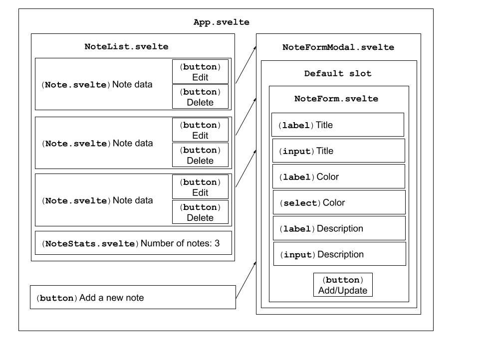

# Intermediate Svelte - Building Notes App

This is a simple workshop which demonstrates how easily we can utilize Svelte for building apps that are very fast by nature and contain some great features improving user experience very easily.

## Prerequisites

In this workshop, we are going to mostly focus on svelte itself and we cover the core functionality on building a simple app.

> Svelte and TypeScript. Although, Svelte recently added a support for TypeScript which is really easy to incorporate, I made a decision to stick to JS in this workshop to save a bit of time whilst focusing on core principles. There will be an additional Svelte workshop next year, that fully embraces the TS and some other advanced patterns.

As one of the core features of any modern web app is the ability to make an HTTP call, we will utilize a backend developed in one of our previous workshop. It was a simple REST API written in Deno and the [Deno-Notes-App](https://github.com/ovotech/co_frontend/tree/master/deno-notes-app) would be really perfect fit for our purposes.

We are also going to utilize [degit](https://github.com/Rich-Harris/degit) for the project scaffolding.

## Getting started

This step is just about a project scaffolding. As mentioned in the [prerequisites](#prerequisites) section, we are going to use a tool called [degit](https://github.com/Rich-Harris/degit).

To setup the project manually from scratch, you can type `npx degit sveltejs/template dano-notes-app` which does 
the work for you. But you need to copy/paste the extra files manually.

> Svelte and dev dependencies. If you check out **package.json** you can easily spot that **svelte** is added among development dependencies instead of standard ones. **Svelte is a compiler** that produces a standard JS code hence there is no need including this dependency in the production runtime.

Before moving forward, let's make sure we still install `node_modules` by typing `npm install`. This is required by either step.

Compare the original file structure, there are the following changes:

- In the `public/index.html` there are removed references to the default css global styles. By default, there is a `global.css` file which we don't need in our case. We are going to use `Bulma` from an external resource. Add the following snippet to your `public/index.html`.

```html
<!-- public/index.html -->
<link
  href="//cdn.jsdelivr.net/npm/bulma@0.9.1/css/bulma.min.css"
  rel="stylesheet"
/>
```

- We are also going to work with two **SVG icons**.They are going to be exported from [Font Awesome](https://fontawesome.com/). As their usage is licensed under [Creative Commons license](https://fontawesome.com/license), I create a dedicated [LICENSE.md](https://github.com/ovotech/co_frontend/tree/master/svelte-notes-app/src/icons/LICENSE.md) file with more details about our intentions.

- To be able to work with the SVG files, we need to include a [Rollup](https://rollupjs.org/) plugin - [rollup-plugin-svelte-svg](https://www.npmjs.com/package/rollup-plugin-svelte-svg) that allows us working with these files. You need to install the plugin by typing `npm i -D rollup-plugin-svelte-svg` and add `svelteSVG()` among the items in **plugins array** in `rollup.config.js`.

> A CORS package for `Deno-Notes-App` was added among the dependencies.

- We are going to make HTTP requests and use our `Deno Notes API` for getting the actual data. However, before we 
  reach that point, the app is going to rely on local mocks. They are stored in the `utils/mocks.js` and contain the following code:

```javascript
// utils/mocks.js
export const generateRandomString = () =>
  Math.random().toString(36).substring(7);

export const generateEmptyObject = () => {
  return { id: '', title: '', description: '', color: '' };
};

export const mockNotes = [
  {
    id: generateRandomString(),
    title: 'My first note',
    description: 'This is a description of the first note',
    color: 'green',
  },
  {
    id: generateRandomString(),
    title: 'Second note',
    description: 'This is a description of the second note',
    color: 'red',
  },
  {
    id: generateRandomString(),
    title: 'Third note',
    description: 'This is a description of the third note',
    color: 'yellow',
  },
];
```

- There are empty file containing the component names within the src directory. The exception are `NoteForm.svelte` and `NoteFormModal.svelte` which contain some initial HTML5 template code.

- Last thing is related to the fact that we can save some time by providing an implementation of util files ahead. In `src/utils` directory there is an `colors.js` file that contains the following code:

```javascript
// utils/colors.js
export const getNoteColor = (color) => {
  switch (color) {
    case 'red':
      return 'is-danger';
    case 'yellow':
      return 'is-warning';
    case 'green':
    default:
      return 'is-success';
  }
};
```

## Creating layout and making basic interactions

In this section, we are going to implement the components in their simplest form (core layout and some basic interactions).

The layout will be based on the one used for static site example in our [Deno-Notes-App](https://github.com/ovotech/co_frontend/tree/master/deno-notes-app). However, the form for showing and editing notes will be handled via modal screen.

### Component Hierarchy

Each component (expect **App.svelte**) will be placed in `components` folder and the `App.svelte` will be used as a _glue_ for connecting everything together.

> HTML boilerplate for `NoteForm.svelte` and `NoteFormModal.svelte`. Just to save some time during this workshop, there is already some initial HTML code in these two components. But without any actual functionality.

A visual (high-level) representation of the component composition is shown in the diagram below.



> Component naming convention in svelte dictates using an upper-case letter at the beginning. It is something that helps with distinction between standard HTML elements and custom components.

### Creating `NoteStats.svelte` Component

The first component we are going to create is `NoteStats.svelte`. In the `src` directory create a new folder called `components` and put a file name `NoteStats.svelte` into it. It will contain the following code

```html
<script>
  // components/NoteStats.svelte
  export let count = 0;
</script>

<p>Number of notes: {count}</p>
```

### Creating `Note.svelte` Component

Let's create a new component named `Note.svelte`. The initial file is in the `components` directory. Let's put the following implementation.

```html
<script>
  // components/Note.svelte
  import EditIcon from '../icons/edit-regular.svg'
  import TrashIcon from '../icons/trash-alt-regular.svg'
  import { getNoteColor } from '../utils/colors'

  export let id = null;
  export let title = '';
  export let description = '';
  export let color = '';
</script>

<article class={"message " + getNoteColor(color)} >
  <div class="message-header">
    {title}

    <div class="buttons">
      <button class="button">
        <EditIcon width="15" />
      </button>
      <button class="button">
        <TrashIcon width="15" />
      </button>
    </div>
  </div>
  <div class="message-body">
    {description}
  </div>
</article>
```

### Creating `NoteList.svelte` Component

This component just iterates over notes input array and render the list based on the data that are provided.

We are expecting to receive `notes` array and within the `each` loop we are passing data as a prop by spreading values of each element.

Svelte provides an `else block` within `each` loop that kicks-in whenever the input array is empty one.

Let's add the following implementation to `components/NoteList.svelte`

```html
<script>
  // components/NoteList.svelte
  import Note from './Note.svelte';
  import NoteStats from './NoteStats.svelte';

  export let notes = [];
</script>

{#each notes as note (note.id)}
<Note {...note} />
{:else}
<div class="block">
  Click on the <strong>Add a new note</strong> button to add a note
</div>
{/each}

<NoteStats count="{notes.length}" />
```

### Creating `NoteForm.svelte` Component

This is, by far, the most complex component. We are creating a `form` with a basic validations (the implementation is more verbose in this case, however it helps me with explaining some of the core principles of svelte).

There are a few instances where we are doing two-way `binding` as well as event listening to `blur` events which help us to distinguish whether a certain field was touched or not.

We are also utilizing `dynamic classes` as well as `even modifiers`.

By default, svelte doesn't provide a form validation library. However, there is a good selection of community ones which you can use in your actual app.

```html
<script>
// components/NoteForm.svelte
export let id = '';
export let title = '';
export let color = '';
export let description = '';

let colors = [
    { id: '', text: 'Select colour'},
		{ id: 'red', text: `Red` },
		{ id: 'yellow', text: `Yellow` },
		{ id: 'green', text: `Green` }
  ];

$: inEditMode = id.length > 0
$: isTitleTouched = inEditMode
$: isTitleValid =  title.length > 0;
$: isColorTouched = inEditMode
$: isColorValid =  color.length > 0;
$: isDescriptionTouched = inEditMode
$: isDescriptionValid = description.length > 0;
$: isFormPopulated =
  isTitleValid &&
  isColorValid &&
  isDescriptionValid

const handleSubmit = (event) => {
  // event.preventDefault()
  console.log('submitting')
}
</script>

<h2 class="title is-2">{inEditMode ? 'Update existing record' : 'Add a new record' }</h2>

<form
  on:submit|preventDefault={handleSubmit}>
  <div class="field">
    <label for="title" class="label">Title</label>
    <div class="control">
      <input
        id="title"
        class="input"
        type="text"
        class:is-danger={isTitleTouched && !isTitleValid}
        placeholder="Enter a note title"
        bind:value={title}
        on:blur={() => isTitleTouched = true}
      />
    </div>
  </div>

  <div class="field">
    <label for="color-select" class="label">Colour</label>
    <div class="control">
      <div class="select" class:is-danger={isColorTouched && !isColorValid}>
        <select bind:value={color} on:blur={() => isColorTouched = true}>
          {#each colors as element}
          <option value={element.id}>
            {element.text}
          </option>
          {/each}
        </select>
      </div>
    </div>
  </div>

  <div class="field">
    <label for="description" class="label">Description</label>
    <div class="control">
      <textarea
        id="description"
        class="textarea"
        placeholder="Enter a note description"
        class:is-danger={isDescriptionTouched && !isDescriptionValid}
        bind:value={description}
        on:blur={() => isDescriptionTouched = true}
      ></textarea>
    </div>
  </div>

  <div class="field is-grouped">
    <div class="control">
      <button class="button is-link" disabled={!isFormPopulated} >
        {!inEditMode ? 'Add a new note' : 'Update note'}
      </button>
    </div>
  </div>
</form>
```

### Creating `NoteFormModal.svelte` Component

Add a `<slot />` into the `components/NoteList.svelte`. This will be held as a placeholder for incorporating any child element.

> There might be multiple slots which can work with different elements. However, **only one of them can be default**. The others have to be **named**.

Let's update the `components/NoteList.svelte` by adding the following code:

```html
<script>
  // components/NoteFormModal.svelte
  export let isActive = false;
  export let toggleFormOpen;
</script>

<div class="modal" class:is-active="{isActive}">
  <div class="modal-background has-background-grey-light"></div>
  <div class="modal-content">
    <!-- add slot here -->
    <slot />
  </div>
  <button
    class="modal-close is-large"
    aria-label="close"
    on:click="{toggleFormOpen}"
  ></button>
</div>
```

### Creating `App.svelte` Component

This component will be the main container which will also contain the core functionality for orchestrating our data flows.

For now, let's add a basic structure.

```html
<script>
  // App.svelte
  import NoteList from './components/NoteList.svelte';
  import NoteForm from './components/NoteForm.svelte';
  import NoteFormModal from './components/NoteFormModal.svelte';
  import { mockNotes } from './utils/mocks';

  let notes = mockNotes;

  $: isFormOpened = false;

  const toggleFormOpen = () => {
    isFormOpened = !isFormOpened;
  };
</script>

<div class="container">
  <h1 class="title is-1">Notes App</h1>

  <NoteList {notes} />

  <button class="button mt-4 is-primary" on:click="{toggleFormOpen}">
    Add a new note
  </button>

  <NoteFormModal isActive="{isFormOpened}" toggleFormOpen="{toggleFormOpen}">
    <NoteForm />
  </NoteFormModal>
</div>
```

## (Custom) Event Handling

In this section, we are going to finish the initial implementation by adding a simple logic for data manipulation which helps us with CRUD operations in later parts of this workshop.

We are going to add capabilities for `adding`, `removing`, `editing` and `deleting` notes. We won't focus on the actual HTTP operations at this step, we rather focus on the demonstration of the mechanisms behind the custom triggering custom events.

> As an alternative to triggering custom events (and later using stores), we can also use **Svelte Context Api**. The main downside is that the context values are not reactive and it should be used only for data that are not frequently changed. If you are interested in learning more, feel free to visit [svelte.dev/tutorial/context-api](https://svelte.dev/tutorial/context-api).

Our main focus will be a custom event handling.

### Updating `App.svelte` Component

Let's add some functionality for receiving data from our (not yet existing) events. Update the `App.svelte` as the following:

```html
<script>
  // App.svelte
  import NoteList from './components/NoteList.svelte';
  import NoteForm from './components/NoteForm.svelte';
  import NoteFormModal from './components/NoteFormModal.svelte';
  import { mockNotes } from './utils/mocks';

  let notes = mockNotes;

  $: isFormOpened = false;

  const toggleFormOpen = () => {
    isFormOpened = !isFormOpened;
  };

  const onAddNote = (event) => {
    console.log('add note', event.detail);
  };

  const onUpdateNote = (event) => {
    console.log('update note:', event.detail);
  };

  const onEditNote = (event) => {
    console.log('edit note:', event.detail);
  };

  const onRemoveNote = (event) => {
    console.log('remove note: ', event.detail);
  };
</script>

<div class="container">
  <h1 class="title is-1">Notes App</h1>

  <NoteList {notes} on:editNote="{onEditNote}" on:removeNote="{onRemoveNote}" />

  <button class="button mt-4 is-primary" on:click="{toggleFormOpen}">
    Add a new note
  </button>

  <NoteFormModal isActive="{isFormOpened}" toggleFormOpen="{toggleFormOpen}">
    <NoteForm on:addNote="{onAddNote}" on:updateNote="{onUpdateNote}" />
  </NoteFormModal>
</div>
```

### Updating `NoteForm.svelte` Component

The first event we are going to care of is `adding a new record`. In `NoteForm.svelte` let's update the `handleSubmit` function as the following:

```html
<script>
// components/NoteForm.svelte
import { createEventDispatcher  } from 'svelte'

export let id = '';
export let title = '';
export let color = '';
export let description = '';

let colors = [
    { id: '', text: 'Select colour'},
		{ id: 'red', text: `Red` },
		{ id: 'yellow', text: `Yellow` },
		{ id: 'green', text: `Green` }
  ];

$: inEditMode = id.length > 0
$: isTitleTouched = inEditMode
$: isTitleValid =  title.length > 0;
$: isColorTouched = inEditMode
$: isColorValid =  color.length > 0;
$: isDescriptionTouched = inEditMode
$: isDescriptionValid = description.length > 0;
$: isFormPopulated =
  isTitleValid &&
  isColorValid &&
  isDescriptionValid

const dispatch = createEventDispatcher()

const handleSubmit = (event) => {
  if (inEditMode) {
    dispatch('updateNote', {
      id,
      title,
      color,
      description
    })
  } else {
      dispatch('addNote', {
      title,
      color,
      description
    })
  }

  id = ''
  title = ''
  color = ''
  description = ''
  isTitleTouched = false
  isColorTouched = false
  isDescriptionTouched = false
}

</script>

<h2 class="title is-2">{inEditMode ? 'Update existing record' : 'Add a new record' }</h2>

<form
  on:submit|preventDefault={handleSubmit}>
  <div class="field">
    <label for="title" class="label">Title</label>
    <div class="control">
      <input
        id="title"
        class="input"
        type="text"
        class:is-danger={isTitleTouched && !isTitleValid}
        placeholder="Enter a note title"
        bind:value={title}
        on:blur={() => isTitleTouched = true}
      />
    </div>
  </div>

  <div class="field">
    <label for="color-select" class="label">Colour</label>
    <div class="control">
      <div class="select" class:is-danger={isColorTouched && !isColorValid}>
        <select bind:value={color} on:blur={() => isColorTouched = true}>
          {#each colors as element}
          <option value={element.id}>
            {element.text}
          </option>
          {/each}
        </select>
      </div>
    </div>
  </div>

  <div class="field">
    <label for="description" class="label">Description</label>
    <div class="control">
      <textarea
        id="description"
        class="textarea"
        placeholder="Enter a note description"
        class:is-danger={isDescriptionTouched && !isDescriptionValid}
        bind:value={description}
        on:blur={() => isDescriptionTouched = true}
      ></textarea>
    </div>
  </div>

  <div class="field is-grouped">
    <div class="control">
      <button class="button is-link" disabled={!isFormPopulated} >
        {!inEditMode ? 'Add a new note' : 'Update note'}
      </button>
    </div>
  </div>
</form>
```

### Updating `Note.svelte` Component

Other two operations (`edit` and `remove`) are related to the `Note.svelte` that is on the lowest end of the component hierarchy. We need to forward an `id` which can be used on the top level `App.svelte` for further manipulation.

For now, let's update the component as the following.

```html
<script>
  // components/Note.svelte
  import { createEventDispatcher } from 'svelte';
  import EditIcon from '../icons/edit-regular.svg'
  import TrashIcon from '../icons/trash-alt-regular.svg'
  import { getNoteColor } from '../utils/colors'

  export let id = null;
  export let title = '';
  export let description = '';
  export let color = '';

  const dispatch = createEventDispatcher()

  const onEditClick = (id) => {
    dispatch('editNote', {
      id
    })
  }

  const onDeleteClick = (id) => {
    dispatch('removeNote', {
      id
    })
  }
</script>

<article class={"message " + getNoteColor(color)} >
  <div class="message-header">
    {title}

    <div class="buttons">
      <button class="button" on:click={() => onEditClick(id)}>
        <EditIcon width="15" />
      </button>
      <button class="button" on:click={() => onDeleteClick(id)}>
        <TrashIcon width="15" />
      </button>
    </div>
  </div>
  <div class="message-body">
    {description}
  </div>
</article>
```

### Updating `NoteList.svelte` Component

Between the top level `App.svelte` component and lowest level `Note.svelte` one there is also `NoteList.svelte` component. We need to forward the event between these two components. And there is a very nice and neat trick to achieve this task easily.

```html
<script>
  // components/NoteList.svelte
  import Note from './Note.svelte';
  import NoteStats from './NoteStats.svelte';

  export let notes = [];
</script>

{#each notes as note (note.id)}
<Note {...note} on:editNote on:removeNote />
{:else}
<div class="block">
  Click on the <strong>Add a new note</strong> button to add a note
</div>
{/each}

<NoteStats count="{notes.length}" />
```

### Updating `App.svelte` Component (again)

As our events are working, let's put some more logic to utilize the data flow. Let's create logic that will work with these in-memory data operations.

```html
<script>
  // App.svelte
  import NoteList from './components/NoteList.svelte';
  import NoteForm from './components/NoteForm.svelte';
  import NoteFormModal from './components/NoteFormModal.svelte';
  import {
    mockNotes,
    generateRandomString,
    generateEmptyObject,
  } from './utils/mocks';

  let notes = mockNotes;

  $: isFormOpened = false;
  $: objectToEdit = generateEmptyObject();

  const toggleFormOpen = () => {
    isFormOpened = !isFormOpened;
  };

  const addNote = (note) => {
    notes = [{ id: generateRandomString(), ...note }, ...notes];
  };

  const updateNote = (note) => {
    notes = notes.map((element) => {
      if (element.id === note.id) {
        return note;
      }

      return element;
    });
  };

  const removeNote = (id) => {
    notes = notes.filter((note) => note.id !== id);
  };

  const onAddNote = (event) => {
    addNote(event.detail);
    toggleFormOpen();
  };

  const onUpdateNote = (event) => {
    updateNote(event.detail);
    toggleFormOpen();
    objectToEdit = generateEmptyObject();
  };

  const onEditNote = (event) => {
    objectToEdit = notes.find((element) => element.id === event.detail.id);
    toggleFormOpen();
  };

  const onRemoveNote = (event) => {
    removeNote(event.detail.id);
  };
</script>

<div class="container">
  <h1 class="title is-1">Notes App</h1>

  <NoteList {notes} on:editNote="{onEditNote}" on:removeNote="{onRemoveNote}" />

  <button class="button mt-4 is-primary" on:click="{toggleFormOpen}">
    Add a new note
  </button>

  <NoteFormModal isActive="{isFormOpened}" toggleFormOpen="{toggleFormOpen}">
    <NoteForm
      on:addNote="{onAddNote}"
      on:updateNote="{onUpdateNote}"
      {...objectToEdit}
    />
  </NoteFormModal>
</div>
```

## Lifecycle methods and HTTP calls

In this section we are going to introduce the HTTP calls and the `onMount` lifecycle function.

### Fetching data directly

We can start simple by making an HTTP request outside a lifecycle function. Let's update the `App.svelte` component.

```html
<script>
  // App.svelte
  import NoteList from './components/NoteList.svelte';
  import NoteForm from './components/NoteForm.svelte';
  import NoteFormModal from './components/NoteFormModal.svelte';
  import {
    mockNotes,
    generateRandomString,
    generateEmptyObject,
  } from './utils/mocks';

  let notes = [];

  fetch('http://localhost:8000/notes')
    .then((response) => response.json())
    .then((data) => {
      notes = data;
    })
    .catch((error) => console.log(error));

  $: isFormOpened = false;
  $: objectToEdit = generateEmptyObject();

  const toggleFormOpen = () => {
    isFormOpened = !isFormOpened;
  };

  const addNote = (note) => {
    notes = [{ id: generateRandomString(), ...note }, ...notes];
  };

  const updateNote = (note) => {
    notes = notes.map((element) => {
      if (element.id === note.id) {
        return note;
      }

      return element;
    });
  };

  const removeNote = (id) => {
    notes = notes.filter((note) => note.id !== id);
  };

  const onAddNote = (event) => {
    addNote(event.detail);
    toggleFormOpen();
  };

  const onUpdateNote = (event) => {
    updateNote(event.detail);
    toggleFormOpen();
    objectToEdit = generateEmptyObject();
  };

  const onEditNote = (event) => {
    objectToEdit = notes.find((element) => element.id === event.detail.id);
    toggleFormOpen();
  };

  const onRemoveNote = (event) => {
    removeNote(event.detail.id);
  };
</script>

<div class="container">
  <h1 class="title is-1">Notes App</h1>

  <NoteList {notes} on:editNote="{onEditNote}" on:removeNote="{onRemoveNote}" />

  <button class="button mt-4 is-primary" on:click="{toggleFormOpen}">
    Add a new note
  </button>

  <NoteFormModal isActive="{isFormOpened}" toggleFormOpen="{toggleFormOpen}">
    <NoteForm
      on:addNote="{onAddNote}"
      on:updateNote="{onUpdateNote}"
      {...objectToEdit}
    />
  </NoteFormModal>
</div>
```

At this point, we are fetching data from a REST endpoint. However, a downside of this approach is that, in case you are using a sapper or doing any kind of server side rendering, fetch will happen both on the backend and frontend.

This is a bit problematic considering the fact that we are using fetch which is a browser API (Deno will utilize it also on the server side in the future).

### Fetching data within onMount() lifecycle method

If you would like to run something on client side only, the lifecycle methods are coming to a rescue. Let's discuss `onMount()` one in this section. If you are familiar to React, you might find similarities with `componentDidMount` or `useEffects`.

> There are more lifecycle methods like `onDestroy`, `beforeUpdate`, `afterUpdate` or `tick`, but they won't be covered during this workshop.

Basically, we are going to move the data fetch from the root level into our `onMount()` lifecycle method which would secure running in only on the client side. Let's update the `App.svelte` as the following:

```html
<script>
  // App.svelte
  import { onMount } from 'svelte';
  import NoteList from './components/NoteList.svelte';
  import NoteForm from './components/NoteForm.svelte';
  import NoteFormModal from './components/NoteFormModal.svelte';
  import { generateRandomString, generateEmptyObject } from './utils/mocks';

  let notes = [];

  onMount(async () => {
    try {
      const response = await fetch('http://localhost:8000/notes');
      const data = await response.json();
      notes = data;
    } catch (error) {
      console.log('error: ', error);
    }
  });

  $: isFormOpened = false;
  $: objectToEdit = generateEmptyObject();

  const toggleFormOpen = () => {
    isFormOpened = !isFormOpened;
  };

  const addNote = (note) => {
    notes = [{ id: generateRandomString(), ...note }, ...notes];
  };

  const updateNote = (note) => {
    notes = notes.map((element) => {
      if (element.id === note.id) {
        return note;
      }

      return element;
    });
  };

  const removeNote = (id) => {
    notes = notes.filter((note) => note.id !== id);
  };

  const onAddNote = (event) => {
    addNote(event.detail);
    toggleFormOpen();
  };

  const onUpdateNote = (event) => {
    updateNote(event.detail);
    toggleFormOpen();
    objectToEdit = generateEmptyObject();
  };

  const onEditNote = (event) => {
    objectToEdit = notes.find((element) => element.id === event.detail.id);
    toggleFormOpen();
  };

  const onRemoveNote = (event) => {
    removeNote(event.detail.id);
  };
</script>

<div class="container">
  <h1 class="title is-1">Notes App</h1>

  <NoteList {notes} on:editNote="{onEditNote}" on:removeNote="{onRemoveNote}" />

  <button class="button mt-4 is-primary" on:click="{toggleFormOpen}">
    Add a new note
  </button>

  <NoteFormModal isActive="{isFormOpened}" toggleFormOpen="{toggleFormOpen}">
    <NoteForm
      on:addNote="{onAddNote}"
      on:updateNote="{onUpdateNote}"
      {...objectToEdit}
    />
  </NoteFormModal>
</div>
```

### Async blocks

Working with async in svelte is pretty much the same as in any solution. With one possible exception that is an async block. You can create something like this.

```html
<script>
  // App.svelte
  import { onMount } from 'svelte';
  import NoteList from './components/NoteList.svelte';
  import NoteForm from './components/NoteForm.svelte';
  import NoteFormModal from './components/NoteFormModal.svelte';
  import { generateRandomString, generateEmptyObject } from './utils/mocks';

  let promise;
  let notes = [];

  onMount(() => {
    promise = fetch('http://localhost:8000/notes').then((response) =>
      response.json()
    );
    // try {
    // 	const response = await fetch('http://localhost:8000/notes');
    // 	const data = await response.json()
    // 	notes = data
    // } catch (error) {
    // 	console.log('error: ', error)
    // }
  });

  $: isFormOpened = false;
  $: objectToEdit = generateEmptyObject();

  const toggleFormOpen = () => {
    isFormOpened = !isFormOpened;
  };

  const addNote = (note) => {
    notes = [{ id: generateRandomString(), ...note }, ...notes];
  };

  const updateNote = (note) => {
    notes = notes.map((element) => {
      if (element.id === note.id) {
        return note;
      }

      return element;
    });
  };

  const removeNote = (id) => {
    notes = notes.filter((note) => note.id !== id);
  };

  const onAddNote = (event) => {
    addNote(event.detail);
    toggleFormOpen();
  };

  const onUpdateNote = (event) => {
    updateNote(event.detail);
    toggleFormOpen();
    objectToEdit = generateEmptyObject();
  };

  const onEditNote = (event) => {
    objectToEdit = notes.find((element) => element.id === event.detail.id);
    toggleFormOpen();
  };

  const onRemoveNote = (event) => {
    removeNote(event.detail.id);
  };
</script>

<div class="container">
  <h1 class="title is-1">Notes App</h1>

  {#await promise}
  <p>Loading</p>
  {:then notes}
  <NoteList {notes} on:editNote="{onEditNote}" on:removeNote="{onRemoveNote}" />
  {:catch error}
  <p>Some error</p>
  {/await}

  <button class="button mt-4 is-primary" on:click="{toggleFormOpen}">
    Add a new note
  </button>

  <NoteFormModal isActive="{isFormOpened}" toggleFormOpen="{toggleFormOpen}">
    <NoteForm
      on:addNote="{onAddNote}"
      on:updateNote="{onUpdateNote}"
      {...objectToEdit}
    />
  </NoteFormModal>
</div>
```

### Other async methods

Let's return the standard async/await pattern and spice it up with a few more async functions in the solution.

```html
<script>
  // App.svelte
  import { onMount } from 'svelte';
  import NoteList from './components/NoteList.svelte';
  import NoteForm from './components/NoteForm.svelte';
  import NoteFormModal from './components/NoteFormModal.svelte';
  import { generateEmptyObject } from './utils/mocks';

  let notes = [];

  onMount(async () => {
    try {
      const response = await fetch('http://localhost:8000/notes');
      const data = await response.json();
      notes = data;
    } catch (error) {
      console.log('error: ', error);
    }
  });

  $: isFormOpened = false;
  $: objectToEdit = generateEmptyObject();

  const toggleFormOpen = () => {
    isFormOpened = !isFormOpened;
  };

  const addNote = async (note) => {
    const newNote = await fetch('http://localhost:8000/notes', {
      method: 'POST',
      headers: { 'Content-Type': 'application/json' },
      body: JSON.stringify(note),
    }).then((response) => response.json());
    notes = [...notes, newNote];
  };

  const updateNote = async (note) => {
    const updatedNote = await fetch(`http://localhost:8000/notes/${note.id}`, {
      method: 'PUT',
      headers: { 'Content-Type': 'application/json' },
      body: JSON.stringify(note),
    }).then((response) => response.json());

    notes = notes.map((element) => {
      if (element.id === updatedNote.id) {
        return updatedNote;
      }

      return element;
    });
  };

  const removeNote = async (id) => {
    await fetch(`http://localhost:8000/notes/${id}`, {
      method: 'DELETE',
      headers: { 'Content-Type': 'application/json' },
    }).then((response) => response.json());

    notes = notes.filter((note) => note.id !== id);
  };

  const onAddNote = (event) => {
    addNote(event.detail);
    toggleFormOpen();
  };

  const onUpdateNote = (event) => {
    updateNote(event.detail);
    toggleFormOpen();
    objectToEdit = generateEmptyObject();
  };

  const onEditNote = (event) => {
    objectToEdit = notes.find((element) => element.id === event.detail.id);
    toggleFormOpen();
  };

  const onRemoveNote = (event) => {
    removeNote(event.detail.id);
  };
</script>

<div class="container">
  <h1 class="title is-1">Notes App</h1>

  <NoteList {notes} on:editNote="{onEditNote}" on:removeNote="{onRemoveNote}" />

  <button class="button mt-4 is-primary" on:click="{toggleFormOpen}">
    Add a new note
  </button>

  <NoteFormModal isActive="{isFormOpened}" toggleFormOpen="{toggleFormOpen}">
    <NoteForm
      on:addNote="{onAddNote}"
      on:updateNote="{onUpdateNote}"
      {...objectToEdit}
    />
  </NoteFormModal>
</div>
```

## Transitions

Before we finish our workshop, let's have a quick play with the transitions. The topic itself is very complex and we will only scratch the surface, but it still should demonstrate the concepts well.

Let's import the transition functions from `svelte/transition` and an easing function `quintOut` from `svelte/easing`.

> Transition doesn't work when directly applied on a component. You have to wrap it by an HTML element.

The example below shows `blur` function, but we can easily swap it by others.

```html
<script>
  // components/NoteList.svelte
  import Note from './Note.svelte';
  import NoteStats from './NoteStats.svelte';
  import { blur, slide, scale, fade, fly } from 'svelte/transition';
  import { quintOut } from 'svelte/easing';

  export let notes = [];
</script>

{#each notes as note (note.id)}
<div transition:blur>
  <Note {...note} on:editNote on:removeNote />
</div>
{:else}
<div class="block">
  Click on the <strong>Add a new note</strong> button to add a note
</div>
{/each}

<NoteStats count="{notes.length}" />
```

We can also parametrise the transition by specifying `in`, `out` and `easing` parts separately as shown on the example below.

```html
<script>
// components/NoteList.svelte
import Note from './Note.svelte'
import NoteStats from './NoteStats.svelte'
import { blur, slide, scale, fade, fly } from 'svelte/transition';
import { quintOut } from 'svelte/easing'

export let notes = []
</script>

{#each notes as note (note.id)}
<div in:fly={{x:-100, y:-100, duration: 2000, delay: 500, easing: quintOut}} out:slide>
  <Note {...note} on:editNote on:removeNote />
</div>
{:else}
  <div class="block">
    Click on the <strong>Add a new note</strong> button to add a note
  </div>
{/each}

<NoteStats count={notes.length} />
```

## Conclusion

Thanks for following this workshop. Any feedback appreciated (radek.tomasek@gmail.com).
