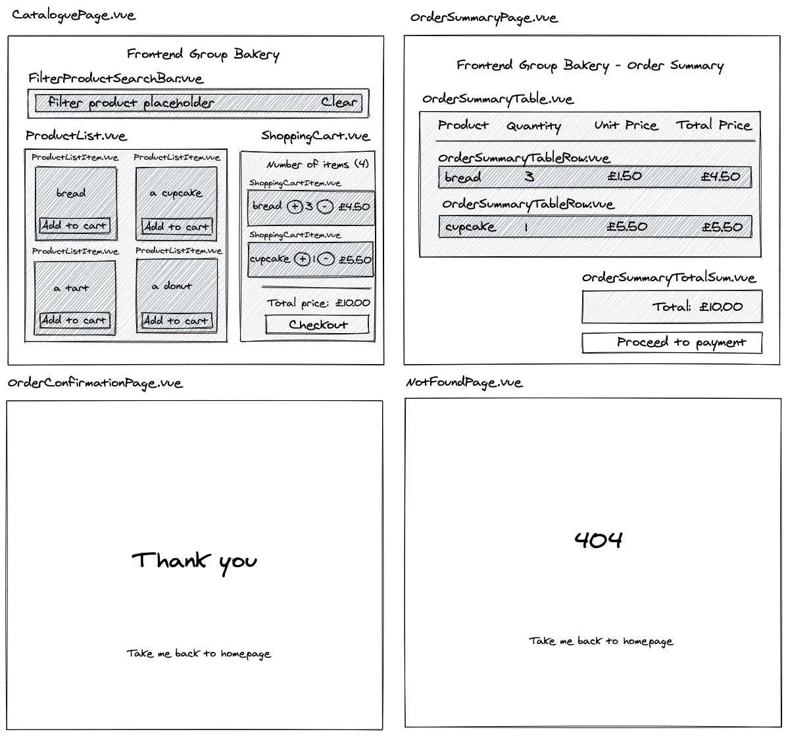
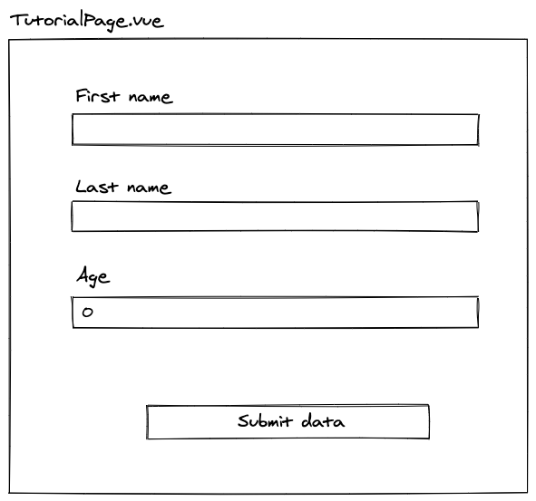

# Advanced Vue 3.0 (Composition API, VueRouter, Vuex, TypeScript and Snowpack)

> Note: This workshop uses legacy [Snowpack builder](https://www.snowpack.dev) which is no longer supported. In the foreseeable future, I would like to migrate it to [Vite](https://vite.dev).

After we discussed the basic concepts of Vue 3.0 in our intro session, it's time to cover the most advanced topics.

In this workshop, we are going to utilize an existing Vue 3.0, which had been built with Options API, Vuex, Vue Router and TypeScript and migrate it into one using Composition API.

As a prerequisite, at least basic knowledge of Vue is expected to be able to fully enjoy this workshop.

There are a lot of patterns used in this app which will help us to diversify our approach and we will see how to apply Composition API to all of them. As a bonus, we are going to build a custom hook at the end of this workshop.

Without further ado, let's get started.

## Initializing a new project

For this project, we are going to use `Snowpack` with its `TypeScript` template. In your terminal, please type the following command:

```bash
npx create-snowpack-app vue-shopping-cart --template @snowpack/app-template-vue-typescript
```

This will initialize the project and add typescript support.

### Installing dependencies

We also need to install several external packages. After the project is initialized, let's go to the project directory (`cd vue-shopping-cart`) and install the following dependencies.

```bash
# Vuex & Vue Router
npm install vuex@4.0.0 vue-router@4.0.3 --save
```

[Tailwind](https://tailwindcss.com) and [PostCSS](https://postcss.org) will be configured and used in the same way as we did in the [Vue Notes App](https://github.com/ovotech/co_frontend/tree/master/vue-notes-app) and [Svelte Shopping Cart](https://github.com/ovotech/co_frontend/tree/master/svelte-shopping-cart) workshops.

Let's install these dependencies first.

```bash
# install tailwind, postcss and autoprefixer, @snowpack/plugin-postcss and cssnano@latest
npm install -D tailwindcss@2.0.2 postcss@8.2.4 autoprefixer@10.2.4 @snowpack/plugin-postcss@1.1.0 cssnano@4.1.10
```

### Creating/Updating config files.

In this subsection, we are going to configure our CSS tooling.

The first step is to initialize a tailwind config. Let's do it typing the following command in your terminal:

```bash
npx tailwindcss init -p
```

This creates two files: `tailwind.config.js` and `postcss.config.js` files which will contain the following code:

```javascript
// tailwind.config.js
module.exports = {
  purge: [],
  darkMode: false, // or 'media' or 'class'
  theme: {
    extend: {},
  },
  variants: {
    extend: {},
  },
  plugins: [],
};
```

```javascript
// postcss.config.js
module.exports = {
  plugins: {
    tailwindcss: {},
    autoprefixer: {},
  },
};
```

In the `tailwind.config.js`, we can configure the **purge** option. This allows us to automatically remove unused styles in production.

```diff
--- a/tailwind.config.js
+++ b/tailwind.config.js
// tailwind.config.js
module.exports = {
- purge: [],
+ purge: ['./index.html', './src/**/*.{vue,js,ts,jsx,tsx}'],
  darkMode: false, // or 'media' or 'class'
  theme: {
    extend: {},
  },
  variants: {
    extend: {},
  },
  plugins: [],
}
```

The final version of the `tailwind.config.js` will look as the following:

```javascript
// tailwind.config.js
module.exports = {
  purge: ['./index.html', './src/**/*.{vue,js,ts,jsx,tsx}'],
  darkMode: false, // or 'media' or 'class'
  theme: {
    extend: {},
  },
  variants: {
    extend: {},
  },
  plugins: [],
};
```

Another change is going to happen in `postcss.config.js` where we are going to replace the original config with the following update.

```diff
--- a/postcss.config.js
+++ b/postcss.config.js
// postcss.config.js
+const tailwind = require('tailwindcss');
+const autoprefixer = require('autoprefixer');
+const cssnano = require('cssnano');
+
+const plugins =
+  process.env.NODE_ENV === 'production'
+    ? [tailwind, autoprefixer, cssnano]
+    : [tailwind, autoprefixer];
+
-module.exports = {
-  plugins: {
-    tailwindcss: {},
-    autoprefixer: {},
-  },
-}
+module.exports = { plugins };
```

And the final version of the `postcss.config.js` file now looks like the code below:

```javascript
// postcss.config.js
const tailwind = require('tailwindcss');
const autoprefixer = require('autoprefixer');
const cssnano = require('cssnano');

const plugins =
  process.env.NODE_ENV === 'production'
    ? [tailwind, autoprefixer, cssnano]
    : [tailwind, autoprefixer];

module.exports = { plugins };
```

We also need to tweak the `snowpack.config.js` and utilize the `@snowpack/plugin-postcss`.

Because we are also planning to use `VueRouter`, we can make another small tweak now which help us to fallback our routes to our static page.

To do that, just **uncomment** the pre-prepared element in the `routes` array.

```diff
--- a/snowpack.config.js
+++ b/snowpack.config.js
// snowpack.config.js
/** @type {import("snowpack").SnowpackUserConfig } */
module.exports = {
  mount: {
    public: {url: '/', static: true},
    src: {url: '/dist'},
  },
  plugins: [
    '@snowpack/plugin-vue',
    '@snowpack/plugin-vue/plugin-tsx-jsx.js',
    '@snowpack/plugin-dotenv',
+   '@snowpack/plugin-postcss'
  ],
  routes: [
    /* Enable an SPA Fallback in development: */
-   // {"match": "routes", "src": ".*", "dest": "/index.html"},
+   {"match": "routes", "src": ".*", "dest": "/index.html"},
  ],
  optimize: {
    /* Example: Bundle your final build: */
    // "bundle": true,
  },
  packageOptions: {
    /* ... */
  },
  devOptions: {
    /* ... */
  },
  buildOptions: {
    /* ... */
  },
};
```

The updated file will look as the following:

```javascript
// snowpack.config.js
/** @type {import("snowpack").SnowpackUserConfig } */
module.exports = {
  mount: {
    public: { url: '/', static: true },
    src: { url: '/dist' },
  },
  plugins: [
    '@snowpack/plugin-vue',
    '@snowpack/plugin-vue/plugin-tsx-jsx.js',
    '@snowpack/plugin-dotenv',
    '@snowpack/plugin-postcss',
  ],
  routes: [
    /* Enable an SPA Fallback in development: */
    { match: 'routes', src: '.*', dest: '/index.html' },
  ],
  optimize: {
    /* Example: Bundle your final build: */
    // "bundle": true,
  },
  packageOptions: {
    /* ... */
  },
  devOptions: {
    /* ... */
  },
  buildOptions: {
    /* ... */
  },
};
```

Now it is time to include `tailwind` in the main css. Let's create a file called `base.css` and put it to `src` with the following content.

```css
/* src/base.css */
@tailwind base;
@tailwind components;
@tailwind utilities;
```

### Tighten things up

As the last step, we need to include the template in the `src/index.js` which would allow us to use tailwind's capabilities globally.

Let's add the style into the flow.

```diff
+++ a/index.js
// src/index.js
import { createApp } from "vue";
import App from "./App.vue";
+import './base.css'

const app = createApp(App);
app.mount("#app");

// Hot Module Replacement (HMR) - Remove this snippet to remove HMR.
// Learn more: https://www.snowpack.dev/concepts/hot-module-replacement
if (import.meta.hot) {
  import.meta.hot.accept();
  import.meta.hot.dispose(() => {
    app.unmount();
  });
}
```

And this one should be your updated version of the code.

```javascript
// src/index.js
import { createApp } from 'vue';
import App from './App.vue';
import './base.css';

const app = createApp(App);
app.mount('#app');

// Hot Module Replacement (HMR) - Remove this snippet to remove HMR.
// Learn more: https://www.snowpack.dev/concepts/hot-module-replacement
if (import.meta.hot) {
  import.meta.hot.accept();
  import.meta.hot.dispose(() => {
    app.unmount();
  });
}
```

The initial configuration is done (we will setup [Vuex](https://next.vuex.vuejs.org/) and [VueRouter](https://next.router.vuejs.org/) a bit later).

### Updating our markup

Let's update the content of `src/App.vue` as the following:

```html
<!-- src/App.vue -->
<template>
  <h1 class="p-4 m-4 bg-green-600">Hello World</h1>
</template>
```

### Cleaning unused components

In the `src/components` your can find a lot of examples how we can use components in Vue and TypeScript.

For now (to avoid any confusion), let's clean the components folder by removing every file there. We are going to start from scratch.

```bash
rm src/components/*
```

### Creating new folders

We will also need a few extra directories in our `src` directory. Apart from `components` that had already been created, let's add these new folders to the **src** directory: `mocks`, `pages`, `types`, `stores`, `routes`, `hooks`.

In the command line, simply type (whilst you are in project's root dir):

```bash
mkdir -p src/{mocks,pages,types,stores,routes,hooks}
```

And it would do the job for you.

### Running the app

Go back to root directory of your project and let's run the app by typing:

```bash
npm run start
```

And you should see a beautiful `Hello World` title styled in Vue colors.

## Add Vue 3 implementation with the Options API

The layout and structure of this project is based on the [Svelte Shopping Cart](https://github.com/ovotech/co_frontend/tree/master/svelte-shopping-cart).

The scope is this section is to implement a full Vue 3.0 application with Options API. We won't cover this part in our actual workshop, but I am going to put it here for the reference purposes.

### Architecture

The architecture of the app is relatively simple. There are a few routes (pages) powered by VueRouter and many smaller components as shown in the picture below.

> There is also a separated page/component called TutorialPage.vue. This will be used as a quick introduction to Composition API, before we start doing the actual migration.

Vuex library is used as a state management library.



### Helper files

We are going to create our types and mocks files first. This application works with just local data and adding these files help us to setup a good foundation.

The types are defined as the following.

```typescript
// src/types/index.ts
export interface Product {
  id: string;
  title: string;
  description: string;
  price: number;
  image: string;
}

export interface CartItem {
  id: string;
  title: string;
  image: string;
  price: number;
  quantity: number;
}
```

And the mocks file.

```typescript
// src/mocks/index.ts
import type { Product } from '../types';

export const products: Product[] = [
  {
    id: 'qyq1b6',
    title: 'Croissants',
    description: 'Quality croissants from our bakery (1 pcs).',
    price: 1.5,
    image:
      'https://images.unsplash.com/photo-1565182363525-f95648bbeee0?ixid=MXwxMjA3fDB8MHxwaG90by1wYWdlfHx8fGVufDB8fHw%3D&ixlib=rb-1.2.1&auto=format&fit=crop&w=2550&q=80',
  },
  {
    id: 'jy117n',
    title: 'Sourdough bread',
    description: 'A sourdough bread from our bakery (1 loaf).',
    price: 5.25,
    image:
      'https://images.unsplash.com/photo-1509440159596-0249088772ff?ixid=MXwxMjA3fDB8MHxwaG90by1wYWdlfHx8fGVufDB8fHw%3D&ixlib=rb-1.2.1&auto=format&fit=crop&w=2552&q=80',
  },
  {
    id: 'f2wjt8',
    title: 'Donuts selection',
    description: 'A box of donuts for your whole family (8 pcs).',
    price: 2.3,
    image:
      'https://images.unsplash.com/photo-1527515545081-5db817172677?ixid=MXwxMjA3fDB8MHxwaG90by1wYWdlfHx8fGVufDB8fHw%3D&ixlib=rb-1.2.1&auto=format&fit=crop&w=2550&q=80',
  },
  {
    id: '6wadkq',
    title: 'Raspberry cups',
    description: 'Our popular option for every occasion (4 pcs).',
    price: 7.3,
    image:
      'https://images.unsplash.com/photo-1570145820404-cf22b115b06f?ixid=MXwxMjA3fDB8MHxwaG90by1wYWdlfHx8fGVufDB8fHw%3D&ixlib=rb-1.2.1&auto=format&fit=crop&w=2167&q=80',
  },
];
```

### FilterProductSearchBar.vue

This component contains a search bar. It will be used for potential filtering of our product list. There is a local state and data are emitted outside to whoever is listening.

```html
<!-- src/components/FilterProductSearchBar.vue -->
<template>
  <div class="pl-8 md:px-8 pt-6 mx-auto">
    <div class="hero">
      <div class="box">
        <div class="box-wrapper">
          <div
            class="bg-white rounded flex items-center w-full p-3 shadow-sm border border-gray-200"
          >
            <svg
              class="w-5 text-gray-600 h-5"
              fill="none"
              stroke-linecap="round"
              stroke-linejoin="round"
              stroke-width="2"
              stroke="currentColor"
              viewBox="0 0 24 24"
            >
              <path d="M21 21l-6-6m2-5a7 7 0 11-14 0 7 7 0 0114 0z"></path>
            </svg>
            <input
              type="text"
              name="searchTerm"
              id="searchTerm"
              v-model="searchTerm"
              @input="updateData"
              placeholder="filter product"
              class="w-full pl-4 text-sm outline-none focus:outline-none bg-transparent"
            />
            <button @click="clearData">Clear</button>
          </div>
        </div>
      </div>
    </div>
  </div>
</template>

<script lang="ts">
  import { defineComponent } from 'vue';

  interface State {
    searchTerm: string;
  }

  export default defineComponent({
    data(): State {
      return {
        searchTerm: '',
      };
    },
    emits: {
      filterData(searchTerm: string): boolean {
        return true;
      },
    },
    methods: {
      updateData(): void {
        this.$emit('filterData', this.searchTerm);
      },
      clearData(): void {
        this.searchTerm = '';
      },
    },
  });
</script>
```

### OrderSummaryTable.vue

This component will display the selected products for user to confirm whether he (or she) is happy to order it. There is a possibility to update (increase/decrease) quantity of the selected items.

```html
<!-- src/components/OrderSummaryTable.vue -->
<template>
  <table class="w-full text-sm lg:text-base" cellspacing="0">
    <thead>
      <tr class="h-12 uppercase">
        <th class="hidden md:table-cell"></th>
        <th class="text-left">Product</th>
        <th class="lg:text-right text-left pl-5 lg:pl-0">
          <span class="lg:hidden" title="Quantity">Qtd</span>
          <span class="hidden lg:inline">Quantity</span>
        </th>
        <th class="hidden text-right md:table-cell">Unit price</th>
        <th class="text-right">Total price</th>
      </tr>
    </thead>
    <tbody>
      <OrderSummaryTableRow
        v-for="cartItem in cartItems"
        :key="cartItem.id"
        :cartItem="cartItem"
        @increaseQuantity="() => $emit('increaseQuantity', cartItem.id)"
        @decreaseQuantity="() => $emit('decreaseQuantity', cartItem.id)"
      />
    </tbody>
  </table>
</template>

<script lang="ts">
  import { defineComponent } from 'vue';
  import OrderSummaryTableRow from './OrderSummaryTableRow.vue';
  import type { CartItem } from '../types';

  export default defineComponent({
    components: {
      OrderSummaryTableRow,
    },
    computed: {
      cartItems(): CartItem[] {
        return this.$store.state['cartItems'];
      },
      totalPrice(): string {
        return this.$store.getters['totalPrice'];
      },
    },
  });
</script>
```

### OrderSummaryTableRow.vue

`OrderSummaryTableRow` is a component which is used within the `OrderSummaryTable`. It contains the markup for displaying each individual row within a loop.

```html
<!-- src/components/OrderSummaryTableRow.vue -->
<template>
  <tr>
    <td class="hidden pb-4 md:table-cell">
      
    </td>
    <td>
      <p class="mb-3">{{ cartItem.title }}</p>
    </td>
    <td class="justify-center md:justify-end md:flex mt-6">
      <div class="w-20 h-10">
        <div class="relative flex flex-row w-full h-8">
          <input
            type="number"
            v-model.number="quantity"
            class="w-full font-semibold text-center text-gray-700 bg-gray-200 outline-none focus:outline-none hover:text-black focus:text-black"
          />
        </div>
      </div>
    </td>
    <td class="hidden text-right md:table-cell">
      <span class="text-sm lg:text-base font-medium">{{ unitPrice }}</span>
    </td>
    <td class="text-right">
      <span class="text-sm lg:text-base font-medium">{{ totalPrice }}</span>
    </td>
  </tr>
</template>

<script lang="ts">
  import { defineComponent, PropType } from 'vue';
  import type { CartItem } from '../types';

  interface State {
    quantity: number;
  }

  export default defineComponent({
    props: {
      cartItem: {
        type: Object as PropType<CartItem>,
        required: true,
      },
    },
    data(): State {
      return {
        quantity: this.cartItem.quantity,
      };
    },
    computed: {
      unitPrice(): string {
        return '£' + this.cartItem.price.toFixed(2);
      },
      totalPrice(): string {
        return '£' + (this.cartItem.price * this.cartItem.quantity).toFixed(2);
      },
    },
    emits: {
      increaseQuantity(productId: string): boolean {
        return true;
      },
      decreaseQuantity(productId: string): boolean {
        return true;
      },
    },
    watch: {
      quantity(newValue: number, oldValue: number) {
        if (newValue <= 0) {
          this.quantity = 0;
        }

        if (newValue > oldValue) {
          this.$emit('increaseQuantity', this.cartItem.id);
        } else {
          this.$emit('decreaseQuantity', this.cartItem.id);
        }
      },
    },
  });
</script>
```

### OrderSummaryTotalSum.vue

This component just contains an additional section displaying `totalPrice` received as a prop and a `button` to confirm the selection.

```html
<!-- src/components/OrderSummaryTotalSum.vue -->
<template>
  <div class="my-4 mt-6 -mx-2 lg:flex justify-end">
    <div class="lg:px-2 lg:w-1/2">
      <div class="p-4 bg-gray-100 rounded-full">
        <h1 class="ml-2 font-bold uppercase">Order Details</h1>
      </div>
      <div class="p-4">
        <p class="mb-6 italic">
          Costs are calculated based on values you have entered
        </p>
        <div class="flex justify-between border-b">
          <div
            class="lg:px-4 lg:py-2 m-2 text-lg lg:text-xl font-bold text-center text-gray-800"
          >
            Total
          </div>
          <div
            class="lg:px-4 lg:py-2 m-2 lg:text-lg font-bold text-center text-gray-900"
          >
            £{{ totalPrice }}
          </div>
        </div>
        <a href="#">
          <button
            @click="onPaymentButtonClick"
            class="flex justify-center w-full px-10 py-3 mt-6 font-medium text-white uppercase bg-gray-800 rounded-full shadow item-center hover:bg-gray-700 focus:shadow-outline focus:outline-none"
          >
            <svg
              aria-hidden="true"
              data-prefix="far"
              data-icon="credit-card"
              class="w-8"
              xmlns="http://www.w3.org/2000/svg"
              viewBox="0 0 576 512"
            >
              <path
                fill="currentColor"
                d="M527.9 32H48.1C21.5 32 0 53.5 0 80v352c0 26.5 21.5 48 48.1 48h479.8c26.6 0 48.1-21.5 48.1-48V80c0-26.5-21.5-48-48.1-48zM54.1 80h467.8c3.3 0 6 2.7 6 6v42H48.1V86c0-3.3 2.7-6 6-6zm467.8 352H54.1c-3.3 0-6-2.7-6-6V256h479.8v170c0 3.3-2.7 6-6 6zM192 332v40c0 6.6-5.4 12-12 12h-72c-6.6 0-12-5.4-12-12v-40c0-6.6 5.4-12 12-12h72c6.6 0 12 5.4 12 12zm192 0v40c0 6.6-5.4 12-12 12H236c-6.6 0-12-5.4-12-12v-40c0-6.6 5.4-12 12-12h136c6.6 0 12 5.4 12 12z"
              />
            </svg>
            <span class="ml-2 mt-5px">Proceed to payment</span>
          </button>
        </a>
      </div>
    </div>
  </div>
</template>

<script lang="ts">
  import { defineComponent, PropType } from 'vue';

  export default defineComponent({
    props: {
      totalPrice: {
        type: String as PropType<String>,
        required: true,
      },
    },
    emits: {
      onPaymentButtonClick(): boolean {
        return true;
      },
    },
    methods: {
      onPaymentButtonClick(): void {
        this.$emit('onPaymentButtonClick');
      },
    },
  });
</script>
```

### ProductList.vue

`ProductList` is a component which will be used for iterating over an array of products. The data will be passed to `ProductListItem` one and `increaseQuantity` event emitted to its parent.

```html
<!-- src/components/ProductList.vue -->
<template>
  <div
    v-if="!isEmpty"
    class="grid w-full md:grid-cols-2 sm:grid-cols-1 lg:grid-cols-2 m-5 mb-10"
  >
    <ProductListItem
      v-for="product in products"
      :key="product.id"
      :product="product"
      @increaseQuantity="() => $emit('increaseQuantity', product.id)"
    />
  </div>
  <div
    v-else
    class="grid w-full md:grid-cols-2 sm:grid-cols-1 lg:grid-cols-2 m-5 mb-10"
  >
    <div class="prod-title">
      <p class="text-2xl uppercase text-gray-900 font-bold">No product found</p>
    </div>
  </div>
</template>

<script lang="ts">
  import { defineComponent, PropType } from 'vue';
  import ProductListItem from './ProductListItem.vue';
  import type { Product } from '../types';

  export default defineComponent({
    components: {
      ProductListItem,
    },
    props: {
      products: {
        type: Array as PropType<Product[]>,
        required: true,
      },
    },
    computed: {
      isEmpty(): boolean {
        return this.products.length === 0;
      },
    },
    emits: {
      increaseQuantity(productId: string): boolean {
        return true;
      },
    },
  });
</script>
```

### ProductListItem.vue

As mentioned previously, this component helps to wrap a piece of markup which is used in the `ProductList's iterator`.

```html
<!-- src/components/ProductListItem.vue -->
<template>
  <div class="bg-white overflow-hidden hover:bg-green-100 p-3">
    <div
      class="card flex flex-col justify-center p-10 bg-white rounded-lg border"
    >
      <div class="prod-title">
        <p class="text-2xl uppercase text-gray-900 font-bold">
          {{ product.title }}
        </p>
        <p class="uppercase text-sm text-gray-400 mt-3">
          {{ product.description }}
        </p>
      </div>
      <div class="prod-img mt-5">
        
      </div>
      <div class="prod-info grid gap-10 mt-5">
        <div
          class="flex flex-col md:flex-row justify-between items-center text-gray-900"
        >
          <p class="font-bold text-xl">{{ displayPrice }}</p>

          <button
            @click="addItem(product.id)"
            class="px-6 py-2 mt-3 transition ease-in duration-200 uppercase rounded-full hover:bg-gray-800 hover:text-white border-2 border-gray-900 focus:outline-none"
          >
            Add to cart
          </button>
        </div>
      </div>
    </div>
  </div>
</template>

<script lang="ts">
  import { defineComponent, PropType } from 'vue';
  import type { Product } from '../types';

  export default defineComponent({
    props: {
      product: {
        type: Object as PropType<Product>,
        required: true,
      },
    },
    computed: {
      displayPrice(): string {
        return '£' + this.product.price.toFixed(2);
      },
    },
    emits: {
      increaseQuantity(productId: string): boolean {
        return true;
      },
    },
    methods: {
      addItem(productId: string) {
        this.$emit('increaseQuantity', productId);
      },
    },
  });
</script>
```

### ShoppingCart.vue

This is another container which contains shopping cart items as well as some other information. This extra elements are usually extracted in separated components.

```html
<!-- src/components/ShoppingCart.vue -->
<template>
  <div class="w-full order-1 mt-8 px-8">
    <div class="flex justify-start">
      <div class="border rounded-md max-w-md w-full px-4 py-3">
        <div v-if="!isBasketEmpty" class="flex items-center justify-between">
          <h3 class="text-gray-700 font-medium text-xl">
            Number of items ({{ numberOfItems }})
          </h3>
        </div>

        <div v-for="cartItem in cartItems" :key="cartItem.id">
          <ShoppingCartItem
            @increaseQuantity="() => $emit('increaseQuantity', cartItem.id)"
            @descreaseQuantity="() => $emit('decreaseQuantity', cartItem.id)"
            :cartItem="cartItem"
          />
          <hr />
        </div>

        <div v-if="!isBasketEmpty" class="prod-info grid gap-10 mt-5">
          <div
            class="flex flex-col md:flex-row justify-between items-center text-gray-900"
          >
            <p class="text-xl">
              Total price: £<span class="font-bold">{{ totalPrice }}</span>
            </p>
            <button
              :disabled="isBasketEmpty"
              @click="() => $emit('onCheckoutClick')"
              class="px-6 py-2 mt-3 md:mt-0 transition ease-in duration-200 uppercase rounded-full hover:bg-gray-800 hover:text-white border-2 border-gray-900 focus:outline-none"
            >
              Checkout
            </button>
          </div>
        </div>

        <div v-else class="prod-info grid gap-10">
          <div
            class="flex flex-col md:flex-row justify-between items-center text-gray-900"
          >
            <p class="text-xl mt-2">
              There is currently no item in your shopping cart
            </p>
          </div>
        </div>
      </div>
    </div>
  </div>
</template>

<script lang="ts">
  import { defineComponent, PropType } from 'vue';
  import ShoppingCartItem from './ShoppingCartItem.vue';
  import type { CartItem } from '../types';

  export default defineComponent({
    components: {
      ShoppingCartItem,
    },
    props: {
      cartItems: {
        type: Array as PropType<CartItem[]>,
        required: true,
      },
    },
    emits: {
      increaseQuantity(productId: string): boolean {
        return true;
      },
      decreaseQuantity(productId: string): boolean {
        return true;
      },
      onCheckoutClick(): boolean {
        return true;
      },
    },
    computed: {
      numberOfItems(): number {
        return this.$store.getters['totalQuantity'];
      },
      isBasketEmpty(): boolean {
        return this.$store.getters['isBasketEmpty'];
      },
      totalPrice(): string {
        return this.$store.getters['totalPrice'];
      },
    },
  });
</script>
```

### ShoppingCartItem.vue

This is a child element of ShoppingCart component. It contains metadata of each item added into shopping cart.

```html
<!-- src/components/ShoppingCartItem.vue -->
<template>
  <div class="flex justify-between my-6">
    <div class="flex">
      
      <div class="mx-3">
        <h3 class="text-sm text-gray-600">{{ cartItem.title }}</h3>
        <div class="flex items-center mt-2">
          <button
            @click="addItem(cartItem.id)"
            class="text-gray-500 focus:outline-none focus:text-gray-600"
          >
            <svg
              class="h-5 w-5"
              fill="none"
              stroke-linecap="round"
              stroke-linejoin="round"
              stroke-width="2"
              viewBox="0 0 24 24"
              stroke="currentColor"
            >
              <path
                d="M12 9v3m0 0v3m0-3h3m-3 0H9m12 0a9 9 0 11-18 0 9 9 0 0118 0z"
              ></path>
            </svg>
          </button>
          <span class="text-gray-700 mx-2">{{ cartItem.quantity }}</span>
          <button
            @click="removeItem(cartItem.id)"
            class="text-gray-500 focus:outline-none focus:text-gray-600"
          >
            <svg
              class="h-5 w-5"
              fill="none"
              stroke-linecap="round"
              stroke-linejoin="round"
              stroke-width="2"
              viewBox="0 0 24 24"
              stroke="currentColor"
            >
              <path d="M15 12H9m12 0a9 9 0 11-18 0 9 9 0 0118 0z"></path>
            </svg>
          </button>
        </div>
      </div>
    </div>
    <span class="text-gray-600">{{ displayPrice }}</span>
  </div>
</template>

<script lang="ts">
  import { defineComponent, PropType } from 'vue';
  import type { CartItem } from '../types';

  export default defineComponent({
    props: {
      cartItem: {
        type: Object as PropType<CartItem>,
        required: true,
      },
    },
    computed: {
      displayPrice(): string {
        return '£' + this.cartItem.price.toFixed(2);
      },
    },
    emits: {
      increaseQuantity(productId: string): boolean {
        return true;
      },
      decreaseQuantity(productId: string): boolean {
        return true;
      },
    },
    methods: {
      addItem(productId: string): void {
        this.$emit('increaseQuantity', productId);
      },
      removeItem(productId: string): void {
        this.$emit('decreaseQuantity', productId);
      },
    },
  });
</script>
```

### CataloguePage.vue

This is the first component used as a page. All the events from its children are propagated here and handled in a centralized way.

There are also some `Vuex helpers` used as an example. However, they are not working with the Composition API.

```html
<!-- src/pages/CataloguePage.vue -->
<template>
  <main class="my-8">
    <h1
      class="w-full text-gray-700 md:text-center text-5xl font-semibold mt-5 px-10"
    >
      Frontend Group Bakery
    </h1>
    <FilterProductSearchBar @filterData="handleFilteredData" />
    <div class="flex flex-col lg:flex-row mt-8">
      <ProductList
        :products="filteredProducts"
        @increaseQuantity="addProduct"
      />
      <ShoppingCart
        :cartItems="cartItems"
        @increaseQuantity="addProduct"
        @descreaseQuantity="removeProduct"
        @onCheckoutClick="handleCheckout"
      />
    </div>
  </main>
</template>

<script lang="ts">
  import { defineComponent } from 'vue';
  import { mapState, mapActions, mapGetters } from 'vuex';
  import ProductList from '../components/ProductList.vue';
  import ShoppingCart from '../components/ShoppingCart.vue';
  import FilterProductSearchBar from '../components/FilterProductSearchBar.vue';
  import { products } from '../mocks';

  export default defineComponent({
    components: {
      ProductList,
      ShoppingCart,
      FilterProductSearchBar,
    },
    computed: {
      ...mapState(['cartItems']),
      ...mapGetters(['filteredProducts']),
    },
    mounted() {
      this.setProducts(products);
    },
    methods: {
      ...mapActions(['setProducts']),
      addProduct(productId: string): void {
        this.$store.dispatch('addToCart', productId);
      },
      removeProduct(productId: string): void {
        this.$store.dispatch('removeFromCart', productId);
      },
      handleFilteredData(filteredData: string): void {
        this.$store.dispatch('setFilterData', filteredData);
      },
      handleCheckout(): void {
        this.$router.push('/orders/summary');
      },
    },
  });
</script>
```

### OrderSummaryPage.vue

In this page, an user can review the shopping cart and make a few extra modifications in his (or her) order. And submit the final order.

```html
<!-- src/pages/OrderSummaryPage.vue -->
<template>
  <main class="my-8">
    <h1
      class="w-full text-gray-700 md:text-center text-5xl font-semibold mt-5 px-10"
    >
      Frontend Group Bakery - Order Summary
    </h1>
    <div class="flex justify-center my-6">
      <div
        class="flex flex-col w-full p-8 text-gray-800 bg-white shadow-lg pin-r pin-y md:w-4/5 lg:w-4/5"
      >
        <div class="flex-1">
          <OrderSummaryTable
            @increaseQuantity="addProduct"
            @descreaseQuantity="removeProduct"
          />
          <hr class="pb-6 mt-6" />
          <OrderSummaryTotalSum
            :totalPrice="totalPrice"
            @onPaymentButtonClick="handlePayment"
          />
        </div>
      </div>
    </div>
  </main>
</template>

<script lang="ts">
  import { mapGetters } from 'vuex';
  import { defineComponent } from 'vue';
  import OrderSummaryTable from '../components/OrderSummaryTable.vue';
  import OrderSummaryTotalSum from '../components/OrderSummaryTotalSum.vue';

  export default defineComponent({
    components: {
      OrderSummaryTable,
      OrderSummaryTotalSum,
    },
    computed: {
      totalPrice(): string {
        return this.$store.getters['totalPrice'];
      },
    },
    mounted() {
      if (parseInt(this.totalPrice) === 0) {
        this.$router.replace('/');
      }
    },
    methods: {
      addProduct(productId: string): void {
        this.$store.dispatch('addToCart', productId);
      },
      removeProduct(productId: string): void {
        this.$store.dispatch('removeFromCart', productId);
      },
      handlePayment() {
        this.$router.push('/orders/confirmation');
      },
    },
  });
</script>
```

### OrderConfirmationPage.vue

This is just a simple page showing a `Thank you` text.

```html
<!-- src/pages/OrderConfirmationPage.vue -->
<template>
  <div
    class="h-screen w-screen bg-blue-600 flex justify-center content-center flex-wrap"
  >
    <p class="font-sans text-white text-9xl leading-tight text-center">
      Thank you
    </p>
  </div>

  <div
    class="absolute w-screen bottom-0 mb-6 text-white text-center font-sans text-xl"
  >
    <span class="opacity-50">Take me back to </span>
    <router-link class="border-b" to="/">homepage</router-link>
  </div>
</template>
```

### NotFoundPage.vue

This page is a simple component which is going to be shown every time, when user visit an undefined route.

```html
<!-- src/pages/NotFoundPage.vue -->
<template>
  <div
    class="h-screen w-screen bg-green-600 flex justify-center content-center flex-wrap"
  >
    <p class="font-sans text-white error-text">404</p>
  </div>

  <div
    class="absolute w-screen bottom-0 mb-6 text-white text-center font-sans text-xl"
  >
    <span class="opacity-50">Take me back to </span>
    <router-link class="border-b" to="/">homepage</router-link>
  </div>
</template>

<style>
  * {
    font-family: 'Helvetica Neue', Helvetica, Arial, Sans-Serif;
  }

  .error-text {
    font-size: 130px;
  }

  @media (min-width: 768px) {
    .error-text {
      font-size: 220px;
    }
  }
</style>
```

### TutorialPage.vue

This is an extra page, which will be used as a baseline for explaining the core concepts of Composition Api.

This page is not directly connected with the rest of the app (apart from having a dedicated route).

```html
<!-- src/pages/TutorialPage.vue -->
<template>
  <div class="flex items-center min-h-screen p-4 bg-gray-100 lg:justify-center">
    <div
      class="flex flex-col overflow-hidden bg-white rounded-md shadow-lg max md:flex-row md:flex-1 lg:max-w-screen-md"
    >
      <div
        class="p-4 py-6 text-white bg-blue-500 md:w-80 md:flex-shrink-0 md:flex md:flex-col md:items-center md:justify-evenly"
      >
        <div class="my-3 text-4xl font-bold tracking-wider text-center">
          Composition API
        </div>
        <p class="mt-6 font-normal text-center text-gray-300 md:mt-0">
          With the power of Vue Composition API, you can simplify your component
          implementation. Let's demonstrate the basic principles on this page.
        </p>
      </div>
      <div class="p-5 bg-white md:flex-1">
        <h3 class="my-4 text-2xl font-semibold text-gray-700">User Details</h3>
        <form @submit.prevent="sendData" class="flex flex-col space-y-5">
          <div class="flex flex-col space-y-1">
            <label for="email" class="text-sm font-semibold text-gray-500"
              >First name</label
            >
            <input
              type="text"
              id="firstName"
              @input="sendFirstName"
              autofocus
              class="px-4 py-2 transition duration-300 border border-gray-300 rounded focus:border-transparent focus:outline-none focus:ring-4 focus:ring-blue-200"
            />
          </div>
          <div class="flex flex-col space-y-1">
            <label for="lastName" class="text-sm font-semibold text-gray-500"
              >Last name</label
            >
            <input
              type="text"
              id="lastName"
              @input="sendLastName"
              class="px-4 py-2 transition duration-300 border border-gray-300 rounded focus:border-transparent focus:outline-none focus:ring-4 focus:ring-blue-200"
            />
          </div>
          <div class="flex flex-col space-y-1">
            <div class="flex items-center justify-between">
              <label for="agw" class="text-sm font-semibold text-gray-500"
                >Age</label
              >
            </div>
            <input
              type="number"
              id="age"
              v-model="age"
              class="px-4 py-2 transition duration-300 border border-gray-300 rounded focus:border-transparent focus:outline-none focus:ring-4 focus:ring-blue-200"
            />
          </div>
          <div>
            <button
              type="submit"
              class="w-full px-4 py-2 text-lg font-semibold text-white transition-colors duration-300 bg-blue-500 rounded-md shadow hover:bg-blue-600 focus:outline-none focus:ring-blue-200 focus:ring-4"
            >
              Submit data
            </button>
          </div>
        </form>
      </div>
    </div>
  </div>
</template>

<script lang="ts">
  import { defineComponent, PropType } from 'vue';

  interface State {
    firstName: string;
    lastName: string;
    age: number;
  }

  export default defineComponent({
    props: {
      id: {
        type: String as PropType<string>,
        required: true,
      },
    },
    data(): State {
      return {
        firstName: '',
        lastName: '',
        age: 0,
      };
    },
    mounted() {
      console.log(`Component received this prop: ${this.id}`);
    },
    computed: {
      fullName(): string {
        return this.firstName + ' ' + this.lastName;
      },
    },
    emits: {
      sendName(name: string): boolean {
        return true;
      },
    },
    methods: {
      sendFirstName(event: Event): void {
        const { value } = event.target as HTMLInputElement;
        this.firstName = value;
      },
      sendLastName(event: Event): void {
        const { value } = event.target as HTMLInputElement;
        this.lastName = value;
      },
      sendData(): void {
        console.log('User submitted: ', { name: this.fullName, age: this.age });
        this.$emit('sendName', this.fullName);
      },
    },
    watch: {
      age(newValue: number, oldValue: number): void {
        console.log(
          `The property age was changed from ${oldValue} to ${newValue}!`
        );
      },
    },
  });
</script>
```

### Defining routes

In `src/routes/index.ts`, we are going to define the routes for our app, including the special `TutorialPage.vue`.

```typescript
// src/routes/index.ts
import { createRouter, createWebHistory, Router } from 'vue-router';

import CataloguePage from '../pages/CataloguePage.vue';
import OrderSummaryPage from '../pages/OrderSummaryPage.vue';
import OrderConfirmationPage from '../pages/OrderConfirmationPage.vue';
import TutorialPage from '../pages/TutorialPage.vue';
import NotFoundPage from '../pages/NotFoundPage.vue';

export const router: Router = createRouter({
  history: createWebHistory(),
  routes: [
    { path: '/', component: CataloguePage },
    {
      path: '/orders/summary',
      component: OrderSummaryPage,
    },
    {
      path: '/orders/confirmation',
      component: OrderConfirmationPage,
    },
    {
      path: '/tutorial/:id',
      component: TutorialPage,
      props: true,
    },
    { path: '/:notFound(.*)', component: NotFoundPage },
  ],
});
```

### Defining Vuex Store

Vuex is going to be our main state management. It controls both product lists as well as the shopping cart.

```typescript
// src/stores/index.ts
import Vuex, { StoreOptions } from 'vuex';
import type { CartItem, Product } from '../types';

interface State {
  cartItems: CartItem[];
  products: Product[];
  searchTerm: string;
}

const rootStore: StoreOptions<State> = {
  state: {
    cartItems: [],
    products: [],
    searchTerm: '',
  },
  getters: {
    totalPrice(state): string {
      return state.cartItems
        .reduce(
          (accumulator, element) =>
            (accumulator += element.price * element.quantity),
          0
        )
        .toFixed(2);
    },
    isBasketEmpty(state): boolean {
      return state.cartItems.length === 0;
    },
    totalQuantity(state): number {
      return state.cartItems.reduce(
        (accumulator, element) => (accumulator += element.quantity),
        0
      );
    },
    allProducts(state): Product[] {
      return state.products;
    },
    filteredProducts(state): Product[] {
      if (!state.searchTerm) {
        return state.products;
      }

      return state.products.filter((product) =>
        product.title.toLowerCase().includes(state.searchTerm)
      );
    },
  },
  mutations: {
    clearCartItems(state) {
      state.cartItems = [];
    },
    setProducts(state, products: Product[]) {
      state.products = [...products];
    },
    setFilterData(state, filterData: string) {
      state.searchTerm = filterData;
    },
    increaseQuantity(state, product: Product) {
      const { id, title, image, price } = product;
      if (!state.cartItems.some((item) => item.id === id)) {
        state.cartItems = [
          ...state.cartItems,
          { id, title, image, price, quantity: 1 },
        ];
      } else {
        state.cartItems = state.cartItems.map((element) =>
          element.id === id
            ? {
                id,
                title,
                image,
                price,
                quantity: element.quantity + 1,
              }
            : element
        );
      }
    },
    decreaseQuantity(state, productId: string) {
      state.cartItems = state.cartItems
        .filter(
          (element) =>
            element.id !== productId ||
            (element.id === productId && element.quantity !== 1)
        )
        .map((element) =>
          element.id === productId
            ? { ...element, quantity: element.quantity - 1 }
            : element
        );
    },
  },
  actions: {
    setProducts(context, payload: Product[]) {
      context.commit('setProducts', payload);
    },
    resetCartItems(context) {
      context.commit('clearCartItems');
    },
    setFilterData(context, searchTerm: string) {
      context.commit('setFilterData', searchTerm);
    },
    addToCart(context, productId: string) {
      const product = context.state.products.find(
        (product) => product.id === productId
      );
      if (!product) {
        throw new ReferenceError(`Invalid 'productId' parameter`);
      }

      context.commit('increaseQuantity', product);
    },
    removeFromCart(context, productId: string) {
      context.commit('decreaseQuantity', productId);
    },
  },
};

export const store = new Vuex.Store<State>(rootStore);
```

### Defining `shims-vuex.d.ts` for using Vuex, VueRouter and TypeScript with Options API

In the previous session, we discussed about the case when we would like to use Vue 3.0 Options API with TypeScript, Vuex and VueRouter, we need to define a special file called `shims-vuex.d.ts` that contains type definitions for these extra libraries.

A good news is that this is really just for the Options API part. Once we migrate our app into the Composition API, this file won't be needed any more.

```typescript
// types/shims-vuex.d.ts
import type { Router } from 'vue-router';
import type { Store } from 'vuex';

declare module '@vue/runtime-core' {
  interface ComponentCustomProperties {
    $router: Router;
    $store: Store;
  }
}
```

### Updating the index.js

We need to connect the `VueRouter` and `Vuex` with the main app. The place where we need to do that is `index.js` in the src folder.

```diff
+++ a/index.js
import { createApp } from 'vue';
import App from './App.vue';
import './base.css';
+import { router } from './routes';
+import { store } from './stores';

const app = createApp(App);
+app.use(router);
+app.use(store);
app.mount('#app');

// Hot Module Replacement (HMR) - Remove this snippet to remove HMR.
// Learn more: https://www.snowpack.dev/concepts/hot-module-replacement
if (import.meta.hot) {
  import.meta.hot.accept();
  import.meta.hot.dispose(() => {
    app.unmount();
  });
}
```

### Updating the `App.vue`

The last update will be related to the `App.vue` which we need to update as the following:

```diff
--- a/App.vue
+++ b/App.vue
<!-- src/App.vue -->
<template>
- <h1 class="p-4 m-4 bg-green-600">Hello World</h1>
+ <router-view></router-view>
</template>
```

And the final update will turn the file into the following:

```html
<!-- src/App.vue -->
<template>
  <router-view></router-view>
</template>
```

## Intro to Composition API

Before we start making a refactoring of our main application, let's talk about basics of Composition API within a context of a single component.

There is a dedicated component in `src/pages` folder called `TutorialPage.vue` which will serve the best for this purpose.

### Diagram

The component looks like (from an UI perspective) as the following:



### Options API implementation

```html
<!-- src/pages/TutorialPage.vue -->
<template>
  <div class="flex items-center min-h-screen p-4 bg-gray-100 lg:justify-center">
    <div
      class="flex flex-col overflow-hidden bg-white rounded-md shadow-lg max md:flex-row md:flex-1 lg:max-w-screen-md"
    >
      <div
        class="p-4 py-6 text-white bg-blue-500 md:w-80 md:flex-shrink-0 md:flex md:flex-col md:items-center md:justify-evenly"
      >
        <div class="my-3 text-4xl font-bold tracking-wider text-center">
          Composition API
        </div>
        <p class="mt-6 font-normal text-center text-gray-300 md:mt-0">
          With the power of Vue Composition API, you can simplify your component
          implementation. Let's demonstrate the basic principles on this page.
        </p>
      </div>
      <div class="p-5 bg-white md:flex-1">
        <h3 class="my-4 text-2xl font-semibold text-gray-700">User Details</h3>
        <form @submit.prevent="sendData" class="flex flex-col space-y-5">
          <div class="flex flex-col space-y-1">
            <label for="email" class="text-sm font-semibold text-gray-500"
              >First name</label
            >
            <input
              type="text"
              id="firstName"
              @input="sendFirstName"
              autofocus
              class="px-4 py-2 transition duration-300 border border-gray-300 rounded focus:border-transparent focus:outline-none focus:ring-4 focus:ring-blue-200"
            />
          </div>
          <div class="flex flex-col space-y-1">
            <label for="lastName" class="text-sm font-semibold text-gray-500"
              >Last name</label
            >
            <input
              type="text"
              id="lastName"
              @input="sendLastName"
              class="px-4 py-2 transition duration-300 border border-gray-300 rounded focus:border-transparent focus:outline-none focus:ring-4 focus:ring-blue-200"
            />
          </div>
          <div class="flex flex-col space-y-1">
            <div class="flex items-center justify-between">
              <label for="agw" class="text-sm font-semibold text-gray-500"
                >Age</label
              >
            </div>
            <input
              type="number"
              id="age"
              v-model="age"
              class="px-4 py-2 transition duration-300 border border-gray-300 rounded focus:border-transparent focus:outline-none focus:ring-4 focus:ring-blue-200"
            />
          </div>
          <div>
            <button
              type="submit"
              class="w-full px-4 py-2 text-lg font-semibold text-white transition-colors duration-300 bg-blue-500 rounded-md shadow hover:bg-blue-600 focus:outline-none focus:ring-blue-200 focus:ring-4"
            >
              Submit data
            </button>
          </div>
        </form>
      </div>
    </div>
  </div>
</template>

<script lang="ts">
  import { defineComponent, PropType } from 'vue';

  interface State {
    firstName: string;
    lastName: string;
    age: number;
  }

  export default defineComponent({
    props: {
      id: {
        type: String as PropType<string>,
        required: true,
      },
    },
    data(): State {
      return {
        firstName: '',
        lastName: '',
        age: 0,
      };
    },
    mounted() {
      console.log(`Component received this prop: ${this.id}`);
    },
    computed: {
      fullName(): string {
        return this.firstName + ' ' + this.lastName;
      },
    },
    emits: {
      sendName(name: string): boolean {
        return true;
      },
    },
    methods: {
      sendFirstName(event: Event): void {
        const { value } = event.target as HTMLInputElement;
        this.firstName = value;
      },
      sendLastName(event: Event): void {
        const { value } = event.target as HTMLInputElement;
        this.lastName = value;
      },
      sendData(): void {
        console.log('User submitted: ', { name: this.fullName, age: this.age });
        this.$emit('sendName', this.fullName);
      },
    },
    watch: {
      age(newValue: number, oldValue: number): void {
        console.log(
          `The property age was changed from ${oldValue} to ${newValue}!`
        );
      },
    },
  });
</script>
```

### Initializing the setup() function and replacing the local state

The Composition API, in a nutshell, provides an API which helps you to encapsulate the `watch`, `methods`, `computed` and `data()` from Options API into one function called `setup`.

> If you are familiar with React and its Hooks API, the Composition API has many similarities with it.

The `setup` function has to expose an object which makes its fields available for the Vue Component.

If you are wondering what happens to other options from Options API (like **props**, **$emits**, **lifecycle methods**), they stays mostly untouched, but will be available for consumption `within the setup function`.

> Another good news is that the scope of the Composition API is a component. It is not required to use one or the other (Options API). You can have a few components utilizing the Composition API (probably the most complex ones) and the rest keeping the Options API.

Let's get started. Open your browser in the following URL: `http://localhost:8080/tutorial/1`.

```diff
--- a/TutorialPage.vue
+++ b/TutorialPage.vue
<!-- src/pages/TutorialPage.vue -->
<template>
  <div class="flex items-center min-h-screen p-4 bg-gray-100 lg:justify-center">
    <div
      class="flex flex-col overflow-hidden bg-white rounded-md shadow-lg max md:flex-row md:flex-1 lg:max-w-screen-md"
    >
      <div
        class="p-4 py-6 text-white bg-blue-500 md:w-80 md:flex-shrink-0 md:flex md:flex-col md:items-center md:justify-evenly"
      >
        <div class="my-3 text-4xl font-bold tracking-wider text-center">
          Composition API
        </div>
        <p class="mt-6 font-normal text-center text-gray-300 md:mt-0">
          With the power of Vue Composition API, you can simplify your component
          implementation. Let's demonstrate the basic principles on this page.
        </p>
      </div>
      <div class="p-5 bg-white md:flex-1">
        <h3 class="my-4 text-2xl font-semibold text-gray-700">User Details</h3>
        <form @submit.prevent="sendData" class="flex flex-col space-y-5">
          <div class="flex flex-col space-y-1">
            <label for="email" class="text-sm font-semibold text-gray-500"
              >First name</label
            >
            <input
              type="text"
              id="firstName"
              @input="sendFirstName"
              autofocus
              class="px-4 py-2 transition duration-300 border border-gray-300 rounded focus:border-transparent focus:outline-none focus:ring-4 focus:ring-blue-200"
            />
          </div>
          <div class="flex flex-col space-y-1">
            <label for="lastName" class="text-sm font-semibold text-gray-500"
              >Last name</label
            >
            <input
              type="text"
              id="lastName"
              @input="sendLastName"
              class="px-4 py-2 transition duration-300 border border-gray-300 rounded focus:border-transparent focus:outline-none focus:ring-4 focus:ring-blue-200"
            />
          </div>
          <div class="flex flex-col space-y-1">
            <div class="flex items-center justify-between">
              <label for="agw" class="text-sm font-semibold text-gray-500"
                >Age</label
              >
            </div>
            <input
              type="number"
              id="age"
              v-model="age"
              class="px-4 py-2 transition duration-300 border border-gray-300 rounded focus:border-transparent focus:outline-none focus:ring-4 focus:ring-blue-200"
            />
          </div>
          <div>
            <button
              type="submit"
              class="w-full px-4 py-2 text-lg font-semibold text-white transition-colors duration-300 bg-blue-500 rounded-md shadow hover:bg-blue-600 focus:outline-none focus:ring-blue-200 focus:ring-4"
            >
              Submit data
            </button>
          </div>
        </form>
      </div>
    </div>
  </div>
</template>

<script lang="ts">
-import { defineComponent, PropType } from 'vue';
+import {
+  defineComponent,
+  PropType,
+  ref,
+  reactive,
+  isRef,
+  isReactive,
+} from 'vue';

interface State {
  firstName: string;
  lastName: string;
  age: number;
}

export default defineComponent({
  props: {
    id: {
      type: String as PropType<string>,
      required: true,
    },
  },
-  data(): State {
-    return {
-      firstName: '',
-      lastName: '',
-      age: 0,
-    };
-  },
+  setup() {
+    const firstName = ref('');
+    const lastName = ref('');
+    const age = ref(0);

+    return {
+      firstName,
+      lastName,
+      age,
+    };
+  },
  mounted() {
    console.log(`Component received this prop: ${this.id}`);
  },
  computed: {
    fullName(): string {
      return this.firstName + ' ' + this.lastName;
    },
  },
  emits: {
    sendName(name: string): boolean {
      return true;
    },
  },
  methods: {
    sendFirstName(event: Event): void {
      const { value } = event.target as HTMLInputElement;
      this.firstName = value;
    },
    sendLastName(event: Event): void {
      const { value } = event.target as HTMLInputElement;
      this.lastName = value;
    },
    sendData(): void {
      console.log('User submitted: ', { name: this.fullName, age: this.age });
      this.$emit('sendName', this.fullName);
    },
  },
  watch: {
    age(newValue: number, oldValue: number): void {
      console.log(
        `The property age was changed from ${oldValue} to ${newValue}!`
      );
    },
  },
});
</script>
```

If you noticed, we imported a few extra functions which I would like to explain to you in the following section

```diff
--- a/TutorialPage.vue
+++ b/TutorialPage.vue
<!-- src/pages/TutorialPage.vue -->
<template>
  <div class="flex items-center min-h-screen p-4 bg-gray-100 lg:justify-center">
    <div
      class="flex flex-col overflow-hidden bg-white rounded-md shadow-lg max md:flex-row md:flex-1 lg:max-w-screen-md"
    >
      <div
        class="p-4 py-6 text-white bg-blue-500 md:w-80 md:flex-shrink-0 md:flex md:flex-col md:items-center md:justify-evenly"
      >
        <div class="my-3 text-4xl font-bold tracking-wider text-center">
          Composition API
        </div>
        <p class="mt-6 font-normal text-center text-gray-300 md:mt-0">
          With the power of Vue Composition API, you can simplify your component
          implementation. Let's demonstrate the basic principles on this page.
        </p>
      </div>
      <div class="p-5 bg-white md:flex-1">
        <h3 class="my-4 text-2xl font-semibold text-gray-700">User Details</h3>
        <form @submit.prevent="sendData" class="flex flex-col space-y-5">
          <div class="flex flex-col space-y-1">
            <label for="email" class="text-sm font-semibold text-gray-500"
              >First name</label
            >
            <input
              type="text"
              id="firstName"
              @input="sendFirstName"
              autofocus
              class="px-4 py-2 transition duration-300 border border-gray-300 rounded focus:border-transparent focus:outline-none focus:ring-4 focus:ring-blue-200"
            />
          </div>
          <div class="flex flex-col space-y-1">
            <label for="lastName" class="text-sm font-semibold text-gray-500"
              >Last name</label
            >
            <input
              type="text"
              id="lastName"
              @input="sendLastName"
              class="px-4 py-2 transition duration-300 border border-gray-300 rounded focus:border-transparent focus:outline-none focus:ring-4 focus:ring-blue-200"
            />
          </div>
          <div class="flex flex-col space-y-1">
            <div class="flex items-center justify-between">
              <label for="agw" class="text-sm font-semibold text-gray-500"
                >Age</label
              >
            </div>
            <input
              type="number"
              id="age"
              v-model="age"
              class="px-4 py-2 transition duration-300 border border-gray-300 rounded focus:border-transparent focus:outline-none focus:ring-4 focus:ring-blue-200"
            />
          </div>
+         {{ refObject }}
+         {{ reactiveObject }}
          <div>
            <button
              type="submit"
              class="w-full px-4 py-2 text-lg font-semibold text-white transition-colors duration-300 bg-blue-500 rounded-md shadow hover:bg-blue-600 focus:outline-none focus:ring-blue-200 focus:ring-4"
            >
              Submit data
            </button>
          </div>
        </form>
      </div>
    </div>
  </div>
</template>

<script lang="ts">
import {
  defineComponent,
  PropType,
  ref,
  reactive,
  isRef,
  isReactive,
} from 'vue';

interface State {
  firstName: string;
  lastName: string;
  age: number;
}

export default defineComponent({
  props: {
    id: {
      type: String as PropType<string>,
      required: true,
    },
  },
  setup() {
    const firstName = ref('');
    const lastName = ref('');
    const age = ref(0);

+    const refObject = ref({
+      firstName: '',
+      lastName: '',
+      age: 0,
+    });
+
+    const reactiveObject = reactive({
+      firstName: '',
+      lastName: '',
+      age: 0,
+    });
+
+    setTimeout(() => {
+      firstName.value = 'John';
+      lastName.value = 'Doe';
+      age.value = 30;
+
+      refObject.value.age = 30;
+      refObject.value.firstName = 'John';
+      refObject.value.lastName = 'Doe';
+
+      reactiveObject.age = 30;
+      reactiveObject.firstName = 'Thomas';
+      reactiveObject.lastName = 'Cook';
+    }, 2000);
+
+    console.log('------------');
+    console.log('isRef(refObject): ', isRef(refObject));
+    console.log('isRef(refObject): ', isRef(reactiveObject));
+    console.log('isReactive(reactiveObject): ', isReactive(reactiveObject));
+    console.log('isReactive(refObject): ', isReactive(refObject));
+    console.log('------------');
+    console.log(
+      'isRef(refObject.value.firstName): ',
+      isRef(refObject.value.firstName)
+    );
+    console.log(
+      'isReactive(reactiveObject.firstName): ',
+      isReactive(reactiveObject.firstName)
+    );
+    console.log('------------');

    return {
      firstName,
      lastName,
      age,
    };
  },
  mounted() {
    console.log(`Component received this prop: ${this.id}`);
  },
  computed: {
    fullName(): string {
      return this.firstName + ' ' + this.lastName;
    },
  },
  emits: {
    sendName(name: string): boolean {
      return true;
    },
  },
  methods: {
    sendFirstName(event: Event): void {
      const { value } = event.target as HTMLInputElement;
      this.firstName = value;
    },
    sendLastName(event: Event): void {
      const { value } = event.target as HTMLInputElement;
      this.lastName = value;
    },
    sendData(): void {
      console.log('User submitted: ', { name: this.fullName, age: this.age });
      this.$emit('sendName', this.fullName);
    },
  },
  watch: {
    age(newValue: number, oldValue: number): void {
      console.log(
        `The property age was changed from ${oldValue} to ${newValue}!`
      );
    },
  },
});
</script>
```

The updated component now looks like as the following:

```html
<!-- src/pages/TutorialPage.vue -->
<template>
  <div class="flex items-center min-h-screen p-4 bg-gray-100 lg:justify-center">
    <div
      class="flex flex-col overflow-hidden bg-white rounded-md shadow-lg max md:flex-row md:flex-1 lg:max-w-screen-md"
    >
      <div
        class="p-4 py-6 text-white bg-blue-500 md:w-80 md:flex-shrink-0 md:flex md:flex-col md:items-center md:justify-evenly"
      >
        <div class="my-3 text-4xl font-bold tracking-wider text-center">
          Composition API
        </div>
        <p class="mt-6 font-normal text-center text-gray-300 md:mt-0">
          With the power of Vue Composition API, you can simplify your component
          implementation. Let's demonstrate the basic principles on this page.
        </p>
      </div>
      <div class="p-5 bg-white md:flex-1">
        <h3 class="my-4 text-2xl font-semibold text-gray-700">User Details</h3>
        <form @submit.prevent="sendData" class="flex flex-col space-y-5">
          <div class="flex flex-col space-y-1">
            <label for="email" class="text-sm font-semibold text-gray-500"
              >First name</label
            >
            <input
              type="text"
              id="firstName"
              @input="sendFirstName"
              autofocus
              class="px-4 py-2 transition duration-300 border border-gray-300 rounded focus:border-transparent focus:outline-none focus:ring-4 focus:ring-blue-200"
            />
          </div>
          <div class="flex flex-col space-y-1">
            <label for="lastName" class="text-sm font-semibold text-gray-500"
              >Last name</label
            >
            <input
              type="text"
              id="lastName"
              @input="sendLastName"
              class="px-4 py-2 transition duration-300 border border-gray-300 rounded focus:border-transparent focus:outline-none focus:ring-4 focus:ring-blue-200"
            />
          </div>
          <div class="flex flex-col space-y-1">
            <div class="flex items-center justify-between">
              <label for="agw" class="text-sm font-semibold text-gray-500"
                >Age</label
              >
            </div>
            <input
              type="number"
              id="age"
              v-model="age"
              class="px-4 py-2 transition duration-300 border border-gray-300 rounded focus:border-transparent focus:outline-none focus:ring-4 focus:ring-blue-200"
            />
          </div>
          {{ refObject }} {{ reactiveObject }}
          <div>
            <button
              type="submit"
              class="w-full px-4 py-2 text-lg font-semibold text-white transition-colors duration-300 bg-blue-500 rounded-md shadow hover:bg-blue-600 focus:outline-none focus:ring-blue-200 focus:ring-4"
            >
              Submit data
            </button>
          </div>
        </form>
      </div>
    </div>
  </div>
</template>

<script lang="ts">
  import {
    defineComponent,
    PropType,
    ref,
    reactive,
    isRef,
    isReactive,
  } from 'vue';

  interface State {
    firstName: string;
    lastName: string;
    age: number;
  }

  export default defineComponent({
    props: {
      id: {
        type: String as PropType<string>,
        required: true,
      },
    },
    setup() {
      const firstName = ref('');
      const lastName = ref('');
      const age = ref(0);

      const refObject = ref({
        firstName: '',
        lastName: '',
        age: 0,
      });

      const reactiveObject = reactive({
        firstName: '',
        lastName: '',
        age: 0,
      });

      setTimeout(() => {
        firstName.value = 'John';
        lastName.value = 'Doe';
        age.value = 30;

        refObject.value.age = 30;
        refObject.value.firstName = 'John';
        refObject.value.lastName = 'Doe';

        reactiveObject.age = 30;
        reactiveObject.firstName = 'Thomas';
        reactiveObject.lastName = 'Cook';
      }, 2000);

      console.log('------------');
      console.log('isRef(refObject): ', isRef(refObject));
      console.log('isRef(refObject): ', isRef(reactiveObject));
      console.log('isReactive(reactiveObject): ', isReactive(reactiveObject));
      console.log('isReactive(refObject): ', isReactive(refObject));
      console.log('------------');
      console.log(
        'isRef(refObject.value.firstName): ',
        isRef(refObject.value.firstName)
      );
      console.log(
        'isReactive(reactiveObject.firstName): ',
        isReactive(reactiveObject.firstName)
      );
      console.log('------------');

      return {
        firstName,
        lastName,
        age,
        refObject,
        reactiveObject,
      };
    },
    mounted() {
      console.log(`Component received this prop: ${this.id}`);
    },
    computed: {
      fullName(): string {
        return this.firstName + ' ' + this.lastName;
      },
    },
    emits: {
      sendName(name: string): boolean {
        return true;
      },
    },
    methods: {
      sendFirstName(event: Event): void {
        const { value } = event.target as HTMLInputElement;
        this.firstName = value;
      },
      sendLastName(event: Event): void {
        const { value } = event.target as HTMLInputElement;
        this.lastName = value;
      },
      sendData(): void {
        console.log('User submitted: ', { name: this.fullName, age: this.age });
        this.$emit('sendName', this.fullName);
      },
    },
    watch: {
      age(newValue: number, oldValue: number): void {
        console.log(
          `The property age was changed from ${oldValue} to ${newValue}!`
        );
      },
    },
  });
</script>
```

### Migrate methods, computed attributes and watchers

The state was migrated, now it is time to handle the other parts of the Options API - **methods**, **computed attributes** and **watchers**.

```diff
--- a/TutorialPage.vue
+++ b/TutorialPage.vue
<!-- src/pages/TutorialPage.vue -->
<template>
  <div class="flex items-center min-h-screen p-4 bg-gray-100 lg:justify-center">
    <div
      class="flex flex-col overflow-hidden bg-white rounded-md shadow-lg max md:flex-row md:flex-1 lg:max-w-screen-md"
    >
      <div
        class="p-4 py-6 text-white bg-blue-500 md:w-80 md:flex-shrink-0 md:flex md:flex-col md:items-center md:justify-evenly"
      >
        <div class="my-3 text-4xl font-bold tracking-wider text-center">
          Composition API
        </div>
        <p class="mt-6 font-normal text-center text-gray-300 md:mt-0">
          With the power of Vue Composition API, you can simplify your component
          implementation. Let's demonstrate the basic principles on this page.
        </p>
      </div>
      <div class="p-5 bg-white md:flex-1">
        <h3 class="my-4 text-2xl font-semibold text-gray-700">User Details</h3>
        <form @submit.prevent="sendData" class="flex flex-col space-y-5">
          <div class="flex flex-col space-y-1">
            <label for="email" class="text-sm font-semibold text-gray-500"
              >First name</label
            >
            <input
              type="text"
              id="firstName"
              @input="sendFirstName"
              autofocus
              class="px-4 py-2 transition duration-300 border border-gray-300 rounded focus:border-transparent focus:outline-none focus:ring-4 focus:ring-blue-200"
            />
          </div>
          <div class="flex flex-col space-y-1">
            <label for="lastName" class="text-sm font-semibold text-gray-500"
              >Last name</label
            >
            <input
              type="text"
              id="lastName"
              @input="sendLastName"
              class="px-4 py-2 transition duration-300 border border-gray-300 rounded focus:border-transparent focus:outline-none focus:ring-4 focus:ring-blue-200"
            />
          </div>
          <div class="flex flex-col space-y-1">
            <div class="flex items-center justify-between">
              <label for="agw" class="text-sm font-semibold text-gray-500"
                >Age</label
              >
            </div>
            <input
              type="number"
              id="age"
              v-model="age"
              class="px-4 py-2 transition duration-300 border border-gray-300 rounded focus:border-transparent focus:outline-none focus:ring-4 focus:ring-blue-200"
            />
          </div>
-         {{ refObject }}
-         {{ reactiveObject }}
          <div>
            <button
              type="submit"
              class="w-full px-4 py-2 text-lg font-semibold text-white transition-colors duration-300 bg-blue-500 rounded-md shadow hover:bg-blue-600 focus:outline-none focus:ring-blue-200 focus:ring-4"
            >
              Submit data
            </button>
          </div>
        </form>
      </div>
    </div>
  </div>
</template>

<script lang="ts">
import {
  defineComponent,
  PropType,
  ref,
- reactive,
- isRef,
- isReactive,
} from 'vue';

-interface State {
-  firstName: string;
-  lastName: string;
-  age: number;
-}

export default defineComponent({
  props: {
    id: {
      type: String as PropType<string>,
      required: true,
    },
  },
  setup() {
    const firstName = ref('');
    const lastName = ref('');
    const age = ref(0);
-
-    const refObject = ref({
-      firstName: '',
-      lastName: '',
-      age: 0,
-    });
-
-    const reactiveObject = reactive({
-      firstName: '',
-      lastName: '',
-      age: 0,
-    });
-
-    setTimeout(() => {
-      firstName.value = 'John';
-      lastName.value = 'Doe';
-      age.value = 30;
-
-      refObject.value.age = 30;
-      refObject.value.firstName = 'John';
-      refObject.value.lastName = 'Doe';
-
-      reactiveObject.age = 30;
-      reactiveObject.firstName = 'Thomas';
-      reactiveObject.lastName = 'Cook';
-    }, 2000);
-
-    console.log('------------');
-    console.log('isRef(refObject): ', isRef(refObject));
-    console.log('isRef(refObject): ', isRef(reactiveObject));
-   console.log('isReactive(reactiveObject): ', isReactive(reactiveObject));
-    console.log('isReactive(refObject): ', isReactive(refObject));
-    console.log('------------');
-    console.log(
-      'isRef(refObject.value.firstName): ',
-      isRef(refObject.value.firstName)
-    );
-    console.log(
-      'isReactive(reactiveObject.firstName): ',
-      isReactive(reactiveObject.firstName)
-    );
-    console.log('------------');
+    const fullName = computed((): string => {
+      return firstName.value + ' ' + lastName.value;
+    });
+
+    const sendFirstName = (event: Event): void => {
+      const { value } = event.target as HTMLInputElement;
+      firstName.value = value;
+    };
+    const sendLastName = (event: Event): void => {
+      const { value } = event.target as HTMLInputElement;
+      lastName.value = value;
+    };
+    const sendData = (): void => {
+      console.log('User submitted: ', { name: fullName.value, age: age.value });
+      // this.$emit('sendName', this.fullName);
+    };
+
+    watch(age, (newValue, oldValue) => {
+      console.log(
+        `The property age was changed from ${oldValue} to ${newValue}!`
+      );
+    });

    return {
      firstName,
      lastName,
      age,
-     refObject,
-     reactiveObject,
    };
  },
  mounted() {
    console.log(`Component received this prop: ${this.id}`);
  },
-  computed: {
-    fullName(): string {
-      return this.firstName + ' ' + this.lastName;
-    },
-  },
  emits: {
    sendName(name: string): boolean {
      return true;
    },
  },
-  methods: {
-    sendFirstName(event: Event): void {
-      const { value } = event.target as HTMLInputElement;
-      this.firstName = value;
-    },
-    sendLastName(event: Event): void {
-      const { value } = event.target as HTMLInputElement;
-      this.lastName = value;
-    },
-    sendData(): void {
-      console.log('User submitted: ', { name: this.fullName, age: this.age });
-      this.$emit('sendName', this.fullName);
-    },
-  },
-  watch: {
-    age(newValue: number, oldValue: number): void {
-      console.log(
-        `The property age was changed from ${oldValue} to ${newValue}!`
-      );
-    },
-  },
});
</script>
```

The updated component will look like as the following:

```html
<!-- src/pages/TutorialPage.vue -->
<template>
  <div class="flex items-center min-h-screen p-4 bg-gray-100 lg:justify-center">
    <div
      class="flex flex-col overflow-hidden bg-white rounded-md shadow-lg max md:flex-row md:flex-1 lg:max-w-screen-md"
    >
      <div
        class="p-4 py-6 text-white bg-blue-500 md:w-80 md:flex-shrink-0 md:flex md:flex-col md:items-center md:justify-evenly"
      >
        <div class="my-3 text-4xl font-bold tracking-wider text-center">
          Composition API
        </div>
        <p class="mt-6 font-normal text-center text-gray-300 md:mt-0">
          With the power of Vue Composition API, you can simplify your component
          implementation. Let's demonstrate the basic principles on this page.
        </p>
      </div>
      <div class="p-5 bg-white md:flex-1">
        <h3 class="my-4 text-2xl font-semibold text-gray-700">User Details</h3>
        <form @submit.prevent="sendData" class="flex flex-col space-y-5">
          <div class="flex flex-col space-y-1">
            <label for="email" class="text-sm font-semibold text-gray-500"
              >First name</label
            >
            <input
              type="text"
              id="firstName"
              @input="sendFirstName"
              autofocus
              class="px-4 py-2 transition duration-300 border border-gray-300 rounded focus:border-transparent focus:outline-none focus:ring-4 focus:ring-blue-200"
            />
          </div>
          <div class="flex flex-col space-y-1">
            <label for="lastName" class="text-sm font-semibold text-gray-500"
              >Last name</label
            >
            <input
              type="text"
              id="lastName"
              @input="sendLastName"
              class="px-4 py-2 transition duration-300 border border-gray-300 rounded focus:border-transparent focus:outline-none focus:ring-4 focus:ring-blue-200"
            />
          </div>
          <div class="flex flex-col space-y-1">
            <div class="flex items-center justify-between">
              <label for="agw" class="text-sm font-semibold text-gray-500"
                >Age</label
              >
            </div>
            <input
              type="number"
              id="age"
              v-model="age"
              class="px-4 py-2 transition duration-300 border border-gray-300 rounded focus:border-transparent focus:outline-none focus:ring-4 focus:ring-blue-200"
            />
          </div>
          <div>
            <button
              type="submit"
              class="w-full px-4 py-2 text-lg font-semibold text-white transition-colors duration-300 bg-blue-500 rounded-md shadow hover:bg-blue-600 focus:outline-none focus:ring-blue-200 focus:ring-4"
            >
              Submit data
            </button>
          </div>
        </form>
      </div>
    </div>
  </div>
</template>

<script lang="ts">
  import { defineComponent, PropType, ref, computed, watch } from 'vue';

  export default defineComponent({
    props: {
      id: {
        type: String as PropType<string>,
        required: true,
      },
    },
    setup() {
      const firstName = ref('');
      const lastName = ref('');
      const age = ref(0);

      const fullName = computed((): string => {
        return firstName.value + ' ' + lastName.value;
      });

      const sendFirstName = (event: Event): void => {
        const { value } = event.target as HTMLInputElement;
        firstName.value = value;
      };
      const sendLastName = (event: Event): void => {
        const { value } = event.target as HTMLInputElement;
        lastName.value = value;
      };
      const sendData = (): void => {
        console.log('User submitted: ', {
          name: fullName.value,
          age: age.value,
        });
        // this.$emit('sendName', this.fullName);
      };

      watch(age, (newValue, oldValue) => {
        console.log(
          `The property age was changed from ${oldValue} to ${newValue}!`
        );
      });

      return {
        firstName,
        lastName,
        age,
        sendFirstName,
        sendLastName,
        sendData,
      };
    },
    mounted() {
      console.log(`Component received this prop: ${this.id}`);
    },
    emits: {
      sendName(name: string): boolean {
        return true;
      },
    },
  });
</script>
```

### Work with other parts of Options API

Let's also talk about how to handle the other common bits of the Options API - `emit`, `props`, and `lifecycle methods`.

```diff
--- a/TutorialPage.vue
+++ b/TutorialPage.vue
<!-- src/pages/TutorialPage.vue -->
<template>
  <div class="flex items-center min-h-screen p-4 bg-gray-100 lg:justify-center">
    <div
      class="flex flex-col overflow-hidden bg-white rounded-md shadow-lg max md:flex-row md:flex-1 lg:max-w-screen-md"
    >
      <div
        class="p-4 py-6 text-white bg-blue-500 md:w-80 md:flex-shrink-0 md:flex md:flex-col md:items-center md:justify-evenly"
      >
        <div class="my-3 text-4xl font-bold tracking-wider text-center">
          Composition API
        </div>
        <p class="mt-6 font-normal text-center text-gray-300 md:mt-0">
          With the power of Vue Composition API, you can simplify your component
          implementation. Let's demonstrate the basic principles on this page.
        </p>
      </div>
      <div class="p-5 bg-white md:flex-1">
        <h3 class="my-4 text-2xl font-semibold text-gray-700">User Details</h3>
        <form @submit.prevent="sendData" class="flex flex-col space-y-5">
          <div class="flex flex-col space-y-1">
            <label for="email" class="text-sm font-semibold text-gray-500"
              >First name</label
            >
            <input
              type="text"
              id="firstName"
              @input="sendFirstName"
              autofocus
              class="px-4 py-2 transition duration-300 border border-gray-300 rounded focus:border-transparent focus:outline-none focus:ring-4 focus:ring-blue-200"
            />
          </div>
          <div class="flex flex-col space-y-1">
            <label for="lastName" class="text-sm font-semibold text-gray-500"
              >Last name</label
            >
            <input
              type="text"
              id="lastName"
              @input="sendLastName"
              class="px-4 py-2 transition duration-300 border border-gray-300 rounded focus:border-transparent focus:outline-none focus:ring-4 focus:ring-blue-200"
            />
          </div>
          <div class="flex flex-col space-y-1">
            <div class="flex items-center justify-between">
              <label for="agw" class="text-sm font-semibold text-gray-500"
                >Age</label
              >
            </div>
            <input
              type="number"
              id="age"
              v-model="age"
              class="px-4 py-2 transition duration-300 border border-gray-300 rounded focus:border-transparent focus:outline-none focus:ring-4 focus:ring-blue-200"
            />
          </div>
          <div>
            <button
              type="submit"
              class="w-full px-4 py-2 text-lg font-semibold text-white transition-colors duration-300 bg-blue-500 rounded-md shadow hover:bg-blue-600 focus:outline-none focus:ring-blue-200 focus:ring-4"
            >
              Submit data
            </button>
          </div>
        </form>
      </div>
    </div>
  </div>
</template>

<script lang="ts">
import {
  defineComponent,
  PropType,
  ref,
  computed,
  watch,
+ onMounted,
} from 'vue';

export default defineComponent({
  props: {
    id: {
      type: String as PropType<string>,
      required: true,
    },
  },
- setup() {
+ setup(props, context) {
    const firstName = ref('');
    const lastName = ref('');
    const age = ref(0);

+   onMounted(() => {
+     console.log(`Component received this prop: ${props.id}`);
+   });

    const fullName = computed((): string => {
      return firstName.value + ' ' + lastName.value;
    });

    const sendFirstName = (event: Event): void => {
      const { value } = event.target as HTMLInputElement;
      firstName.value = value;
    };
    const sendLastName = (event: Event): void => {
      const { value } = event.target as HTMLInputElement;
      lastName.value = value;
    };
    const sendData = (): void => {
      console.log('User submitted: ', { name: fullName.value, age: age.value });
-     // this.$emit('sendName', this.fullName);
+     context.emit('sendName', fullName);
    };

    watch(age, (newValue, oldValue) => {
      console.log(
        `The property age was changed from ${oldValue} to ${newValue}!`
      );
    });

    return {
      firstName,
      lastName,
      age,
      sendFirstName,
      sendLastName,
      sendData,
    };
  },
- mounted() {
-   console.log(`Component received this prop: ${this.id}`);
- },
  emits: {
    sendName(name: string): boolean {
      return true;
    },
  },
});
</script>
```

After we make all of the update, the final version of the component should look like the code below.

```html
<!-- src/pages/TutorialPage.vue -->
<template>
  <div class="flex items-center min-h-screen p-4 bg-gray-100 lg:justify-center">
    <div
      class="flex flex-col overflow-hidden bg-white rounded-md shadow-lg max md:flex-row md:flex-1 lg:max-w-screen-md"
    >
      <div
        class="p-4 py-6 text-white bg-blue-500 md:w-80 md:flex-shrink-0 md:flex md:flex-col md:items-center md:justify-evenly"
      >
        <div class="my-3 text-4xl font-bold tracking-wider text-center">
          Composition API
        </div>
        <p class="mt-6 font-normal text-center text-gray-300 md:mt-0">
          With the power of Vue Composition API, you can simplify your component
          implementation. Let's demonstrate the basic principles on this page.
        </p>
      </div>
      <div class="p-5 bg-white md:flex-1">
        <h3 class="my-4 text-2xl font-semibold text-gray-700">User Details</h3>
        <form @submit.prevent="sendData" class="flex flex-col space-y-5">
          <div class="flex flex-col space-y-1">
            <label for="email" class="text-sm font-semibold text-gray-500"
              >First name</label
            >
            <input
              type="text"
              id="firstName"
              @input="sendFirstName"
              autofocus
              class="px-4 py-2 transition duration-300 border border-gray-300 rounded focus:border-transparent focus:outline-none focus:ring-4 focus:ring-blue-200"
            />
          </div>
          <div class="flex flex-col space-y-1">
            <label for="lastName" class="text-sm font-semibold text-gray-500"
              >Last name</label
            >
            <input
              type="text"
              id="lastName"
              @input="sendLastName"
              class="px-4 py-2 transition duration-300 border border-gray-300 rounded focus:border-transparent focus:outline-none focus:ring-4 focus:ring-blue-200"
            />
          </div>
          <div class="flex flex-col space-y-1">
            <div class="flex items-center justify-between">
              <label for="agw" class="text-sm font-semibold text-gray-500"
                >Age</label
              >
            </div>
            <input
              type="number"
              id="age"
              v-model="age"
              class="px-4 py-2 transition duration-300 border border-gray-300 rounded focus:border-transparent focus:outline-none focus:ring-4 focus:ring-blue-200"
            />
          </div>
          <div>
            <button
              type="submit"
              class="w-full px-4 py-2 text-lg font-semibold text-white transition-colors duration-300 bg-blue-500 rounded-md shadow hover:bg-blue-600 focus:outline-none focus:ring-blue-200 focus:ring-4"
            >
              Submit data
            </button>
          </div>
        </form>
      </div>
    </div>
  </div>
</template>

<script lang="ts">
  import {
    defineComponent,
    PropType,
    ref,
    computed,
    watch,
    onMounted,
  } from 'vue';

  export default defineComponent({
    props: {
      id: {
        type: String as PropType<string>,
        required: true,
      },
    },
    setup(props, context) {
      const firstName = ref('');
      const lastName = ref('');
      const age = ref(0);

      onMounted(() => {
        console.log(`Component received this prop: ${props.id}`);
      });

      const fullName = computed((): string => {
        return firstName.value + ' ' + lastName.value;
      });

      const sendFirstName = (event: Event): void => {
        const { value } = event.target as HTMLInputElement;
        firstName.value = value;
      };
      const sendLastName = (event: Event): void => {
        const { value } = event.target as HTMLInputElement;
        lastName.value = value;
      };
      const sendData = (): void => {
        console.log('User submitted: ', {
          name: fullName.value,
          age: age.value,
        });
        context.emit('sendName', fullName);
      };

      watch(age, (newValue, oldValue) => {
        console.log(
          `The property age was changed from ${oldValue} to ${newValue}!`
        );
      });

      return {
        firstName,
        lastName,
        age,
        sendFirstName,
        sendLastName,
        sendData,
      };
    },
    emits: {
      sendName(name: string): boolean {
        return true;
      },
    },
  });
</script>
```

## Migration of the project into the Composition API

In this section, we are going to work on the migration of the project from Options API to Context API.

The whole process will help us to understand the concepts more deeply and we will see how to use Composition API in some other scenarios (Vuex, VueRouter).

### ShoppingCartItem.vue

The first in a row to update is `ShoppingCartItem.vue`. We are using `computed` function as well as consuming props and emitting events.

```diff
--- a/ShoppingCartItem.vue
+++ b/ShoppingCartItem.vue
<!-- src/components/ShoppingCartItem.vue -->
<template>
  <div class="flex justify-between my-6">
    <div class="flex">
      
      <div class="mx-3">
        <h3 class="text-sm text-gray-600">{{ cartItem.title }}</h3>
        <div class="flex items-center mt-2">
          <button
            @click="addItem(cartItem.id)"
            class="text-gray-500 focus:outline-none focus:text-gray-600"
          >
            <svg
              class="h-5 w-5"
              fill="none"
              stroke-linecap="round"
              stroke-linejoin="round"
              stroke-width="2"
              viewBox="0 0 24 24"
              stroke="currentColor"
            >
              <path
                d="M12 9v3m0 0v3m0-3h3m-3 0H9m12 0a9 9 0 11-18 0 9 9 0 0118 0z"
              ></path>
            </svg>
          </button>
          <span class="text-gray-700 mx-2">{{ cartItem.quantity }}</span>
          <button
            @click="removeItem(cartItem.id)"
            class="text-gray-500 focus:outline-none focus:text-gray-600"
          >
            <svg
              class="h-5 w-5"
              fill="none"
              stroke-linecap="round"
              stroke-linejoin="round"
              stroke-width="2"
              viewBox="0 0 24 24"
              stroke="currentColor"
            >
              <path d="M15 12H9m12 0a9 9 0 11-18 0 9 9 0 0118 0z"></path>
            </svg>
          </button>
        </div>
      </div>
    </div>
    <span class="text-gray-600">{{ displayPrice }}</span>
  </div>
</template>

<script lang="ts">
-import { defineComponent, PropType } from 'vue';
+import { defineComponent, PropType, computed } from 'vue';
import type { CartItem } from '../types';

export default defineComponent({
  props: {
    cartItem: {
      type: Object as PropType<CartItem>,
      required: true,
    },
  },
- computed: {
-   displayPrice(): string {
-     return '£' + this.cartItem.price.toFixed(2);
-   },
- },
  emits: {
    increaseQuantity(productId: string): boolean {
      return true;
    },
    descreaseQuantity(productId: string): boolean {
      return true;
    },
  },
- methods: {
-   addItem(productId: string): void {
-     this.$emit('increaseQuantity', productId);
-   },
-   removeItem(productId: string): void {
-     this.$emit('descreaseQuantity', productId);
-   },
- },
+ setup(props, context) {
+    const displayPrice = computed((): string => {
+      return '£' + props.cartItem.price.toFixed(2);
+    });
+
+    const addItem = (productId: string): void => {
+      context.emit('increaseQuantity', productId);
+    };
+
+    const removeItem = (productId: string): void => {
+      context.emit('descreaseQuantity', productId);
+    };
+
+    return {
+      displayPrice,
+      addItem,
+      removeItem,
+    };
+  },
});
</script>
```

The full update will looks as the following:

```html
<!-- src/components/ShoppingCartItem.vue -->
<template>
  <div class="flex justify-between my-6">
    <div class="flex">
      
      <div class="mx-3">
        <h3 class="text-sm text-gray-600">{{ cartItem.title }}</h3>
        <div class="flex items-center mt-2">
          <button
            @click="addItem(cartItem.id)"
            class="text-gray-500 focus:outline-none focus:text-gray-600"
          >
            <svg
              class="h-5 w-5"
              fill="none"
              stroke-linecap="round"
              stroke-linejoin="round"
              stroke-width="2"
              viewBox="0 0 24 24"
              stroke="currentColor"
            >
              <path
                d="M12 9v3m0 0v3m0-3h3m-3 0H9m12 0a9 9 0 11-18 0 9 9 0 0118 0z"
              ></path>
            </svg>
          </button>
          <span class="text-gray-700 mx-2">{{ cartItem.quantity }}</span>
          <button
            @click="removeItem(cartItem.id)"
            class="text-gray-500 focus:outline-none focus:text-gray-600"
          >
            <svg
              class="h-5 w-5"
              fill="none"
              stroke-linecap="round"
              stroke-linejoin="round"
              stroke-width="2"
              viewBox="0 0 24 24"
              stroke="currentColor"
            >
              <path d="M15 12H9m12 0a9 9 0 11-18 0 9 9 0 0118 0z"></path>
            </svg>
          </button>
        </div>
      </div>
    </div>
    <span class="text-gray-600">{{ displayPrice }}</span>
  </div>
</template>

<script lang="ts">
  import { defineComponent, PropType, computed } from 'vue';
  import type { CartItem } from '../types';

  export default defineComponent({
    props: {
      cartItem: {
        type: Object as PropType<CartItem>,
        required: true,
      },
    },
    emits: {
      increaseQuantity(productId: string): boolean {
        return true;
      },
      decreaseQuantity(productId: string): boolean {
        return true;
      },
    },
    setup(props, context) {
      const displayPrice = computed((): string => {
        return '£' + props.cartItem.price.toFixed(2);
      });

      const addItem = (productId: string): void => {
        context.emit('increaseQuantity', productId);
      };
      const removeItem = (productId: string): void => {
        context.emit('decreaseQuantity', productId);
      };

      return {
        displayPrice,
        addItem,
        removeItem,
      };
    },
  });
</script>
```

### ShoppingCart.vue

In `ShoppingCart.vue`, we can see how to work with Vuex and Composition API. There is a special hook called `useStore` which helps us to achieve that.

```diff
--- a/ShoppingCart.vue
+++ b/ShoppingCart.vue
<!-- src/components/ShoppingCart.vue -->
<template>
  <div class="w-full order-1 mt-8 px-8">
    <div class="flex justify-start">
      <div class="border rounded-md max-w-md w-full px-4 py-3">
        <div v-if="!isBasketEmpty" class="flex items-center justify-between">
          <h3 class="text-gray-700 font-medium text-xl">
            Number of items ({{ numberOfItems }})
          </h3>
        </div>

        <div v-for="cartItem in cartItems" :key="cartItem.id">
          <ShoppingCartItem
-           @increaseQuantity="() => $emit('increaseQuantity', cartItem.id)"
-           @descreaseQuantity="() => $emit('descreaseQuantity', cartItem.id)"
+           @increaseQuantity="onIncreaseQuantity(cartItem.id)"
+           @descreaseQuantity="onDescreaseQuantity(cartItem.id)"
            :cartItem="cartItem"
          />
          <hr />
        </div>

        <div v-if="!isBasketEmpty" class="prod-info grid gap-10 mt-5">
          <div
            class="flex flex-col md:flex-row justify-between items-center text-gray-900"
          >
            <p class="text-xl">
              Total price: £<span class="font-bold">{{ totalPrice }}</span>
            </p>
            <button
              :disabled="isBasketEmpty"
-             @click="() => $emit('onCheckoutClick')"
+             @click="onCheckoutClick"
              class="px-6 py-2 mt-3 md:mt-0 transition ease-in duration-200 uppercase rounded-full hover:bg-gray-800 hover:text-white border-2 border-gray-900 focus:outline-none"
            >
              Checkout
            </button>
          </div>
        </div>

        <div v-else class="prod-info grid gap-10">
          <div
            class="flex flex-col md:flex-row justify-between items-center text-gray-900"
          >
            <p class="text-xl mt-2">
              There is currently no item in your shopping cart
            </p>
          </div>
        </div>
      </div>
    </div>
  </div>
</template>

<script lang="ts">
-import { defineComponent, PropType } from 'vue';
+import { defineComponent, PropType, computed } from 'vue';
+import { useStore } from 'vuex';
import ShoppingCartItem from './ShoppingCartItem.vue';
import type { CartItem } from '../types';

export default defineComponent({
  components: {
    ShoppingCartItem,
  },
  props: {
    cartItems: {
      type: Array as PropType<CartItem[]>,
      required: true,
    },
  },
  emits: {
    increaseQuantity(productId: string): boolean {
      return true;
    },
    descreaseQuantity(productId: string): boolean {
      return true;
    },
    onCheckoutClick(): boolean {
      return true;
    },
  },
-  computed: {
-    numberOfItems(): number {
-      return this.$store.getters['totalQuantity'];
-    },
-    isBasketEmpty(): boolean {
-      return this.$store.getters['isBasketEmpty'];
-    },
-    totalPrice(): string {
-      return this.$store.getters['totalPrice'];
-    },
-  },
+  setup(props, context) {
+    const store = useStore();
+
+    const numberOfItems = computed((): number => {
+      return store.getters['totalQuantity'];
+    });
+
+    const isBasketEmpty = computed((): boolean => {
+      return store.getters['isBasketEmpty'];
+    });
+
+    const totalPrice = computed((): string => {
+      return store.getters['totalPrice'];
+    });
+
+    const onIncreaseQuantity = (productId: string) =>
+      context.emit('increaseQuantity', productId);
+
+    const onDescreaseQuantity = (productId: string) =>
+      context.emit('descreaseQuantity', productId);
+
+    const onCheckoutClick = () => context.emit('onCheckoutClick');
+
+    return {
+      numberOfItems,
+      isBasketEmpty,
+      totalPrice,
+      onIncreaseQuantity,
+      onDescreaseQuantity,
+      onCheckoutClick,
+    };
+  },
});
</script>
```

The fully updated component will look like as the following

```html
<!-- src/components/ShoppingCart.vue -->
<template>
  <div class="w-full order-1 mt-8 px-8">
    <div class="flex justify-start">
      <div class="border rounded-md max-w-md w-full px-4 py-3">
        <div v-if="!isBasketEmpty" class="flex items-center justify-between">
          <h3 class="text-gray-700 font-medium text-xl">
            Number of items ({{ numberOfItems }})
          </h3>
        </div>

        <div v-for="cartItem in cartItems" :key="cartItem.id">
          <ShoppingCartItem
            @increaseQuantity="onIncreaseQuantity(cartItem.id)"
            @descreaseQuantity="onDecreaseQuantity(cartItem.id)"
            :cartItem="cartItem"
          />
          <hr />
        </div>

        <div v-if="!isBasketEmpty" class="prod-info grid gap-10 mt-5">
          <div
            class="flex flex-col md:flex-row justify-between items-center text-gray-900"
          >
            <p class="text-xl">
              Total price: £<span class="font-bold">{{ totalPrice }}</span>
            </p>
            <button
              :disabled="isBasketEmpty"
              @click="onCheckoutClick"
              class="px-6 py-2 mt-3 md:mt-0 transition ease-in duration-200 uppercase rounded-full hover:bg-gray-800 hover:text-white border-2 border-gray-900 focus:outline-none"
            >
              Checkout
            </button>
          </div>
        </div>

        <div v-else class="prod-info grid gap-10">
          <div
            class="flex flex-col md:flex-row justify-between items-center text-gray-900"
          >
            <p class="text-xl mt-2">
              There is currently no item in your shopping cart
            </p>
          </div>
        </div>
      </div>
    </div>
  </div>
</template>

<script lang="ts">
  import { defineComponent, PropType, computed } from 'vue';
  import { useStore } from 'vuex';
  import ShoppingCartItem from './ShoppingCartItem.vue';
  import type { CartItem } from '../types';

  export default defineComponent({
    components: {
      ShoppingCartItem,
    },
    props: {
      cartItems: {
        type: Array as PropType<CartItem[]>,
        required: true,
      },
    },
    emits: {
      increaseQuantity(productId: string): boolean {
        return true;
      },
      decreaseQuantity(productId: string): boolean {
        return true;
      },
      onCheckoutClick(): boolean {
        return true;
      },
    },
    setup(props, context) {
      const store = useStore();

      const numberOfItems = computed((): number => {
        return store.getters['totalQuantity'];
      });

      const isBasketEmpty = computed((): boolean => {
        return store.getters['isBasketEmpty'];
      });

      const totalPrice = computed((): string => {
        return store.getters['totalPrice'];
      });

      const onIncreaseQuantity = (productId: string) =>
        context.emit('increaseQuantity', productId);

      const onDecreaseQuantity = (productId: string) =>
        context.emit('decreaseQuantity', productId);

      const onCheckoutClick = () => context.emit('onCheckoutClick');

      return {
        numberOfItems,
        isBasketEmpty,
        totalPrice,
        onIncreaseQuantity,
        onDecreaseQuantity,
        onCheckoutClick,
      };
    },
  });
</script>
```

### ProductListItem.vue

This is another very straightforward migration. We are utilizing the `computed` function and emits some events here as well.

```diff
--- a/ProductListItem.vue
+++ b/ProductListItem.vue
<!-- src/components/ProductListItem.vue -->
<template>
  <div class="bg-white overflow-hidden hover:bg-green-100 p-3">
    <div
      class="card flex flex-col justify-center p-10 bg-white rounded-lg border"
    >
      <div class="prod-title">
        <p class="text-2xl uppercase text-gray-900 font-bold">
          {{ product.title }}
        </p>
        <p class="uppercase text-sm text-gray-400 mt-3">
          {{ product.description }}
        </p>
      </div>
      <div class="prod-img mt-5">
        
      </div>
      <div class="prod-info grid gap-10 mt-5">
        <div
          class="flex flex-col md:flex-row justify-between items-center text-gray-900"
        >
          <p class="font-bold text-xl">{{ displayPrice }}</p>

          <button
            @click="addItem(product.id)"
            class="px-6 py-2 mt-3 transition ease-in duration-200 uppercase rounded-full hover:bg-gray-800 hover:text-white border-2 border-gray-900 focus:outline-none"
          >
            Add to cart
          </button>
        </div>
      </div>
    </div>
  </div>
</template>

<script lang="ts">
- import { defineComponent, PropType } from 'vue';
+ import { defineComponent, PropType, computed } from 'vue';
  import type { Product } from '../types';

  export default defineComponent({
    props: {
      product: {
        type: Object as PropType<Product>,
        required: true,
      },
    },
-   computed: {
-     displayPrice(): string {
-       return '£' + this.product.price.toFixed(2);
-     },
-   },
    emits: {
      increaseQuantity(productId: string): boolean {
        return true;
      },
    },
-   methods: {
-     addItem(productId: string) {
-       this.$emit('increaseQuantity', productId);
-     },
-   },
+   setup(props, context) {
+     const displayPrice = computed((): string => {
+       return '£' + props.product.price.toFixed(2);
+     });
+
+     const addItem = (productId: string) => {
+       context.emit('increaseQuantity', productId);
+     };
+
+     return {
+       displayPrice,
+       addItem,
+     };
+   },
  });
</script>
```

After the update, the full component looks like this:

```html
<!-- src/components/ProductListItem.vue -->
<template>
  <div class="bg-white overflow-hidden hover:bg-green-100 p-3">
    <div
      class="card flex flex-col justify-center p-10 bg-white rounded-lg border"
    >
      <div class="prod-title">
        <p class="text-2xl uppercase text-gray-900 font-bold">
          {{ product.title }}
        </p>
        <p class="uppercase text-sm text-gray-400 mt-3">
          {{ product.description }}
        </p>
      </div>
      <div class="prod-img mt-5">
        
      </div>
      <div class="prod-info grid gap-10 mt-5">
        <div
          class="flex flex-col md:flex-row justify-between items-center text-gray-900"
        >
          <p class="font-bold text-xl">{{ displayPrice }}</p>

          <button
            @click="addItem(product.id)"
            class="px-6 py-2 mt-3 transition ease-in duration-200 uppercase rounded-full hover:bg-gray-800 hover:text-white border-2 border-gray-900 focus:outline-none"
          >
            Add to cart
          </button>
        </div>
      </div>
    </div>
  </div>
</template>

<script lang="ts">
  import { defineComponent, PropType, computed } from 'vue';
  import type { Product } from '../types';

  export default defineComponent({
    props: {
      product: {
        type: Object as PropType<Product>,
        required: true,
      },
    },
    emits: {
      increaseQuantity(productId: string): boolean {
        return true;
      },
    },
    setup(props, context) {
      const displayPrice = computed((): string => {
        return '£' + props.product.price.toFixed(2);
      });

      const addItem = (productId: string) => {
        context.emit('increaseQuantity', productId);
      };

      return {
        displayPrice,
        addItem,
      };
    },
  });
</script>
```

### ProductList.vue

This component is the same case as the previous one. We just apply already familiar patterns and turn the component into more compact one.

```diff
--- a/ProductList.vue
+++ b/ProductList.vue
<!-- src/components/ProductList.vue -->
<template>
  <div
    v-if="!isEmpty"
    class="grid w-full md:grid-cols-2 sm:grid-cols-1 lg:grid-cols-2 m-5 mb-10"
  >
    <ProductListItem
      v-for="product in products"
      :key="product.id"
      :product="product"
-     @increaseQuantity="() => $emit('increaseQuantity', product.id)"
+     @increaseQuantity="onIncreaseQuantity(product.id)"
    />
  </div>
  <div
    v-else
    class="grid w-full md:grid-cols-2 sm:grid-cols-1 lg:grid-cols-2 m-5 mb-10"
  >
    <div class="prod-title">
      <p class="text-2xl uppercase text-gray-900 font-bold">No product found</p>
    </div>
  </div>
</template>

<script lang="ts">
-import { defineComponent, PropType } from 'vue';
+import { defineComponent, PropType, computed } from 'vue';
import ProductListItem from './ProductListItem.vue';
import type { Product } from '../types';

export default defineComponent({
  components: {
    ProductListItem,
  },
  props: {
    products: {
      type: Array as PropType<Product[]>,
      required: true,
    },
  },
- computed: {
-   isEmpty(): boolean {
-     return this.products.length === 0;
-   },
- },
  emits: {
    increaseQuantity(productId: string): boolean {
      return true;
    },
  },
+ setup(props, context) {
+   const isEmpty = computed((): boolean => {
+     return props.products.length === 0;
+   });
+
+   const onIncreaseQuantity = (productId: string) =>
+     context.emit('increaseQuantity', productId);
+
+   return {
+     isEmpty,
+     onIncreaseQuantity,
+   };
+ },
});
</script>
```

The fully updated component now looks like this:

```html
<!-- src/components/ProductList.vue -->
<template>
  <div
    v-if="!isEmpty"
    class="grid w-full md:grid-cols-2 sm:grid-cols-1 lg:grid-cols-2 m-5 mb-10"
  >
    <ProductListItem
      v-for="product in products"
      :key="product.id"
      :product="product"
      @increaseQuantity="onIncreaseQuantity(product.id)"
    />
  </div>
  <div
    v-else
    class="grid w-full md:grid-cols-2 sm:grid-cols-1 lg:grid-cols-2 m-5 mb-10"
  >
    <div class="prod-title">
      <p class="text-2xl uppercase text-gray-900 font-bold">No product found</p>
    </div>
  </div>
</template>

<script lang="ts">
  import { defineComponent, PropType, computed } from 'vue';
  import ProductListItem from './ProductListItem.vue';
  import type { Product } from '../types';

  export default defineComponent({
    components: {
      ProductListItem,
    },
    props: {
      products: {
        type: Array as PropType<Product[]>,
        required: true,
      },
    },
    emits: {
      increaseQuantity(productId: string): boolean {
        return true;
      },
    },
    setup(props, context) {
      const isEmpty = computed((): boolean => {
        return props.products.length === 0;
      });

      const onIncreaseQuantity = (productId: string) =>
        context.emit('increaseQuantity', productId);

      return {
        isEmpty,
        onIncreaseQuantity,
      };
    },
  });
</script>
```

### OrderSummaryTotalSum.vue

OrderSummaryTotalSum is another very straightforward component to migrate.

```diff
--- a/OrderSummaryTotalSum.vue
+++ b/OrderSummaryTotalSum.vue
<!-- src/components/OrderSummaryTotalSum.vue -->
<template>
  <div class="my-4 mt-6 -mx-2 lg:flex justify-end">
    <div class="lg:px-2 lg:w-1/2">
      <div class="p-4 bg-gray-100 rounded-full">
        <h1 class="ml-2 font-bold uppercase">Order Details</h1>
      </div>
      <div class="p-4">
        <p class="mb-6 italic">
          Costs are calculated based on values you have entered
        </p>
        <div class="flex justify-between border-b">
          <div
            class="lg:px-4 lg:py-2 m-2 text-lg lg:text-xl font-bold text-center text-gray-800"
          >
            Total
          </div>
          <div
            class="lg:px-4 lg:py-2 m-2 lg:text-lg font-bold text-center text-gray-900"
          >
            £{{ totalPrice }}
          </div>
        </div>
        <a href="#">
          <button
            @click="onPaymentButtonClick"
            class="flex justify-center w-full px-10 py-3 mt-6 font-medium text-white uppercase bg-gray-800 rounded-full shadow item-center hover:bg-gray-700 focus:shadow-outline focus:outline-none"
          >
            <svg
              aria-hidden="true"
              data-prefix="far"
              data-icon="credit-card"
              class="w-8"
              xmlns="http://www.w3.org/2000/svg"
              viewBox="0 0 576 512"
            >
              <path
                fill="currentColor"
                d="M527.9 32H48.1C21.5 32 0 53.5 0 80v352c0 26.5 21.5 48 48.1 48h479.8c26.6 0 48.1-21.5 48.1-48V80c0-26.5-21.5-48-48.1-48zM54.1 80h467.8c3.3 0 6 2.7 6 6v42H48.1V86c0-3.3 2.7-6 6-6zm467.8 352H54.1c-3.3 0-6-2.7-6-6V256h479.8v170c0 3.3-2.7 6-6 6zM192 332v40c0 6.6-5.4 12-12 12h-72c-6.6 0-12-5.4-12-12v-40c0-6.6 5.4-12 12-12h72c6.6 0 12 5.4 12 12zm192 0v40c0 6.6-5.4 12-12 12H236c-6.6 0-12-5.4-12-12v-40c0-6.6 5.4-12 12-12h136c6.6 0 12 5.4 12 12z"
              />
            </svg>
            <span class="ml-2 mt-5px">Procceed to payment</span>
          </button>
        </a>
      </div>
    </div>
  </div>
</template>

<script lang="ts">
import { defineComponent, PropType } from 'vue';

export default defineComponent({
  props: {
    totalPrice: {
      type: String as PropType<String>,
      required: true,
    },
  },
  emits: {
    onPaymentButtonClick(): boolean {
      return true;
    },
  },
- methods: {
-   onPaymentButtonClick(): void {
-     this.$emit('onPaymentButtonClick');
-   },
- },
+ setup(props, context) {
+   const onPaymentButtonClick = (): void => {
+     context.emit('onPaymentButtonClick');
+   };
+
+   return {
+     onPaymentButtonClick,
+   };
+ },
});
</script>
```

The fully updated component now looks like this:

```html
<!-- src/components/OrderSummaryTotalSum.vue -->
<template>
  <div class="my-4 mt-6 -mx-2 lg:flex justify-end">
    <div class="lg:px-2 lg:w-1/2">
      <div class="p-4 bg-gray-100 rounded-full">
        <h1 class="ml-2 font-bold uppercase">Order Details</h1>
      </div>
      <div class="p-4">
        <p class="mb-6 italic">
          Costs are calculated based on values you have entered
        </p>
        <div class="flex justify-between border-b">
          <div
            class="lg:px-4 lg:py-2 m-2 text-lg lg:text-xl font-bold text-center text-gray-800"
          >
            Total
          </div>
          <div
            class="lg:px-4 lg:py-2 m-2 lg:text-lg font-bold text-center text-gray-900"
          >
            £{{ totalPrice }}
          </div>
        </div>
        <a href="#">
          <button
            @click="onPaymentButtonClick"
            class="flex justify-center w-full px-10 py-3 mt-6 font-medium text-white uppercase bg-gray-800 rounded-full shadow item-center hover:bg-gray-700 focus:shadow-outline focus:outline-none"
          >
            <svg
              aria-hidden="true"
              data-prefix="far"
              data-icon="credit-card"
              class="w-8"
              xmlns="http://www.w3.org/2000/svg"
              viewBox="0 0 576 512"
            >
              <path
                fill="currentColor"
                d="M527.9 32H48.1C21.5 32 0 53.5 0 80v352c0 26.5 21.5 48 48.1 48h479.8c26.6 0 48.1-21.5 48.1-48V80c0-26.5-21.5-48-48.1-48zM54.1 80h467.8c3.3 0 6 2.7 6 6v42H48.1V86c0-3.3 2.7-6 6-6zm467.8 352H54.1c-3.3 0-6-2.7-6-6V256h479.8v170c0 3.3-2.7 6-6 6zM192 332v40c0 6.6-5.4 12-12 12h-72c-6.6 0-12-5.4-12-12v-40c0-6.6 5.4-12 12-12h72c6.6 0 12 5.4 12 12zm192 0v40c0 6.6-5.4 12-12 12H236c-6.6 0-12-5.4-12-12v-40c0-6.6 5.4-12 12-12h136c6.6 0 12 5.4 12 12z"
              />
            </svg>
            <span class="ml-2 mt-5px">Proceed to payment</span>
          </button>
        </a>
      </div>
    </div>
  </div>
</template>

<script lang="ts">
  import { defineComponent, PropType } from 'vue';

  export default defineComponent({
    props: {
      totalPrice: {
        type: String as PropType<String>,
        required: true,
      },
    },
    emits: {
      onPaymentButtonClick(): boolean {
        return true;
      },
    },
    setup(props, context) {
      const onPaymentButtonClick = (): void => {
        context.emit('onPaymentButtonClick');
      };

      return {
        onPaymentButtonClick,
      };
    },
  });
</script>
```

### OrderSummaryTableRow.vue

In this component, there is a new function we are going to use - `watch`. Which is going to help us orchestrating quantity changes. Apart from that, the migration is very simple.

```diff
--- a/OrderSummaryTableRow.vue
+++ b/OrderSummaryTableRow.vue
<!-- src/components/OrderSummaryTableRow.vue -->
<template>
  <tr>
    <td class="hidden pb-4 md:table-cell">
      
    </td>
    <td>
      <p class="mb-3">{{ cartItem.title }}</p>
    </td>
    <td class="justify-center md:justify-end md:flex mt-6">
      <div class="w-20 h-10">
        <div class="relative flex flex-row w-full h-8">
          <input
            type="number"
            v-model.number="quantity"
            class="w-full font-semibold text-center text-gray-700 bg-gray-200 outline-none focus:outline-none hover:text-black focus:text-black"
          />
        </div>
      </div>
    </td>
    <td class="hidden text-right md:table-cell">
      <span class="text-sm lg:text-base font-medium">{{ unitPrice }}</span>
    </td>
    <td class="text-right">
      <span class="text-sm lg:text-base font-medium">{{ totalPrice }}</span>
    </td>
  </tr>
</template>

<script lang="ts">
-import { defineComponent, PropType } from 'vue';
+import { defineComponent, PropType, computed, watch, ref } from 'vue';
import type { CartItem } from '../types';

-interface State {
-  quantity: number;
-}

export default defineComponent({
  props: {
    cartItem: {
      type: Object as PropType<CartItem>,
      required: true,
    },
  },
- data(): State {
-   return {
-     quantity: this.cartItem.quantity,
-   };
- },
- computed: {
-   unitPrice(): string {
-     return '£' + this.cartItem.price.toFixed(2);
-   },
-   totalPrice(): string {
-     return '£' + (this.cartItem.price * this.cartItem.quantity).toFixed(2);
-   },
- },
  emits: {
    increaseQuantity(productId: string): boolean {
      return true;
    },
    descreaseQuantity(productId: string): boolean {
      return true;
    },
  },
- watch: {
-   quantity(newValue: number, oldValue: number) {
-     if (newValue <= 0) {
-       this.quantity = 0;
-     }
-
-     if (newValue > oldValue) {
-       this.$emit('increaseQuantity', this.cartItem.id);
-     } else {
-       this.$emit('descreaseQuantity', this.cartItem.id);
-     }
-   },
- },
+ setup(props, context) {
+   const quantity = ref(props.cartItem.quantity);
+
+   const unitPrice = computed((): string => {
+     return '£' + props.cartItem.price.toFixed(2);
+   });
+
+   const totalPrice = computed((): string => {
+     return '£' + (props.cartItem.price * props.cartItem.quantity).toFixed(2);
+   });
+
+   watch(quantity, (newValue: number, oldValue: number) => {
+     if (newValue <= 0) {
+       quantity.value = 0;
+     }
+
+     if (newValue > oldValue) {
+       context.emit('increaseQuantity', props.cartItem.id);
+     } else {
+       context.emit('descreaseQuantity', props.cartItem.id);
+     }
+   });
+
+   return {
+     quantity,
+     unitPrice,
+     totalPrice,
+   };
+ },
});
</script>
```

The fully updated component now looks like as the following:

```html
<!-- src/components/OrderSummaryTableRow.vue -->
<template>
  <tr>
    <td class="hidden pb-4 md:table-cell">
      
    </td>
    <td>
      <p class="mb-3">{{ cartItem.title }}</p>
    </td>
    <td class="justify-center md:justify-end md:flex mt-6">
      <div class="w-20 h-10">
        <div class="relative flex flex-row w-full h-8">
          <input
            type="number"
            v-model.number="quantity"
            class="w-full font-semibold text-center text-gray-700 bg-gray-200 outline-none focus:outline-none hover:text-black focus:text-black"
          />
        </div>
      </div>
    </td>
    <td class="hidden text-right md:table-cell">
      <span class="text-sm lg:text-base font-medium">{{ unitPrice }}</span>
    </td>
    <td class="text-right">
      <span class="text-sm lg:text-base font-medium">{{ totalPrice }}</span>
    </td>
  </tr>
</template>

<script lang="ts">
  import { defineComponent, PropType, computed, watch, ref } from 'vue';
  import type { CartItem } from '../types';

  export default defineComponent({
    props: {
      cartItem: {
        type: Object as PropType<CartItem>,
        required: true,
      },
    },
    emits: {
      increaseQuantity(productId: string): boolean {
        return true;
      },
      decreaseQuantity(productId: string): boolean {
        return true;
      },
    },
    setup(props, context) {
      const quantity = ref(props.cartItem.quantity);

      const unitPrice = computed((): string => {
        return '£' + props.cartItem.price.toFixed(2);
      });

      const totalPrice = computed((): string => {
        return (
          '£' + (props.cartItem.price * props.cartItem.quantity).toFixed(2)
        );
      });

      watch(quantity, (newValue: number, oldValue: number) => {
        if (newValue <= 0) {
          quantity.value = 0;
        }

        if (newValue > oldValue) {
          context.emit('increaseQuantity', props.cartItem.id);
        } else {
          context.emit('decreaseQuantity', props.cartItem.id);
        }
      });

      return {
        quantity,
        unitPrice,
        totalPrice,
      };
    },
  });
</script>
```

### OrderSummaryTable.vue

This component shouldn't cause any troubles as well. All the concepts have been already covered deeply.

```diff
--- a/OrderSummaryTable.vue
+++ b/OrderSummaryTable.vue
<!-- src/components/OrderSummaryTable.vue -->
<template>
  <table class="w-full text-sm lg:text-base" cellspacing="0">
    <thead>
      <tr class="h-12 uppercase">
        <th class="hidden md:table-cell"></th>
        <th class="text-left">Product</th>
        <th class="lg:text-right text-left pl-5 lg:pl-0">
          <span class="lg:hidden" title="Quantity">Qtd</span>
          <span class="hidden lg:inline">Quantity</span>
        </th>
        <th class="hidden text-right md:table-cell">Unit price</th>
        <th class="text-right">Total price</th>
      </tr>
    </thead>
    <tbody>
      <OrderSummaryTableRow
        v-for="cartItem in cartItems"
        :key="cartItem.id"
        :cartItem="cartItem"
-       @increaseQuantity="() => $emit('increaseQuantity', cartItem.id)"
-       @descreaseQuantity="() => $emit('descreaseQuantity', cartItem.id)"
+       @increaseQuantity="onIncreaseQuantity(cartItem.id)"
+       @descreaseQuantity="onDecreaseQuantity(cartItem.id)"
      />
    </tbody>
  </table>
</template>

<script lang="ts">
-import { defineComponent } from 'vue';
+import { defineComponent, computed } from 'vue';
+import { useStore } from 'vuex';
import OrderSummaryTableRow from './OrderSummaryTableRow.vue';
import type { CartItem } from '../types';

export default defineComponent({
  components: {
    OrderSummaryTableRow,
  },
- computed: {
-   cartItems(): CartItem[] {
-     return this.$store.state['cartItems'];
-   },
-   totalPrice(): string {
-     return this.$store.getters['totalPrice'];
-   },
- },
+ setup(props, context) {
+   const store = useStore();
+
+   const cartItems = computed((): CartItem[] => {
+     return store.state['cartItems'];
+   });
+
+   const totalPrice = computed((): string => {
+     return store.getters['totalPrice'];
+   });
+
+   const onIncreaseQuantity = (productId: string) =>
+     context.emit('increaseQuantity', productId);
+
+   const onDecreaseQuantity = (productId: string) =>
+     context.emit('descreaseQuantity', productId);
+
+   return {
+     cartItems,
+     totalPrice,
+     onIncreaseQuantity,
+     onDecreaseQuantity,
+   };
+ },
});
</script>
```

The fully updated component now looks as the following:

```html
<!-- src/components/OrderSummaryTable.vue -->
<template>
  <table class="w-full text-sm lg:text-base" cellspacing="0">
    <thead>
      <tr class="h-12 uppercase">
        <th class="hidden md:table-cell"></th>
        <th class="text-left">Product</th>
        <th class="lg:text-right text-left pl-5 lg:pl-0">
          <span class="lg:hidden" title="Quantity">Qtd</span>
          <span class="hidden lg:inline">Quantity</span>
        </th>
        <th class="hidden text-right md:table-cell">Unit price</th>
        <th class="text-right">Total price</th>
      </tr>
    </thead>
    <tbody>
      <OrderSummaryTableRow
        v-for="cartItem in cartItems"
        :key="cartItem.id"
        :cartItem="cartItem"
        @increaseQuantity="onIncreaseQuantity(cartItem.id)"
        @descreaseQuantity="onDecreaseQuantity(cartItem.id)"
      />
    </tbody>
  </table>
</template>

<script lang="ts">
  import { defineComponent, computed } from 'vue';
  import { useStore } from 'vuex';
  import OrderSummaryTableRow from './OrderSummaryTableRow.vue';
  import type { CartItem } from '../types';

  export default defineComponent({
    components: {
      OrderSummaryTableRow,
    },

    setup(props, context) {
      const store = useStore();

      const cartItems = computed((): CartItem[] => {
        return store.state['cartItems'];
      });

      const totalPrice = computed((): string => {
        return store.getters['totalPrice'];
      });

      const onIncreaseQuantity = (productId: string) =>
        context.emit('increaseQuantity', productId);

      const onDecreaseQuantity = (productId: string) =>
        context.emit('decreaseQuantity', productId);

      return {
        cartItems,
        totalPrice,
        onIncreaseQuantity,
        onDecreaseQuantity,
      };
    },
  });
</script>
```

### FilterProductSearchBar.vue

In this component, we are going to utilize a local state properly (I added this component just for this specific reason).

For that purpose, we are going to use `ref` function.

```diff
--- a/FilterProductSearchBar.vue
+++ b/FilterProductSearchBar.vue
<!-- src/components/FilterProductSearchBar.vue -->
<template>
  <div class="pl-8 md:px-8 pt-6 mx-auto">
    <div class="hero">
      <div class="box">
        <div class="box-wrapper">
          <div
            class="bg-white rounded flex items-center w-full p-3 shadow-sm border border-gray-200"
          >
            <svg
              class="w-5 text-gray-600 h-5"
              fill="none"
              stroke-linecap="round"
              stroke-linejoin="round"
              stroke-width="2"
              stroke="currentColor"
              viewBox="0 0 24 24"
            >
              <path d="M21 21l-6-6m2-5a7 7 0 11-14 0 7 7 0 0114 0z"></path>
            </svg>
            <input
              type="text"
              name="searchTerm"
              id="searchTerm"
              v-model="searchTerm"
              @input="updateData"
              placeholder="filter product"
              class="w-full pl-4 text-sm outline-none focus:outline-none bg-transparent"
            />
            <button @click="clearData">Clear</button>
          </div>
        </div>
      </div>
    </div>
  </div>
</template>

<script lang="ts">
-import { defineComponent } from 'vue';
+import { defineComponent, ref } from 'vue';

-interface State {
-  searchTerm: string;
-}

export default defineComponent({
- data(): State {
-   return {
-     searchTerm: '',
-   };
- },
  emits: {
    filterData(searchTerm: string): boolean {
      return true;
    },
  },
- methods: {
-   updateData(): void {
-     this.$emit('filterData', this.searchTerm);
-   },
-   clearData(): void {
-     this.searchTerm = '';
-   },
- },
+ setup(props, context) {
+   const searchTerm = ref('');
+
+   const updateData = (): void => {
+     context.emit('filterData', searchTerm.value);
+   };
+
+   const clearData = (): void => {
+     searchTerm.value = '';
+   };
+
+   return {
+     searchTerm,
+     updateData,
+     clearData,
+   };
+ },
});
</script>
```

The updated component now looks like as the following:

```html
<!-- src/components/FilterProductSearchBar.vue -->
<template>
  <div class="pl-8 md:px-8 pt-6 mx-auto">
    <div class="hero">
      <div class="box">
        <div class="box-wrapper">
          <div
            class="bg-white rounded flex items-center w-full p-3 shadow-sm border border-gray-200"
          >
            <svg
              class="w-5 text-gray-600 h-5"
              fill="none"
              stroke-linecap="round"
              stroke-linejoin="round"
              stroke-width="2"
              stroke="currentColor"
              viewBox="0 0 24 24"
            >
              <path d="M21 21l-6-6m2-5a7 7 0 11-14 0 7 7 0 0114 0z"></path>
            </svg>
            <input
              type="text"
              name="searchTerm"
              id="searchTerm"
              v-model="searchTerm"
              @input="updateData"
              placeholder="filter product"
              class="w-full pl-4 text-sm outline-none focus:outline-none bg-transparent"
            />
            <button @click="clearData">Clear</button>
          </div>
        </div>
      </div>
    </div>
  </div>
</template>

<script lang="ts">
  import { defineComponent, ref } from 'vue';

  export default defineComponent({
    emits: {
      filterData(searchTerm: string): boolean {
        return true;
      },
    },
    setup(props, context) {
      const searchTerm = ref('');

      const updateData = (): void => {
        context.emit('filterData', searchTerm.value);
      };

      const clearData = (): void => {
        searchTerm.value = '';
      };
      return {
        searchTerm,
        updateData,
        clearData,
      };
    },
  });
</script>
```

### OrderSummaryPage.vue

This page is a bit complex one. But we have an opportunity to cover `lifecycle methods`, `Vuex`, and `VueRouter` and their relationship with the Composition API.

```diff
--- a/OrderSummaryPage.vue
+++ b/OrderSummaryPage.vue
<!-- src/pages/OrderSummaryPage.vue -->
<template>
  <main class="my-8">
    <h1
      class="w-full text-gray-700 md:text-center text-5xl font-semibold mt-5 px-10"
    >
      Frontend Group Bakery - Order Summary
    </h1>
    <div class="flex justify-center my-6">
      <div
        class="flex flex-col w-full p-8 text-gray-800 bg-white shadow-lg pin-r pin-y md:w-4/5 lg:w-4/5"
      >
        <div class="flex-1">
          <OrderSummaryTable
            @increaseQuantity="addProduct"
            @descreaseQuantity="removeProduct"
          />
          <hr class="pb-6 mt-6" />
          <OrderSummaryTotalSum
            :totalPrice="totalPrice"
            @onPaymentButtonClick="handlePayment"
          />
        </div>
      </div>
    </div>
  </main>
</template>

<script lang="ts">
-import { defineComponent } from 'vue';
+import { defineComponent, computed, onMounted } from 'vue';
+import { useRouter } from 'vue-router';
+import { useStore } from 'vuex';
import OrderSummaryTable from '../components/OrderSummaryTable.vue';
import OrderSummaryTotalSum from '../components/OrderSummaryTotalSum.vue';

export default defineComponent({
  components: {
    OrderSummaryTable,
    OrderSummaryTotalSum,
  },
- computed: {
-   totalPrice(): string {
-     return this.$store.getters['totalPrice'];
-   },
- },
- mounted() {
-   if (parseInt(this.totalPrice) === 0) {
-     this.$router.replace('/');
-   }
- },
- methods: {
-   addProduct(productId: string): void {
-     this.$store.dispatch('addToCart', productId);
-   },
-   removeProduct(productId: string): void {
-     this.$store.dispatch('removeFromCart', productId);
-   },
-   handlePayment() {
-     this.$router.push('/orders/confirmation');
-   },
- },
+ setup(props, context) {
+   const store = useStore();
+   const router = useRouter();
+
+   const totalPrice = computed((): string => {
+     return store.getters['totalPrice'];
+   });
+
+   onMounted(() => {
+     if (parseInt(totalPrice.value) === 0) {
+       router.replace('/');
+     }
+   });
+
+   const addProduct = (productId: string): void => {
+     store.dispatch('addToCart', productId);
+   };
+   const removeProduct = (productId: string): void => {
+     store.dispatch('removeFromCart', productId);
+   };
+   const handlePayment = () => {
+     router.push('/orders/confirmation');
+   };
+
+   return {
+     totalPrice,
+     addProduct,
+     removeProduct,
+     handlePayment,
+   };
+ },
});
</script>
```

The fully updated component now looks like the code snippet below:

```html
<!-- src/pages/OrderSummaryPage.vue -->
<template>
  <main class="my-8">
    <h1
      class="w-full text-gray-700 md:text-center text-5xl font-semibold mt-5 px-10"
    >
      Frontend Group Bakery - Order Summary
    </h1>
    <div class="flex justify-center my-6">
      <div
        class="flex flex-col w-full p-8 text-gray-800 bg-white shadow-lg pin-r pin-y md:w-4/5 lg:w-4/5"
      >
        <div class="flex-1">
          <OrderSummaryTable
            @increaseQuantity="addProduct"
            @descreaseQuantity="removeProduct"
          />
          <hr class="pb-6 mt-6" />
          <OrderSummaryTotalSum
            :totalPrice="totalPrice"
            @onPaymentButtonClick="handlePayment"
          />
        </div>
      </div>
    </div>
  </main>
</template>

<script lang="ts">
  import { defineComponent, computed, onMounted } from 'vue';
  import { useRouter } from 'vue-router';
  import { useStore } from 'vuex';
  import OrderSummaryTable from '../components/OrderSummaryTable.vue';
  import OrderSummaryTotalSum from '../components/OrderSummaryTotalSum.vue';

  export default defineComponent({
    components: {
      OrderSummaryTable,
      OrderSummaryTotalSum,
    },
    setup(props, context) {
      const store = useStore();
      const router = useRouter();

      const totalPrice = computed((): string => {
        return store.getters['totalPrice'];
      });

      onMounted(() => {
        if (parseInt(totalPrice.value) === 0) {
          router.replace('/');
        }
      });

      const addProduct = (productId: string): void => {
        store.dispatch('addToCart', productId);
      };
      const removeProduct = (productId: string): void => {
        store.dispatch('removeFromCart', productId);
      };
      const handlePayment = () => {
        router.push('/orders/confirmation');
      };

      return {
        totalPrice,
        addProduct,
        removeProduct,
        handlePayment,
      };
    },
  });
</script>
```

### CataloguePage.vue

This is another complex page which will nicely utilize all of the concepts we had discussed so far.

However, it is not possible to use the Vuex helpers `mapState, mapActions, mapGetters` with the Composition API and we need to map these fields manually.

```diff
--- a/CataloguePage.vue
+++ b/CataloguePage.vue
<!-- src/pages/CataloguePage.vue -->
<template>
  <main class="my-8">
    <h1
      class="w-full text-gray-700 md:text-center text-5xl font-semibold mt-5 px-10"
    >
      Frontend Group Bakery
    </h1>
    <FilterProductSearchBar @filterData="handleFilteredData" />
    <div class="flex flex-col lg:flex-row mt-8">
      <ProductList
        :products="filteredProducts"
        @increaseQuantity="addProduct"
      />
      <ShoppingCart
        :cartItems="cartItems"
        @increaseQuantity="addProduct"
        @descreaseQuantity="removeProduct"
        @onCheckoutClick="handleCheckout"
      />
    </div>
  </main>
</template>

<script lang="ts">
-import { defineComponent } from 'vue';
+import { defineComponent, computed, onMounted, reactive } from 'vue';
+import { useStore } from 'vuex';
+import { useRouter } from 'vue-router';
-import { mapState, mapActions, mapGetters } from 'vuex';
import ProductList from '../components/ProductList.vue';
import ShoppingCart from '../components/ShoppingCart.vue';
import FilterProductSearchBar from '../components/FilterProductSearchBar.vue';
import { products } from '../mocks';
+import type { Product, CartItem } from '../types';

export default defineComponent({
  components: {
    ProductList,
    ShoppingCart,
    FilterProductSearchBar,
  },
- computed: {
-   ...mapState(['cartItems']),
-   ...mapGetters(['filteredProducts']),
- },
- mounted() {
-   this.setProducts(products);
- },
- methods: {
-   ...mapActions(['setProducts']),
-   addProduct(productId: string): void {
-     this.$store.dispatch('addToCart', productId);
-   },
-   removeProduct(productId: string): void {
-     this.$store.dispatch('removeFromCart', productId);
-   },
-   handleFilteredData(filteredData: string): void {
-     this.$store.dispatch('setFilterData', filteredData);
-   },
-   handleCheckout(): void {
-     this.$router.push('/orders/summary');
-   },
- },
+ setup(props, context) {
+   const store = useStore();
+   const router = useRouter();
+   const inputData = reactive(products);

+   const cartItems = computed((): CartItem[] => {
+     return store.state.cartItems;
+   });
+
+   const filteredProducts = computed((): Product[] => {
+     return store.getters.filteredProducts;
+   });
+
+   const setProducts = (products: Product[]) => {
+     store.dispatch('setProducts', products);
+   };
+
+   const addProduct = (productId: string): void => {
+     store.dispatch('addToCart', productId);
+   };
+   const removeProduct = (productId: string): void => {
+     store.dispatch('removeFromCart', productId);
+   };
+   const handleFilteredData = (filteredData: string): void => {
+     store.dispatch('setFilterData', filteredData);
+   };
+   const handleCheckout = (): void => {
+     router.push('/orders/summary');
+   };
+
+   onMounted(() => {
+     setProducts(inputData);
+   });
+
+   return {
+     cartItems,
+     filteredProducts,
+     addProduct,
+     removeProduct,
+     handleFilteredData,
+     handleCheckout,
+   };
+ },
});
</script>
```

The fully updated component now looks like this

```html
<!-- src/pages/CataloguePage.vue -->
<template>
  <main class="my-8">
    <h1
      class="w-full text-gray-700 md:text-center text-5xl font-semibold mt-5 px-10"
    >
      Frontend Group Bakery
    </h1>
    <FilterProductSearchBar @filterData="handleFilteredData" />
    <div class="flex flex-col lg:flex-row mt-8">
      <ProductList
        :products="filteredProducts"
        @increaseQuantity="addProduct"
      />
      <ShoppingCart
        :cartItems="cartItems"
        @increaseQuantity="addProduct"
        @descreaseQuantity="removeProduct"
        @onCheckoutClick="handleCheckout"
      />
    </div>
  </main>
</template>

<script lang="ts">
  import { defineComponent, computed, onMounted, reactive } from 'vue';
  import { useStore } from 'vuex';
  import { useRouter } from 'vue-router';
  import ProductList from '../components/ProductList.vue';
  import ShoppingCart from '../components/ShoppingCart.vue';
  import FilterProductSearchBar from '../components/FilterProductSearchBar.vue';
  import { products } from '../mocks';
  import type { Product, CartItem } from '../types';

  export default defineComponent({
    components: {
      ProductList,
      ShoppingCart,
      FilterProductSearchBar,
    },
    setup(props, context) {
      const store = useStore();
      const router = useRouter();
      const inputData = reactive(products);

      const cartItems = computed((): CartItem[] => {
        return store.state.cartItems;
      });

      const filteredProducts = computed((): Product[] => {
        return store.getters.filteredProducts;
      });

      const setProducts = (products: Product[]) => {
        store.dispatch('setProducts', products);
      };

      const addProduct = (productId: string): void => {
        store.dispatch('addToCart', productId);
      };
      const removeProduct = (productId: string): void => {
        store.dispatch('removeFromCart', productId);
      };
      const handleFilteredData = (filteredData: string): void => {
        store.dispatch('setFilterData', filteredData);
      };
      const handleCheckout = (): void => {
        router.push('/orders/summary');
      };

      onMounted(() => {
        setProducts(inputData);
      });

      return {
        cartItems,
        filteredProducts,
        addProduct,
        removeProduct,
        handleFilteredData,
        handleCheckout,
      };
    },
  });
</script>
```

And now the application should behave as it did initially.

## Creating a custom hook

We can have a look at a quick example of how to create a custom hook. This is really useful, when we need to re-use the functionality.

As the first step, let's create `search.ts` in `src/hooks`. Add the following content:

```typescript
// src/hooks/search.ts
import { ref } from 'vue';

export function useSearch() {
  const searchTerm = ref('');

  const clearData = (): void => {
    searchTerm.value = '';
  };

  return { searchTerm, clearData };
}
```

Now we can utilize the hook in the component. Let's see if we can tweak the `FilterProductSearchBar.vue` one.

```diff
--- a/FilterProductSearchBar.vue
+++ b/FilterProductSearchBar.vue
<!-- src/components/FilterProductSearchBar.vue -->
<template>
  <div class="pl-8 md:px-8 pt-6 mx-auto">
    <div class="hero">
      <div class="box">
        <div class="box-wrapper">
          <div
            class="bg-white rounded flex items-center w-full p-3 shadow-sm border border-gray-200"
          >
            <svg
              class="w-5 text-gray-600 h-5"
              fill="none"
              stroke-linecap="round"
              stroke-linejoin="round"
              stroke-width="2"
              stroke="currentColor"
              viewBox="0 0 24 24"
            >
              <path d="M21 21l-6-6m2-5a7 7 0 11-14 0 7 7 0 0114 0z"></path>
            </svg>
            <input
              type="text"
              name="searchTerm"
              id="searchTerm"
              v-model="searchTerm"
              @input="updateData"
              placeholder="filter product"
              class="w-full pl-4 text-sm outline-none focus:outline-none bg-transparent"
            />
            <button @click="clearData">Clear</button>
          </div>
        </div>
      </div>
    </div>
  </div>
</template>

<script lang="ts">
- import { defineComponent, ref } from 'vue';
+ import { defineComponent } from 'vue';
+ import { useSearch } from '../hooks/search';
  export default defineComponent({
    emits: {
      filterData(searchTerm: string): boolean {
        return true;
      },
    },
    setup(props, context) {
-     const searchTerm = ref('');
+     const { searchTerm, clearData } = useSearch();

      const updateData = (): void => {
        context.emit('filterData', searchTerm.value);
      };

-     const clearData = (): void => {
-       searchTerm.value = '';
-     };

      return {
        searchTerm,
        updateData,
        clearData,
      };
    },
  });
</script>
```

The final update will now look as the following:

```html
<!-- src/components/FilterProductSearchBar.vue -->
<template>
  <div class="pl-8 md:px-8 pt-6 mx-auto">
    <div class="hero">
      <div class="box">
        <div class="box-wrapper">
          <div
            class="bg-white rounded flex items-center w-full p-3 shadow-sm border border-gray-200"
          >
            <svg
              class="w-5 text-gray-600 h-5"
              fill="none"
              stroke-linecap="round"
              stroke-linejoin="round"
              stroke-width="2"
              stroke="currentColor"
              viewBox="0 0 24 24"
            >
              <path d="M21 21l-6-6m2-5a7 7 0 11-14 0 7 7 0 0114 0z"></path>
            </svg>
            <input
              type="text"
              name="searchTerm"
              id="searchTerm"
              v-model="searchTerm"
              @input="updateData"
              placeholder="filter product"
              class="w-full pl-4 text-sm outline-none focus:outline-none bg-transparent"
            />
            <button @click="clearData">Clear</button>
          </div>
        </div>
      </div>
    </div>
  </div>
</template>

<script lang="ts">
  import { defineComponent } from 'vue';
  import { useSearch } from '../hooks/search';

  export default defineComponent({
    emits: {
      filterData(searchTerm: string): boolean {
        return true;
      },
    },

    setup(props, context) {
      const { searchTerm, clearData } = useSearch();

      const updateData = (): void => {
        context.emit('filterData', searchTerm.value);
      };

      return {
        searchTerm,
        updateData,
        clearData,
      };
    },
  });
</script>
```

## Conclusion

Thanks for following this workshop. Any feedback appreciated (radek.tomasek@gmail.com).