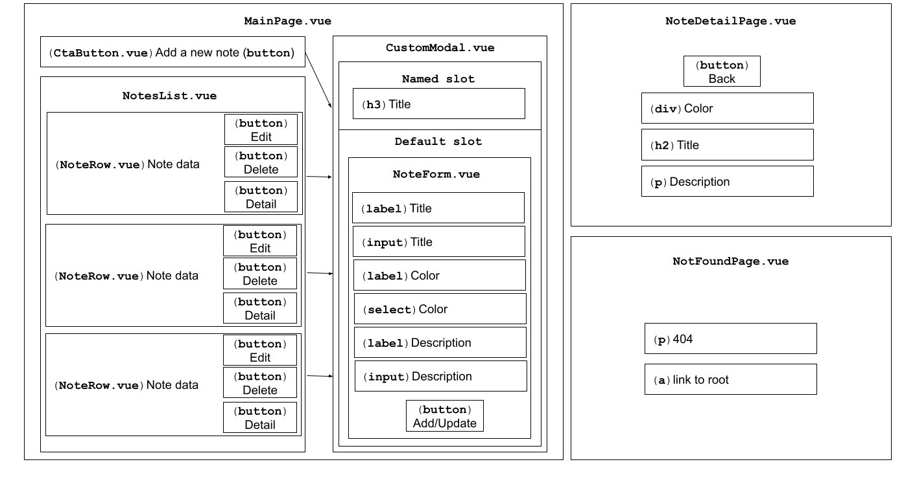

# Vue 3.0 Workshop (Options API, VueRouter, Vuex, TypeScript)

In this workshop, we are going to create a simple Vue 3.0 application that is going to demonstrate the core concepts of using this framework.

## Stack used in this project

- Vue ^3.0 - [https://v3.vuejs.org](https://v3.vuejs.org/)
- Vue Router ^4.0.0 - [https://next.router.vuejs.org](https://next.router.vuejs.org)
- Vuex ^4.0.0 - [https://next.vuex.vuejs.org](https://next.vuex.vuejs.org)
- Snowpack ^3.0.0 - [https://www.snowpack.dev](https://www.snowpack.dev)
- TypeScript ^4.0.0 - [https://www.typescriptlang.org](https://www.typescriptlang.org)
- Tailwind - ^2.0.0 - [https://tailwindcss.com](https://tailwindcss.com)
- PostCSS - ^8.2.0 - [https://postcss.org](https://postcss.org)
- Deno.land - [https://deno.land](https://deno.land)

## Overview of the backend

For the backend, we are going to reuse the deno project we created earlier - [Deno Notes App](https://github.com/radektomasek/frontend-community-workshops-archive/tree/main/deno-v1-intro).

The API has a very simple interface which allows us to do a very simple note management (create, edit, update and delete a note).

There are the following REST methods available to be used:

```HTTP
GET /notes -> returns a list of all notes.
GET /notes/:id -> returns a specific note.
POST /notes -> creates a new note.
PUT /notes/:id -> allows editing a specific note.
DELETE /notes/:id -> removes a specific note.
```

## Overview of the frontend components

A visual (high-level) representation of the component composition is shown in the diagram below.



## Initializing a new project

For this project, we are going to use `Snowpack` with its `TypeScript` template. In your terminal, please type the following command:

```bash
npx create-snowpack-app vue-notes-app --template @snowpack/app-template-vue-typescript
```

This would initialize the project and add typescript support.

> For components, we can use various techniques how how to define one (`.vue`, `.tsx`, `.jsx` files). I will stick with the standard `.vue` option.

### Installing dependencies

We also need to install several external packages. After the project is initialized, let's go to the project directory (`cd vue-notes-app`) and install the following dependencies.

```bash
# Vuex & Vue Router
npm install vuex@4.0.0 vue-router@4.0.3 --save
```

[Tailwind](https://tailwindcss.com) and [PostCSS](https://postcss.org) will be configured and used in the same way as we did in the [Svelte Shopping Cart Tutorial](https://github.com/ovotech/co_frontend/tree/master/svelte-shopping-cart).

Let's install these dependencies first.

```bash
# install tailwind, postcss and autoprefixer, @snowpack/plugin-postcss and cssnano@latest
npm install -D tailwindcss@2.0.2 postcss@8.2.4 autoprefixer@10.2.4 @snowpack/plugin-postcss@1.1.0 cssnano@4.1.10
```

### Creating/Updating config files.

In this subsection, we are going to configure our CSS tooling.

The process is very simple and mirrors the one described [in the previous workshop](https://github.com/ovotech/co_frontend/tree/master/svelte-shopping-cart#creatingupdating-config-files).

The first step is to initialize a tailwind config. Let's do it typing the following command in your terminal:

```bash
npx tailwindcss init -p
```

This would create two files: `tailwind.config.js` and `postcss.config.js` files which will contain the following code:

```javascript
// tailwind.config.js
module.exports = {
  purge: [],
  darkMode: false, // or 'media' or 'class'
  theme: {
    extend: {},
  },
  variants: {
    extend: {},
  },
  plugins: [],
};
```

```javascript
// postcss.config.js
module.exports = {
  plugins: {
    tailwindcss: {},
    autoprefixer: {},
  },
};
```

In the `tailwind.config.js`, we can configure the **purge** option. This allows us to automatically remove unused styles in production.

```diff
--- a/tailwind.config.js
+++ b/tailwind.config.js
// tailwind.config.js
module.exports = {
- purge: [],
+ purge: ['./index.html', './src/**/*.{vue,js,ts,jsx,tsx}'],
  darkMode: false, // or 'media' or 'class'
  theme: {
    extend: {},
  },
  variants: {
    extend: {},
  },
  plugins: [],
}
```

The final version of the `tailwind.config.js` will look as the following:

```javascript
// tailwind.config.js
module.exports = {
  purge: ['./index.html', './src/**/*.{vue,js,ts,jsx,tsx}'],
  darkMode: false, // or 'media' or 'class'
  theme: {
    extend: {},
  },
  variants: {
    extend: {},
  },
  plugins: [],
};
```

Another change is going to happen in `postcss.config.js` where we are going to replace the original config with the following update.

```diff
--- a/postcss.config.js
+++ b/postcss.config.js
// postcss.config.js
+const tailwind = require('tailwindcss');
+const autoprefixer = require('autoprefixer');
+const cssnano = require('cssnano');
+
+const plugins =
+  process.env.NODE_ENV === 'production'
+    ? [tailwind, autoprefixer, cssnano]
+    : [tailwind, autoprefixer];
+
-module.exports = {
-  plugins: {
-    tailwindcss: {},
-    autoprefixer: {},
-  },
-}
+module.exports = { plugins };
```

And the final version of the `postcss.config.js` file will look as the following:

```javascript
// postcss.config.js
const tailwind = require('tailwindcss');
const autoprefixer = require('autoprefixer');
const cssnano = require('cssnano');

const plugins =
  process.env.NODE_ENV === 'production'
    ? [tailwind, autoprefixer, cssnano]
    : [tailwind, autoprefixer];

module.exports = { plugins };
```

We also need to tweak the `snowpack.config.js` and utilize the `@snowpack/plugin-postcss`.

Because we are also planning to use `VueRouter`, we can make another small tweak now which help us to fallback our routes to our static page.

To do that, just **uncomment** the pre-prepared element in the `routes` array.

```diff
--- a/snowpack.config.js
+++ b/snowpack.config.js
// snowpack.config.js
/** @type {import("snowpack").SnowpackUserConfig } */
module.exports = {
  mount: {
    public: {url: '/', static: true},
    src: {url: '/dist'},
  },
  plugins: [
    '@snowpack/plugin-vue',
    '@snowpack/plugin-vue/plugin-tsx-jsx.js',
    '@snowpack/plugin-dotenv',
+   '@snowpack/plugin-postcss'
  ],
  routes: [
    /* Enable an SPA Fallback in development: */
-   // {"match": "routes", "src": ".*", "dest": "/index.html"},
+   {"match": "routes", "src": ".*", "dest": "/index.html"},
  ],
  optimize: {
    /* Example: Bundle your final build: */
    // "bundle": true,
  },
  packageOptions: {
    /* ... */
  },
  devOptions: {
    /* ... */
  },
  buildOptions: {
    /* ... */
  },
};
```

The updated file will look as the following:

```javascript
// snowpack.config.js
/** @type {import("snowpack").SnowpackUserConfig } */
module.exports = {
  mount: {
    public: {url: '/', static: true},
    src: {url: '/dist'},
  },
  plugins: [
    '@snowpack/plugin-vue',
    '@snowpack/plugin-vue/plugin-tsx-jsx.js',
    '@snowpack/plugin-dotenv',
    '@snowpack/plugin-postcss'
  ],
  routes: [
    /* Enable an SPA Fallback in development: */
    {"match": "routes", "src": ".*", "dest": "/index.html"},
  ],
  optimize: {
    /* Example: Bundle your final build: */
    // "bundle": true,
  },
  packageOptions: {
    /* ... */
  },
  devOptions: {
    /* ... */
  },
  buildOptions: {
    /* ... */
  },
};
```

Now it is time to include `tailwind` in the main css. Let's create a file calle `base.css` and put it to `src/components` with the following content.

```css
/* src/base.css */
@tailwind base;
@tailwind components;
@tailwind utilities;
```

### Tighten things up

As the last step, we need to include the template in the `src/main.js` which would allow us to use tailwind's capabilities globally.

The initial `src/index.js` should like as the following snippet below.

```javascript
// src/index.js
import { createApp } from 'vue';
import App from './App.vue';

const app = createApp(App);
app.mount('#app');

// Hot Module Replacement (HMR) - Remove this snippet to remove HMR.
// Learn more: https://www.snowpack.dev/concepts/hot-module-replacement
if (import.meta.hot) {
  import.meta.hot.accept();
  import.meta.hot.dispose(() => {
    app.unmount();
  });
}
```

Let's add the style into the flow.

```diff
+++ a/index.js
// src/index.js
import { createApp } from "vue";
import App from "./App.vue";
+import './base.css'

const app = createApp(App);
app.mount("#app");

// Hot Module Replacement (HMR) - Remove this snippet to remove HMR.
// Learn more: https://www.snowpack.dev/concepts/hot-module-replacement
if (import.meta.hot) {
  import.meta.hot.accept();
  import.meta.hot.dispose(() => {
    app.unmount();
  });
}
```

And this one should be your updated version of the code.

```javascript
// src/index.js
import { createApp } from 'vue';
import App from './App.vue';
import './base.css';

const app = createApp(App);
app.mount('#app');

// Hot Module Replacement (HMR) - Remove this snippet to remove HMR.
// Learn more: https://www.snowpack.dev/concepts/hot-module-replacement
if (import.meta.hot) {
  import.meta.hot.accept();
  import.meta.hot.dispose(() => {
    app.unmount();
  });
}
```

And the initial configuration is done (we will setup [Vuex](https://next.vuex.vuejs.org/) and [VueRouter](https://next.router.vuejs.org/) a bit later).

### Updating our markup

Let's update the content of `src/App.vue` as the following:

```html
<!-- src/App.vue -->
<template>
  <h1 class="p-4 m-4 bg-green-600">Hello World</h1>
</template>
```

### Cleaning unused components

In the `src/components` your can find a lot of examples how we can use components in Vue and TypeScript.

> It is worth mentioning, they are using `Composition API`. This is something we are going to cover in greater details during the following workshop.

For now (to avoid any confusion), let's clean the components folder by removing every file there. We are going to start from scratch.

```bash
rm src/components/*
```

### Creating new folders

We will also need a few extra folders in our `src` directory. Apart from `components` that had already been created, let's add these new folders to the **src** directory: `api`, `mocks`, `pages`, `types`, `widgets`, `stores` and `routes`.

In the command line, simply type (whilst you are in project's root dir):

```bash
mkdir -p src/{api,mocks,pages,types,widgets,stores,routes}
```

And it would do the job for you.

### Running the app

Go back to root directory of your project and let's run the app by typing:

```bash
npm run start
```

And you should see a beautiful `Hello World` title styled in Vue colors.

## Creating initial files

Before we start getting deeper on our Vue 3.0 journey. let's save some time and bootstrap our project a bit by creating important helpers and initial components in advance.

I will document these properly here, however, won't mention them too deeply during our workshop.

### Project structure

Here is a little description of each folder available within our `src` folder.

- **api** - HTTP helpers, securing communication with our [Deno backend](https://github.com/ovotech/co_frontend/tree/master/deno-notes-app).
- **components** - Vue components used across the project.
- **mocks** - Fake data, used initially as a show something quickly solution.
- **pages** - Vue components connected to Vue Router directly.
- **types** - Custom type definitions.
- **widgets** - Vue components mounted globally.
- **stores** - Vuex stores.
- **routes** - VueRouter definitions.

### src/types/index.ts

Let's implement the types definition first by adding an `index.ts` file to `src/types` directory with the following code:

```typescript
// src/types/index.ts
export type NoteColor = 'red' | 'green' | 'yellow' | '';

export interface Note {
  id: string;
  title: string;
  description: string;
  color: NoteColor;
}
```

### src/mocks/index.ts

Another very straightforward implementation is a mock file which is just a copy & paste from our [svelte project](https://github.com/ovotech/co_frontend/blob/master/svelte-notes-app/src/utils/mocks.js).

```typescript
// src/mocks/index.ts
import type { Note } from '../types';

export const generateRandomString = () =>
  Math.random().toString(36).substring(7);

export const mockNotes: Note[] = [
  {
    id: generateRandomString(),
    title: 'My first note',
    description: 'This is a description of the first note',
    color: 'green',
  },
  {
    id: generateRandomString(),
    title: 'Second note',
    description: 'This is a description of the second note',
    color: 'red',
  },
  {
    id: generateRandomString(),
    title: 'Third note',
    description: 'This is a description of the third note',
    color: 'yellow',
  },
];
```

### src/api/index.ts

Later in this project we are going to make some HTTP calls. It makes a sense to pre-prepare some functions which would handle the actual logic.

```typescript
// src/api/index.ts
import type { Note } from '../types';

const BASE_URL = 'http://localhost:8000';

export const getNotes = async (): Promise<Note[]> =>
  fetch(`${BASE_URL}/notes`).then((response) =>
    response.json()
  );

export const getNoteById = async (
  noteId: string
): Promise<Note> =>
  fetch(`${BASE_URL}/notes/${noteId}`).then((response) =>
    response.json()
  );

export const addNote = async (note: Note): Promise<Note> =>
  fetch(`${BASE_URL}/notes`, {
    method: 'POST',
    headers: { 'Content-Type': 'application/json' },
    body: JSON.stringify(note),
  }).then((response) => response.json());

export const updateNote = async (
  note: Note
): Promise<Note> =>
  fetch(`${BASE_URL}/notes/${note.id}`, {
    method: 'PUT',
    headers: { 'Content-Type': 'application/json' },
    body: JSON.stringify(note),
  }).then((response) => response.json());

export const removeNote = async (
  id: string
): Promise<boolean> =>
  fetch(`${BASE_URL}/notes/${id}`, {
    method: 'DELETE',
    headers: { 'Content-Type': 'application/json' },
  }).then((response) => response.json());
```

### src/components/NoteForm.vue

This is going to be our first Vue component. I generally assume you had got some basic familiarity with Vue 3.0 core concepts (e.g from previous session - [Introduction to Vue 3](https://drive.google.com/file/d/1BUgdRxeEZFd1jqrzuos8IRl-74LGJtco/view?usp=sharing)), but if not, don't worry. We will talk about the basics in this component later on.

```html
<!-- src/components/NoteForm.vue -->
<template>
  <form class="form bg-white p-6 my-10 relative">
    <!-- <h3 class="text-2xl text-gray-900 font-semibold">
      Add a new note
    </h3> -->
    <div class="flex space-x-5 mt-3">
      <input
        type="text"
        name="title"
        id="title"
        placeholder="Title"
        class="border p-2 w-1/2"
      />
      <select
        class="w-1/2 border bg-white rounded px-3 py-2 outline-none"
      >
        <option value="" disabled>Select color</option>
        <option value="green">Green</option>
        <option value="red">Red</option>
        <option value="yellow">Yellow</option>
      </select>
    </div>
    <textarea
      name="description"
      id="description"
      cols="10"
      rows="3"
      placeholder="Describe your idea in more details."
      class="border p-2 mt-3 w-full"
    ></textarea>

    <input
      type="submit"
      value="Submit"
      class="w-full mt-6 bg-blue-600 hover:bg-blue-500 text-white font-semibold p-3"
    />
  </form>
</template>
```

### src/components/NoteRow.vue

This component will contain a basic Vue implementation. In the next section, we are going to extend it and most importantly - migrate to TypeScript.

```html
<!-- src/components/NoteRow.vue -->
<template>
  <tr class="hover:bg-grey-lighter">
    <td class="py-4 px-6 border-b border-grey-light">
      {{ note.title }}
    </td>
    <td class="py-4 px-6 border-b border-grey-light">
      <span
        class="rounded py-1 px-3 text-xs font-bold"
        :class="{
          'bg-yellow-400': isYellow,
          'bg-red-400': isRed,
          'bg-green-400': isGreen,
        }"
        >{{ note.color }}</span
      >
    </td>
    <td class="py-4 px-6 border-b border-grey-light">
      <div class="flex justify-between items-center px-3">
        <button
          @click="handleNoteEdit(note.id)"
          class="text-blue-400 hover:text-blue-600 underline"
        >
          Edit
        </button>
        <button
          @click="handleNoteRemove(note.id)"
          class="text-blue-400 hover:text-blue-600 underline"
        >
          Remove
        </button>
        <button
          @click="handleNoteDetail(note.id)"
          class="text-blue-400 hover:text-blue-600 underline"
        >
          Detail
        </button>
      </div>
    </td>
  </tr>
</template>

<script>
  export default {
    props: ['note'],
    emits: ['onNoteEdit', 'onNoteRemove', 'onNoteDetail'],
    methods: {
      handleNoteEdit(id) {
        this.$emit('onNoteEdit', id);
      },
      handleNoteRemove(id) {
        this.$emit('onNoteRemove', id);
      },
      handleNoteDetail(id) {
        this.$emit('onNoteDetail', id);
      },
    },
    computed: {
      isGreen() {
        return this.note.color === 'green';
      },
      isRed() {
        return this.note.color === 'red';
      },
      isYellow() {
        return this.note.color === 'yellow';
      },
    },
  };
</script>
```

### src/components/NotesList.vue

This component will import our previously created `NoteRow.vue` and use it locally. But other than that, the initial implementation is very straightforward.

```html
<!-- src/components/NotesList.vue -->
<template>
  <div class="w-11/12 md:w-4/5 lg:w-1/2 mx-auto">
    <div class="bg-white shadow-md rounded my-6">
      <table class="text-left w-full border-collapse">
        <thead>
          <tr>
            <th
              class="py-4 px-6 bg-grey-lightest font-bold uppercase text-sm text-grey-dark border-b border-grey-light"
            >
              Title
            </th>
            <th
              class="py-4 px-6 bg-grey-lightest font-bold uppercase text-sm text-grey-dark border-b border-grey-light"
            >
              Color
            </th>
            <th
              class="py-4 px-6 bg-grey-lightest font-bold uppercase text-sm text-grey-dark border-b border-grey-light"
            >
              Actions
            </th>
          </tr>
        </thead>
        <tbody>
          <!-- <NoteRow /> -->
        </tbody>
      </table>
    </div>
  </div>
</template>

<script>
  import NoteRow from './NoteRow.vue';

  export default {
    components: {
      NoteRow,
    },
    props: ['notes'],
    emits: ['onNoteEdit', 'onNoteRemove', 'onNoteDetail'],
    methods: {
      handleNoteEdit(id) {
        this.$emit('onNoteEdit', id);
      },
      handleNoteRemove(id) {
        this.$emit('onNoteRemove', id);
      },
      handleNoteDetail(id) {
        this.$emit('onNoteDetail', id);
      },
    },
  };
</script>
```

### src/widgets/CtaButton.vue

This is going to be our global component. A button used on the main page.

```html
<!-- src/widgets/CtaButton.vue -->
<template>
  <section
    class="flex h-20 p-20 justify-center items-start"
  >
    <button
      id="btn"
      class="py-3 px-10 bg-gray-800 text-white rounded text shadow-xl"
      @click="handleClick"
    >
      {{ title }}
    </button>
  </section>
</template>

<script>
  export default {
    props: ['title'],
    emits: ['openModal'],
    methods: {
      handleClick() {
        this.$emit('openModal');
      },
    },
  };
</script>
```

### src/widgets/CustomModal.vue

Another important component is our modal one, which is going to be the second global component.

It will be used as a wrapper of other components (using **slots**). We are also use some dynamic styling (`:style`).

```html
<!-- src/widgets/CustomModal.vue -->
<template>
  <div
    class="main-modal fixed w-full h-100 inset-0 z-50 overflow-hidden justify-center items-center animated fadeIn faster"
    :style="{
      display: canShowModal ? 'flex' : 'none',
      background: canShowModal
        ? 'rgba(0, 0, 0, 0.7)'
        : 'transparent',
    }"
  >
    <div
      class="border border-teal-500 shadow-lg modal-container bg-white w-11/12 md:max-w-md mx-auto rounded shadow-lg z-50 overflow-y-auto"
    >
      <div class="modal-content py-4 text-left px-6">
        <!--Title-->
        <div class="flex justify-between items-center pb-3">
          <slot name="header">
            <h3 class="text-2xl font-bold">Default Header</h3>
          </slot>
          <button @click="closeModal">
            <div class="modal-close cursor-pointer z-50">
              <svg
                class="fill-current text-black"
                xmlns="http://www.w3.org/2000/svg"
                width="18"
                height="18"
                viewBox="0 0 18 18"
              >
                <path
                  d="M14.53 4.53l-1.06-1.06L9 7.94 4.53 3.47 3.47 4.53 7.94 9l-4.47 4.47 1.06 1.06L9 10.06l4.47 4.47 1.06-1.06L10.06 9z"
                ></path>
              </svg>
            </div>
          </button>
        </div>
        <!--Body-->
        <slot>
          <div class="my-5">
            <p>This is a default body of the modal</p>
          </div>
        </slot>
      </div>
    </div>
  </div>
</template>

<script>
  export default {
    props: ['canShowModal'],
    emits: ['closeModal'],
    methods: {
      closeModal() {
        this.$emit('closeModal');
      },
    },
  };
</script>

<style>
  .animated {
    -webkit-animation-duration: 1s;
    animation-duration: 1s;
    -webkit-animation-fill-mode: both;
    animation-fill-mode: both;
  }

  .animated.faster {
    -webkit-animation-duration: 500ms;
    animation-duration: 500ms;
  }

  .fadeIn {
    -webkit-animation-name: fadeIn;
    animation-name: fadeIn;
  }

  .fadeOut {
    -webkit-animation-name: fadeOut;
    animation-name: fadeOut;
  }

  @keyframes fadeIn {
    from {
      opacity: 0;
    }

    to {
      opacity: 1;
    }
  }

  @keyframes fadeOut {
    from {
      opacity: 1;
    }

    to {
      opacity: 0;
    }
  }
</style>
```

### Registering global components

Because `CustomModal` and `CtaButton` are tend to be used as global components, we need to register them as such.

In `src/index.js`, let's add a few lines of code to do it.

```diff
+++ a/index.js
// src/index.js
import { createApp } from "vue";
import App from "./App.vue";
+import CtaButton from './widgets/CtaButton.vue';
+import CustomModal from './widgets/CustomModal.vue';
import './base.css'

const app = createApp(App);
+app.component('CtaButton', CtaButton);
+app.component('CustomModal', CustomModal);
app.mount("#app");

// Hot Module Replacement (HMR) - Remove this snippet to remove HMR.
// Learn more: https://www.snowpack.dev/concepts/hot-module-replacement
if (import.meta.hot) {
  import.meta.hot.accept();
  import.meta.hot.dispose(() => {
    app.unmount();
  });
}
```

So, the latest snapshot of the file will look as the following:

```javascript
// src/index.js
import { createApp } from 'vue';
import App from './App.vue';
import CtaButton from './widgets/CtaButton.vue';
import CustomModal from './widgets/CustomModal.vue';
import './base.css';

const app = createApp(App);
app.component('CtaButton', CtaButton);
app.component('CustomModal', CustomModal);
app.mount('#app');

// Hot Module Replacement (HMR) - Remove this snippet to remove HMR.
// Learn more: https://www.snowpack.dev/concepts/hot-module-replacement
if (import.meta.hot) {
  import.meta.hot.accept();
  import.meta.hot.dispose(() => {
    app.unmount();
  });
}
```

### src/pages/NoteDetailPage.vue

This component will be use later for displaying the detail of a note. It also contains placeholders for our lifecycle hooks (mostly for reference purposes).

```html
<!-- src/pages/NoteDetailPage.vue -->
<template>
  <div class="container h-screen m-auto">
    <!-- <div class="container h-screen m-auto">
      <h2 class="text-center text-3xl m-8">Note not found</h2>
      <p class="text-center m-8">
        <a
          href="#"
          class="text-blue-400 hover:text-blue-600 underline"
          >Back to the list</a
        >
      </p>
    </div> -->
    <h2 class="text-center text-3xl m-8">Note Detail</h2>
    <p class="text-center m-8">
      <a
        href="#"
        class="text-blue-400 hover:text-blue-600 underline"
        >Back to the list</a
      >
    </p>
    <div class="mx-auto max-w-md w-full lg:flex">
      <div
        class="bg-red-400 h-10 w-full lg:h-auto lg:w-28 flex-none bg-cover rounded lg:rounded-l text-center"
      ></div>
      <div
        class="border-r border-b border-l border-grey-light lg:border-l-0 lg:border-t lg:border-grey-light bg-white rounded-b lg:rounded-b-none lg:rounded-r p-4 flex flex-col justify-between leading-normal"
      >
        <div class="mb-3">
          <div class="text-black font-bold text-xl mb-2">
            Note title
          </div>
          <p class="text-grey-darker text-base">
            Lorem ipsum dolor sit amet consectetur
            adipisicing elit. Officia unde alias fugit
            excepturi accusantium rerum, rem ipsam atque
            placeat, voluptas velit libero molestiae, id
            nulla ut tenetur quas dolor incidunt.
          </p>
        </div>
      </div>
    </div>
  </div>
</template>

<script>
  export default {
    beforeCreate() {
      console.log('beforeCreate lifecycle hook');
    },
    created() {
      console.log('created lifecycle hook');
    },
    beforeMount() {
      console.log('beforeMount lifecycle hook');
    },
    mounted() {
      console.log('mounted lifecycle hook');
    },
    beforeUpdate() {
      console.log('beforeUpdate lifecycle hook');
    },
    updated() {
      console.log('updated lifecycle hook');
    },
    beforeUnmount() {
      console.log('beforeUnmount lifecycle hook');
    },
    unmounted() {
      console.log('unmounted lifecycle hook');
    },
  };
</script>
```

### src/pages/NotFoundPage.vue

This page will be used as a default redirect for routes which are not matching our routing definition (the definition will be added later).

```html
<!-- src/pages/NotFoundPage.vue -->
<template>
  <div
    class="h-screen w-screen bg-green-600 flex justify-center content-center flex-wrap"
  >
    <p class="font-sans text-white error-text">404</p>
  </div>

  <div
    class="absolute w-screen bottom-0 mb-6 text-white text-center font-sans text-xl"
  >
    <span class="opacity-50">Take me back to </span>
    <a class="border-b" href="#">homepage</a>
  </div>
</template>

<style>
  * {
    font-family: 'Helvetica Neue', Helvetica, Arial,
      Sans-Serif;
  }

  .error-text {
    font-size: 130px;
  }

  @media (min-width: 768px) {
    .error-text {
      font-size: 220px;
    }
  }
</style>
```

### src/pages/MainPage.vue

This is going to be one of our main component associated with the main route. It has already contained some initial logic.

```html
<!-- src/pages/MainPage.vue -->
<template>
  <CustomModal
    @closeModal="closeModal"
    :canShowModal="showModal"
  >
    <NoteForm
      :note="selectedNote"
      @noteData="onSubmitData"
    />
  </CustomModal>
  <CtaButton
    :title="addNoteButtonTitle"
    @openModal="openModal"
  />
  <NotesList
    :notes="notes"
    @onNoteEdit="handleNoteEdit"
    @onNoteRemove="handleNoteRemove"
    @onNoteDetail="handleNoteDetail"
  />
</template>

<script>
  import NotesList from '../components/NotesList.vue';
  import NoteForm from '../components/NoteForm.vue';
  import { mockNotes } from '../mocks';

  export default {
    components: {
      NotesList,
      NoteForm,
    },
    data() {
      return {
        showModal: false,
        addNoteButtonTitle: 'Add new note',
        notes: [...mockNotes],
        selectedNote: null,
      };
    },
    methods: {
      openModal() {
        this.showModal = true;
      },
      closeModal() {
        this.showModal = false;
      },
      handleNoteEdit(id) {
        console.log('clicked on edit button with id: ', id);
        this.openModal();
      },
      handleNoteRemove(id) {
        console.log(
          'clicked on remove button with id: ',
          id
        );
      },
      handleNoteDetail(id) {
        console.log(
          'clicked on detail button with id: ',
          id
        );
      },
      onSubmitData(payload, isEditing) {
        console.log(
          'clicked on submit button with data: ',
          payload,
          isEditing
        );
        this.closeModal();
      },
    },
  };
</script>
```

### src/App.vue

This component is the main one. It will contain our routing which we are going to add very soon. For now, it will just include our `<MainPage />` component.

```diff
--- a/App.vue
+++ b/App.vue
<!-- src/App.vue -->
<template>
- <h1 class="p-4 m-4 bg-green-600">Hello World</h1>
+ <MainPage />
</template>

<script>
import MainPage from './pages/MainPage.vue';

export default {
  components: {
    MainPage,
  },
};
</script>
```

So the final component will looks as the following:

```html
<!-- src/App.vue -->
<template>
  <MainPage />
</template>

<script>
  import MainPage from './pages/MainPage.vue';

  export default {
    components: {
      MainPage,
    },
  };
</script>
```

And the initial implementation should be completed (although it wouldn't work properly at this stage). But we are going to fix it.


## Applying TypeScript and completing the initial functionality.

As we have the basics components in place, it's time to complete the basic functionality and convert JavaScript code into a TypeScript one.

### src/components/NoteForm.vue

Let's demonstrate all important Vue concepts on this component first.

> The other ones will have some basic Vue implementation in place and we will just focus on their conversion into TypeScript.

Let's add basic Vue implementation first

```diff
--- a/NoteForm.vue
+++ b/NoteForm.vue
<!-- src/components/NoteForm.vue -->
<template>
- <form class="form bg-white p-6 my-10 relative">
+ <form @submit.prevent="handleSubmit" class="form bg-white p-6 my-10 relative">
    <!-- <h3 class="text-2xl text-gray-900 font-semibold">
      Add a new note
    </h3> -->
    <div class="flex space-x-5 mt-3">
      <input
        type="text"
        name="title"
        id="title"
        placeholder="Title"
        class="border p-2 w-1/2"
+       v-model.trim="title"
      />
      <select
        class="w-1/2 border bg-white rounded px-3 py-2 outline-none"
+       v-model="color"
      >
        <option value="" disabled>Select color</option>
        <option value="green">Green</option>
        <option value="red">Red</option>
        <option value="yellow">Yellow</option>
      </select>
    </div>
    <textarea
      name="description"
      id="description"
      cols="10"
      rows="3"
      placeholder="Describe your idea in more details."
      class="border p-2 mt-3 w-full"
+     v-model="description"
    ></textarea>

    <input
      type="submit"
      value="Submit"
      class="w-full mt-6 bg-blue-600 hover:bg-blue-500 text-white font-semibold p-3"
    />
  </form>
</template>
+
+<script>
+import { generateRandomString } from '../mocks';
+
+export default {
+  props: {
+    note: {
+      type: Object,
+      required: false,
+    },
+  },
+  data() {
+    return {
+      id: this.note?.id || '',
+      title: this.note?.title || '',
+      color: this.note?.color || '',
+      description: this.note?.description || '',
+    };
+  },
+  emits: ['noteData'],
+  methods: {
+    handleSubmit() {
+      const payload = {
+        title: this.title,
+        color: this.color,
+        description: this.description,
+      };
+
+      if (!this.id) {
+        this.$emit(
+          'noteData',
+          { id: generateRandomString(), ...payload },
+          false
+        );
+      } else {
+        this.$emit(
+          'noteData',
+          { id: this.id, ...payload },
+          true
+        );
+      }
+
+      this.id = '';
+      this.title = '';
+      this.color = '';
+      this.description = '';
+    },
+  },
+};
+</script>
```

The example above is fine, but could do better. We can convert the code into TypeScript.

```diff
--- a/NoteForm.vue
+++ b/NoteForm.vue
<!-- src/components/NoteForm.vue -->
<template>
  <form
    @submit.prevent="handleSubmit"
    class="form bg-white p-6 my-10 relative"
  >
    <!-- <h3 class="text-2xl text-gray-900 font-semibold">
      Add a new note
    </h3> -->
    <div class="flex space-x-5 mt-3">
      <input
        type="text"
        name="title"
        id="title"
        placeholder="Title"
        class="border p-2 w-1/2"
        v-model.trim="title"
      />
      <select
        class="w-1/2 border bg-white rounded px-3 py-2 outline-none"
        v-model="color"
      >
        <option value="" disabled>Select color</option>
        <option value="green">Green</option>
        <option value="red">Red</option>
        <option value="yellow">Yellow</option>
      </select>
    </div>
    <textarea
      name="description"
      id="description"
      cols="10"
      rows="3"
      placeholder="Describe your idea in more details."
      class="border p-2 mt-3 w-full"
      v-model="description"
    ></textarea>

    <input
      type="submit"
      value="Submit"
      class="w-full mt-6 bg-blue-600 hover:bg-blue-500 text-white font-semibold p-3"
    />
  </form>
</template>

-<script>
+<script lang="ts">
import { generateRandomString } from '../mocks';
+import { defineComponent, PropType } from 'vue';
+import type { Note } from '../types';

- export default {
+ export default defineComponent({
  props: {
    note: {
-     type: Object,
+     type: Object as PropType<Note | null>,
      required: false,
    },
  },
- data() {
+ data(): Note {
    return {
      id: this.note?.id || '',
      title: this.note?.title || '',
      color: this.note?.color || '',
      description: this.note?.description || '',
    };
  },
- emits: ['noteData'],
+ emits: {
+   noteData(payload: Note, isEditing: boolean) {
+     return true;
+   },
+ },
  methods: {
-   handleSubmit() {
+   handleSubmit(): void {
      const payload = {
        title: this.title,
        color: this.color,
        description: this.description,
      };

      if (!this.id) {
        this.$emit(
          'noteData',
          { id: generateRandomString(), ...payload },
          false
        );
      } else {
        this.$emit(
          'noteData',
          { id: this.id, ...payload },
          true
        );
      }

      this.id = '';
      this.title = '';
      this.color = '';
      this.description = '';
    },
  },
-}
+});
</script>
```

The latest state of the `NoteForm.vue` will look like as the following:

```html
<!-- src/components/NoteForm.vue -->
<template>
  <form
    @submit.prevent="handleSubmit"
    class="form bg-white p-6 my-10 relative"
  >
    <!-- <h3 class="text-2xl text-gray-900 font-semibold">
      Add a new note
    </h3> -->
    <div class="flex space-x-5 mt-3">
      <input
        type="text"
        name="title"
        id="title"
        placeholder="Title"
        class="border p-2 w-1/2"
        v-model.trim="title"
      />
      <select
        class="w-1/2 border bg-white rounded px-3 py-2 outline-none"
        v-model="color"
      >
        <option value="" disabled>Select color</option>
        <option value="green">Green</option>
        <option value="red">Red</option>
        <option value="yellow">Yellow</option>
      </select>
    </div>
    <textarea
      name="description"
      id="description"
      cols="10"
      rows="3"
      placeholder="Describe your idea in more details."
      class="border p-2 mt-3 w-full"
      v-model="description"
    ></textarea>

    <input
      type="submit"
      value="Submit"
      class="w-full mt-6 bg-blue-600 hover:bg-blue-500 text-white font-semibold p-3"
    />
  </form>
</template>

<script lang="ts">
  import { generateRandomString } from '../mocks';
  import { defineComponent, PropType } from 'vue';
  import type { Note } from '../types';

  export default defineComponent({
    props: {
      note: {
        type: Object as PropType<Note | null>,
        required: false,
      },
    },
    data(): Note {
      return {
        id: this.note?.id || '',
        title: this.note?.title || '',
        color: this.note?.color || '',
        description: this.note?.description || '',
      };
    },
    emits: {
      noteData(payload: Note, isEditing: boolean) {
        return true;
      },
    },
    methods: {
      handleSubmit(): void {
        const payload = {
          title: this.title,
          color: this.color,
          description: this.description,
        };

        if (!this.id) {
          this.$emit(
            'noteData',
            { id: generateRandomString(), ...payload },
            false
          );
        } else {
          this.$emit(
            'noteData',
            { id: this.id, ...payload },
            true
          );
        }

        this.id = '';
        this.title = '';
        this.color = '';
        this.description = '';
      },
    },
  });
</script>
```

### src/components/NoteRow.vue

This component contains some decent amount of Vue 3.0 logic already. But you will see the conversion into TypeScript is very straightforward.

```diff
--- a/NoteRow.vue
+++ b/NoteRow.vue
<!-- src/components/NoteRow.vue -->
<template>
  <tr class="hover:bg-grey-lighter">
    <td class="py-4 px-6 border-b border-grey-light">
      {{ note.title }}
    </td>
    <td class="py-4 px-6 border-b border-grey-light">
      <span
        class="rounded py-1 px-3 text-xs font-bold"
        :class="{
          'bg-yellow-400': isYellow,
          'bg-red-400': isRed,
          'bg-green-400': isGreen,
        }"
        >{{ note.color }}</span
      >
    </td>
    <td class="py-4 px-6 border-b border-grey-light">
      <div class="flex justify-between items-center px-3">
        <button
          @click="handleNoteEdit(note.id)"
          class="text-blue-400 hover:text-blue-600 underline"
        >
          Edit
        </button>
        <button
          @click="handleNoteRemove(note.id)"
          class="text-blue-400 hover:text-blue-600 underline"
        >
          Remove
        </button>
        <button
          @click="handleNoteDetail(note.id)"
          class="text-blue-400 hover:text-blue-600 underline"
        >
          Detail
        </button>
      </div>
    </td>
  </tr>
</template>

-<script>
+<script lang="ts">
+ import { defineComponent, PropType } from 'vue';
+ import type { Note } from '../types';

- export default {
+ export default defineComponent({
-   props: ['note'],
+   props: {
+     note: {
+       type: Object as PropType<Note>,
+       required: true,
+     },
+   },
-   emits: ['onNoteEdit', 'onNoteRemove', 'onNoteDetail'],
+   emits: {
+     onNoteEdit(id: string) {
+       return true;
+     },
+     onNoteRemove(id: string) {
+       return true;
+     },
+     onNoteDetail(id: string) {
+       return true;
+     },
+   },
    methods: {
-     handleNoteEdit(id) {
+     handleNoteEdit(id: string): void {
        this.$emit('onNoteEdit', id);
      },
-     handleNoteRemove(id) {
+     handleNoteRemove(id: string): void {
        this.$emit('onNoteRemove', id);
      },
-     handleNoteDetail(id) {
+     handleNoteDetail(id: string): void {
        this.$emit('onNoteDetail', id);
      },
    },
    computed: {
-     isGreen() {
+     isGreen(): boolean {
        return this.note.color === 'green';
      },
-     isRed() {
+     isRed(): boolean {
        return this.note.color === 'red';
      },
-     isYellow() {
+     isYellow(): boolean {}
        return this.note.color === 'yellow';
      },
    },
-  };
+ });
</script>
```

The latest state of the `NoteRow.vue` looks as the code below:

```html
<!-- src/components/NoteRow.vue -->
<template>
  <tr class="hover:bg-grey-lighter">
    <td class="py-4 px-6 border-b border-grey-light">
      {{ note.title }}
    </td>
    <td class="py-4 px-6 border-b border-grey-light">
      <span
        class="rounded py-1 px-3 text-xs font-bold"
        :class="{
          'bg-yellow-400': isYellow,
          'bg-red-400': isRed,
          'bg-green-400': isGreen,
        }"
        >{{ note.color }}</span
      >
    </td>
    <td class="py-4 px-6 border-b border-grey-light">
      <div class="flex justify-between items-center px-3">
        <button
          @click="handleNoteEdit(note.id)"
          class="text-blue-400 hover:text-blue-600 underline"
        >
          Edit
        </button>
        <button
          @click="handleNoteRemove(note.id)"
          class="text-blue-400 hover:text-blue-600 underline"
        >
          Remove
        </button>
        <button
          @click="handleNoteDetail(note.id)"
          class="text-blue-400 hover:text-blue-600 underline"
        >
          Detail
        </button>
      </div>
    </td>
  </tr>
</template>

<script lang="ts">
  import { defineComponent, PropType } from 'vue';
  import type { Note } from '../types';

  export default defineComponent({
    props: {
      note: {
        type: Object as PropType<Note>,
        required: true,
      },
    },
    emits: {
      onNoteEdit(id: string) {
        return true;
      },
      onNoteRemove(id: string) {
        return true;
      },
      onNoteDetail(id: string) {
        return true;
      },
    },
    methods: {
      handleNoteEdit(id: string): void {
        this.$emit('onNoteEdit', id);
      },
      handleNoteRemove(id: string): void {
        this.$emit('onNoteRemove', id);
      },
      handleNoteDetail(id: string): void {
        this.$emit('onNoteDetail', id);
      },
    },
    computed: {
      isGreen(): boolean {
        return this.note.color === 'green';
      },
      isRed(): boolean {
        return this.note.color === 'red';
      },
      isYellow(): boolean {
        return this.note.color === 'yellow';
      },
    },
  });
</script>
```

### src/components/NotesList.vue

This is another component which needs to be converted into TypeScript. But we also need to incorporate the `NoteRow.vue` which we are going to render in a loop (`v-for`).

```diff
--- a/NoteList.vue
+++ b/NoteList.vue
<!-- src/components/NotesList.vue -->
<template>
  <div class="w-11/12 md:w-4/5 lg:w-1/2 mx-auto">
    <div class="bg-white shadow-md rounded my-6">
      <table class="text-left w-full border-collapse">
        <thead>
          <tr>
            <th
              class="py-4 px-6 bg-grey-lightest font-bold uppercase text-sm text-grey-dark border-b border-grey-light"
            >
              Title
            </th>
            <th
              class="py-4 px-6 bg-grey-lightest font-bold uppercase text-sm text-grey-dark border-b border-grey-light"
            >
              Color
            </th>
            <th
              class="py-4 px-6 bg-grey-lightest font-bold uppercase text-sm text-grey-dark border-b border-grey-light"
            >
              Actions
            </th>
          </tr>
        </thead>
        <tbody>
-          <!-- <NoteRow /> -->
+          <NoteRow
+            v-for="note in notes"
+            :key="note.id"
+            :note="note"
+            @onNoteEdit="handleNoteEdit"
+            @onNoteRemove="handleNoteRemove"
+            @onNoteDetail="handleNoteDetail"
+          />
        </tbody>
      </table>
    </div>
  </div>
</template>

-<script>
+<script lang="ts">
  import NoteRow from './NoteRow.vue';
+ import { defineComponent, PropType } from 'vue';
+ import type { Note } from '../types';

- export default {
+ export default defineComponent({
    components: {
      NoteRow,
    },
-   props: ['notes'],
+   props: {
+     notes: {
+       type: Object as PropType<Note[]>,
+       required: true,
+     },
+   },
-   emits: ['onNoteEdit', 'onNoteRemove', 'onNoteDetail'],
+   emits: {
+     onNoteEdit(id: string): boolean {
+       return true;
+     },
+     onNoteRemove(id: string): boolean {
+       return true;
+     },
+     onNoteDetail(id: string): boolean {
+       return true;
+     },
+   },
    methods: {
-     handleNoteEdit(id) {
+     handleNoteEdit(id: string): void {
        this.$emit('onNoteEdit', id);
      },
-     handleNoteRemove(id) {
+     handleNoteRemove(id: string): void {
        this.$emit('onNoteRemove', id);
      },
-     handleNoteDetail(id) {
+     handleNoteDetail(id: string): void {
        this.$emit('onNoteDetail', id);
      },
    },
- };
+ });
</script>
```

After you incorporate the changes, the component should look like as the following:

```html
<!-- src/components/NotesList.vue -->
<template>
  <div class="w-11/12 md:w-4/5 lg:w-1/2 mx-auto">
    <div class="bg-white shadow-md rounded my-6">
      <table class="text-left w-full border-collapse">
        <thead>
          <tr>
            <th
              class="py-4 px-6 bg-grey-lightest font-bold uppercase text-sm text-grey-dark border-b border-grey-light"
            >
              Title
            </th>
            <th
              class="py-4 px-6 bg-grey-lightest font-bold uppercase text-sm text-grey-dark border-b border-grey-light"
            >
              Color
            </th>
            <th
              class="py-4 px-6 bg-grey-lightest font-bold uppercase text-sm text-grey-dark border-b border-grey-light"
            >
              Actions
            </th>
          </tr>
        </thead>
        <tbody>
          <NoteRow
            v-for="note in notes"
            :key="note.id"
            :note="note"
            @onNoteEdit="handleNoteEdit"
            @onNoteRemove="handleNoteRemove"
            @onNoteDetail="handleNoteDetail"
          />
        </tbody>
      </table>
    </div>
  </div>
</template>

<script lang="ts">
  import NoteRow from './NoteRow.vue';
  import { defineComponent, PropType } from 'vue';
  import type { Note } from '../types';

  export default defineComponent({
    components: {
      NoteRow,
    },
    props: {
      notes: {
        type: Object as PropType<Note[]>,
        required: true,
      },
    },
    emits: {
      onNoteEdit(id: string): boolean {
        return true;
      },
      onNoteRemove(id: string): boolean {
        return true;
      },
      onNoteDetail(id: string): boolean {
        return true;
      },
    },
    methods: {
      handleNoteEdit(id: string): void {
        this.$emit('onNoteEdit', id);
      },
      handleNoteRemove(id: string): void {
        this.$emit('onNoteRemove', id);
      },
      handleNoteDetail(id: string): void {
        this.$emit('onNoteDetail', id);
      },
    },
  });
</script>
```

### src/widgets/CtaButton.vue

Let's make another TypeScript conversion, at this time in our first global component.

```diff
--- a/CtaButton.vue
+++ b/CtaButton.vue
<!-- src/widgets/CtaButton.vue -->
<template>
  <section
    class="flex h-20 p-20 justify-center items-start"
  >
    <button
      id="btn"
      class="py-3 px-10 bg-gray-800 text-white rounded text shadow-xl"
      @click="handleClick"
    >
      {{ title }}
    </button>
  </section>
</template>

-<script>
+<script lang="ts">
+ import { defineComponent, PropType } from 'vue';
- export default {
+ export default defineComponent({
-   props: ['title'],
+   props: {
+     title: {
+       type: String as PropType<string>,
+       required: true,
+     },
+   },
-   emits: ['openModal'],
+   emits: {
+     openModal(): boolean {
+       return true;
+     },
+   },
    methods: {
-     handleClick() {
+     handleClick(): void
        this.$emit('openModal');
      },
    },
- };
+ });
</script>
```

After the changes are applied, the latest state of the `CtaButton.vue` will turn into this:

```html
<!-- src/widgets/CtaButton.vue -->
<template>
  <section
    class="flex h-20 p-20 justify-center items-start"
  >
    <button
      id="btn"
      class="py-3 px-10 bg-gray-800 text-white rounded text shadow-xl"
      @click="handleClick"
    >
      {{ title }}
    </button>
  </section>
</template>

<script lang="ts">
  import { defineComponent, PropType } from 'vue';
  export default defineComponent({
    props: {
      title: {
        type: String as PropType<string>,
        required: true,
      },
    },
    emits: {
      openModal(): boolean {
        return true;
      },
    },
    methods: {
      handleClick(): void {
        this.$emit('openModal');
      },
    },
  });
</script>
```

### src/widgets/CustomModal.vue

Our global modal component is another good candidate for a conversion into TypeScript.

```diff
--- a/CustomModal.vue
+++ b/CustomModal.vue
<!-- src/widgets/CustomModal.vue -->
<template>
  <div
    class="main-modal fixed w-full h-100 inset-0 z-50 overflow-hidden justify-center items-center animated fadeIn faster"
    :style="{
      display: canShowModal ? 'flex' : 'none',
      background: canShowModal
        ? 'rgba(0, 0, 0, 0.7)'
        : 'transparent',
    }"
  >
    <div
      class="border border-teal-500 shadow-lg modal-container bg-white w-11/12 md:max-w-md mx-auto rounded shadow-lg z-50 overflow-y-auto"
    >
      <div class="modal-content py-4 text-left px-6">
        <!--Title-->
        <div class="flex justify-between items-center pb-3">
          <slot name="header">
            <h3 class="text-2xl font-bold">Default Header</h3>
          </slot>
          <button @click="closeModal">
            <div class="modal-close cursor-pointer z-50">
              <svg
                class="fill-current text-black"
                xmlns="http://www.w3.org/2000/svg"
                width="18"
                height="18"
                viewBox="0 0 18 18"
              >
                <path
                  d="M14.53 4.53l-1.06-1.06L9 7.94 4.53 3.47 3.47 4.53 7.94 9l-4.47 4.47 1.06 1.06L9 10.06l4.47 4.47 1.06-1.06L10.06 9z"
                ></path>
              </svg>
            </div>
          </button>
        </div>
        <!--Body-->
        <slot>
          <div class="my-5">
            <p>This is a default body of the modal</p>
          </div>
        </slot>
      </div>
    </div>
  </div>
</template>

-<script>
+<script lang="ts">
+ import { defineComponent, PropType } from 'vue';
- export default {
+ export default defineComponent({
-   props: ['canShowModal'],
+   props: {
+     canShowModal: {
+       type: Boolean as PropType<boolean>,
+     },
+   },
-   emits: ['closeModal'],
+   emits: {
+     closeModal(): boolean {
+       return true;
+     },
+   },
    methods: {
-     closeModal() {
+     closeModal(): void {
        this.$emit('closeModal');
      },
    },
- };
+ });
</script>

<style>
  .animated {
    -webkit-animation-duration: 1s;
    animation-duration: 1s;
    -webkit-animation-fill-mode: both;
    animation-fill-mode: both;
  }

  .animated.faster {
    -webkit-animation-duration: 500ms;
    animation-duration: 500ms;
  }

  .fadeIn {
    -webkit-animation-name: fadeIn;
    animation-name: fadeIn;
  }

  .fadeOut {
    -webkit-animation-name: fadeOut;
    animation-name: fadeOut;
  }

  @keyframes fadeIn {
    from {
      opacity: 0;
    }

    to {
      opacity: 1;
    }
  }

  @keyframes fadeOut {
    from {
      opacity: 1;
    }

    to {
      opacity: 0;
    }
  }
</style>
```

The complete code for `CustomModal.vue` component should look like the code sample below now:

```html
<!-- src/widgets/CustomModal.vue -->
<template>
  <div
    class="main-modal fixed w-full h-100 inset-0 z-50 overflow-hidden justify-center items-center animated fadeIn faster"
    :style="{
      display: canShowModal ? 'flex' : 'none',
      background: canShowModal
        ? 'rgba(0, 0, 0, 0.7)'
        : 'transparent',
    }"
  >
    <div
      class="border border-teal-500 shadow-lg modal-container bg-white w-11/12 md:max-w-md mx-auto rounded shadow-lg z-50 overflow-y-auto"
    >
      <div class="modal-content py-4 text-left px-6">
        <!--Title-->
        <div class="flex justify-between items-center pb-3">
          <slot name="header">
            <h3 class="text-2xl font-bold">Default Header</h3>
          </slot>
          <button @click="closeModal">
            <div class="modal-close cursor-pointer z-50">
              <svg
                class="fill-current text-black"
                xmlns="http://www.w3.org/2000/svg"
                width="18"
                height="18"
                viewBox="0 0 18 18"
              >
                <path
                  d="M14.53 4.53l-1.06-1.06L9 7.94 4.53 3.47 3.47 4.53 7.94 9l-4.47 4.47 1.06 1.06L9 10.06l4.47 4.47 1.06-1.06L10.06 9z"
                ></path>
              </svg>
            </div>
          </button>
        </div>
        <!--Body-->
        <slot>
          <div class="my-5">
            <p>This is a default body of the modal</p>
          </div>
        </slot>
      </div>
    </div>
  </div>
</template>

<script lang="ts">
  import { defineComponent, PropType } from 'vue';
  export default defineComponent({
    props: {
      canShowModal: {
        type: Boolean as PropType<boolean>,
      },
    },
    emits: {
      closeModal(): boolean {
        return true;
      },
    },
    methods: {
      closeModal(): void {
        this.$emit('closeModal');
      },
    },
  });
</script>

<style>
  .animated {
    -webkit-animation-duration: 1s;
    animation-duration: 1s;
    -webkit-animation-fill-mode: both;
    animation-fill-mode: both;
  }

  .animated.faster {
    -webkit-animation-duration: 500ms;
    animation-duration: 500ms;
  }

  .fadeIn {
    -webkit-animation-name: fadeIn;
    animation-name: fadeIn;
  }

  .fadeOut {
    -webkit-animation-name: fadeOut;
    animation-name: fadeOut;
  }

  @keyframes fadeIn {
    from {
      opacity: 0;
    }

    to {
      opacity: 1;
    }
  }

  @keyframes fadeOut {
    from {
      opacity: 1;
    }

    to {
      opacity: 0;
    }
  }
</style>
```

### src/App.vue

This component will be a quick one.

```diff
--- a/App.vue
+++ b/App.vue
<!-- src/App.vue -->
<template>
  <MainPage />
</template>

-<script>
+<script lang="ts">
  import MainPage from './pages/MainPage.vue';
+ import { defineComponent } from 'vue';

- export default {
+ export default defineComponent({
    components: {
      MainPage,
    },
- };
+ });
</script>
```

After you apply the changes, you should turn your `App.vue` component into the one as shown in the code snippet below.

```html
<!-- src/App.vue -->
<template>
  <MainPage />
</template>

<script lang="ts">
  import MainPage from './pages/MainPage.vue';
  import { defineComponent } from 'vue';

  export default defineComponent({
    components: {
      MainPage,
    },
  });
</script>
```

### src/pages/MainPage.vue

In this component, we will cover a lot of functionality through the workshop. For now, let's just convert it into TypeScript.

```diff
--- a/MainPage.vue
+++ b/MainPage.vue
<!-- src/pages/MainPage.vue -->
<template>
  <CustomModal
    @closeModal="closeModal"
    :canShowModal="showModal"
  >
    <NoteForm
      :note="selectedNote"
      @noteData="onSubmitData"
    />
  </CustomModal>
  <CtaButton :title="addNoteButtonTitle" @openModal="openModal" />
  <NotesList
    :notes="notes"
    @onNoteEdit="handleNoteEdit"
    @onNoteRemove="handleNoteRemove"
    @onNoteDetail="handleNoteDetail"
  />
</template>

-<script>
+<script lang="ts">
  import NotesList from '../components/NotesList.vue';
  import NoteForm from '../components/NoteForm.vue';
  import { mockNotes } from '../mocks';
+ import { defineComponent } from 'vue';
+ import type { Note } from '../types';

+ interface State {
+  showModal: boolean;
+  addNoteButtonTitle: string;
+  notes: Note[];
+  selectedNote: Note | null;
+ }

- export default {
+ export default defineComponent({
    components: {
      NotesList,
      NoteForm,
    },
-   data() {
+   data(): State {
      return {
        showModal: false,
        addNoteButtonTitle: 'Add new note',
        notes: [...mockNotes],
        selectedNote: null,
      };
    },
    methods: {
-     openModal() {
+     openModal(): void {
        this.showModal = true;
      },
-     closeModal() {
+     closeModal(): void {
        this.showModal = false;
      },
-     handleNoteEdit(id) {
+     handleNoteEdit(id: string): void {
-       console.log('clicked on edit button with id: ', id);
+       this.selectedNote = this.notes.find((note) => note.id === id) || null;
+       console.log('this.selectedNote: ', this.selectedNote);
        this.openModal();
      },
-     handleNoteRemove(id) {
+     handleNoteRemove(id: string): void {
-       console.log('clicked on remove button with id: ', id);
+       this.notes = this.notes.filter((note) => note.id !== id);
      },
-     handleNoteDetail(id) {
+     handleNoteDetail(id: string): void {
        console.log(
          'clicked on detail button with id: ',
          id
        );
      },
-     onSubmitData(payload, isEditing) {
+     onSubmitData(payload: Note, isEditing: boolean): void {
-       console.log('clicked on submit button with data: ', payload, isEditing);
+       if (!isEditing) {
+         this.notes = [...this.notes, payload];
+       } else {
+         this.notes = this.notes.map((note) =>
+           note.id === payload.id ? payload : note
+         );
+       }
        this.closeModal();
      },
    },
- };
+ });
</script>
```

The updated component will look as the following:

```html
<!-- src/pages/MainPage.vue -->
<template>
  <CustomModal
    @closeModal="closeModal"
    :canShowModal="showModal"
  >
    <NoteForm
      :note="selectedNote"
      @noteData="onSubmitData"
    />
  </CustomModal>
  <CtaButton
    :title="addNoteButtonTitle"
    @openModal="openModal"
  />
  <NotesList
    :notes="notes"
    @onNoteEdit="handleNoteEdit"
    @onNoteRemove="handleNoteRemove"
    @onNoteDetail="handleNoteDetail"
  />
</template>

<script lang="ts">
  import NotesList from '../components/NotesList.vue';
  import NoteForm from '../components/NoteForm.vue';
  import { mockNotes } from '../mocks';
  import { defineComponent } from 'vue';
  import type { Note } from '../types';

  interface State {
    showModal: boolean;
    addNoteButtonTitle: string;
    notes: Note[];
    selectedNote: Note | null;
  }

  export default defineComponent({
    components: {
      NotesList,
      NoteForm,
    },
    data(): State {
      return {
        showModal: false,
        addNoteButtonTitle: 'Add new note',
        notes: [...mockNotes],
        selectedNote: null,
      };
    },
    methods: {
      openModal(): void {
        this.showModal = true;
      },
      closeModal(): void {
        this.showModal = false;
      },
      handleNoteEdit(id: string): void {
        this.selectedNote =
          this.notes.find((note) => note.id === id) || null;
        console.log(
          'this.selectedNote: ',
          this.selectedNote
        );
        this.openModal();
      },
      handleNoteRemove(id: string): void {
        this.notes = this.notes.filter(
          (note) => note.id !== id
        );
      },
      handleNoteDetail(id: string): void {
        console.log('clicked on detail with id: ', id);
      },
      onSubmitData(
        payload: Note,
        isEditing: boolean
      ): void {
        if (!isEditing) {
          this.notes = [...this.notes, payload];
        } else {
          this.notes = this.notes.map((note) =>
            note.id === payload.id ? payload : note
          );
        }

        this.closeModal();
      },
    },
  });
</script>
```

### src/components/NoteForm.vue (again)

Now everything seems to be working well. Everything, apart from a capability of selecting a different note (and detail). The reason for this kind of behaviour is simple.

We relying on a `data object` which is initialized every time a component is mounted into DOM. However, as we are using `NoteForm.vue` as a modal within the `MainPage.vue` component, it is technically mounted all the time.

To be able to make it work properly, we need to use a different concept - a **watcher**.

> **Watcher** is a mechanism that allows to observe data or computed properties and provide a diff between old and new value to make a particular action.

```diff
+++ a/NoteForm.vue
<!-- src/components/NoteForm.vue -->
<template>
  <form
    @submit.prevent="handleSubmit"
    class="form bg-white p-6 my-10 relative"
  >
    <!-- <h3 class="text-2xl text-gray-900 font-semibold">
      Add a new note
    </h3> -->
    <div class="flex space-x-5 mt-3">
      <input
        type="text"
        name="title"
        id="title"
        placeholder="Title"
        class="border p-2 w-1/2"
        v-model.trim="title"
      />
      <select
        class="w-1/2 border bg-white rounded px-3 py-2 outline-none"
        v-model="color"
      >
        <option value="" disabled>Select color</option>
        <option value="green">Green</option>
        <option value="red">Red</option>
        <option value="yellow">Yellow</option>
      </select>
    </div>
    <textarea
      name="description"
      id="description"
      cols="10"
      rows="3"
      placeholder="Describe your idea in more details."
      class="border p-2 mt-3 w-full"
      v-model="description"
    ></textarea>

    <input
      type="submit"
      value="Submit"
      class="w-full mt-6 bg-blue-600 hover:bg-blue-500 text-white font-semibold p-3"
    />
  </form>
</template>

<script lang="ts">
import { generateRandomString } from '../mocks';
import { defineComponent, PropType } from 'vue';
import type { Note } from '../types';

export default defineComponent({
  props: {
    note: {
      type: Object as PropType<Note | null>,
      required: false,
    },
  },
  data(): Note {
    return {
      id: this.note?.id || '',
      title: this.note?.title || '',
      color: this.note?.color || '',
      description: this.note?.description || '',
    };
  },
  emits: {
    noteData(payload: Note, isEditing: boolean) {
      return true;
    },
  },
  methods: {
    handleSubmit(): void {
      const payload = {
        title: this.title,
        color: this.color,
        description: this.description,
      };

      if (!this.id) {
        this.$emit(
          'noteData',
          { id: generateRandomString(), ...payload },
          false
        );
      } else {
        this.$emit(
          'noteData',
          { id: this.id, ...payload },
          true
        );
      }

      this.id = '';
      this.title = '';
      this.color = '';
      this.description = '';
    },
  },
+  watch: {
+    note(newValue, oldValue) {
+      if (newValue === null) {
+        this.id = '';
+        this.title = '';
+        this.color = '';
+        this.description = '';
+      } else {
+        this.id = newValue.id;
+        this.title = newValue.title;
+        this.color = newValue.color;
+        this.description = newValue.description;
+      }
+    },
+  },
});
</script>
```

The latest state of the component will look like as the following:

```html
<!-- src/components/NoteForm.vue -->
<template>
  <form
    @submit.prevent="handleSubmit"
    class="form bg-white p-6 my-10 relative"
  >
    <!-- <h3 class="text-2xl text-gray-900 font-semibold">
      Add a new note
    </h3> -->
    <div class="flex space-x-5 mt-3">
      <input
        type="text"
        name="title"
        id="title"
        placeholder="Title"
        class="border p-2 w-1/2"
        v-model.trim="title"
      />
      <select
        class="w-1/2 border bg-white rounded px-3 py-2 outline-none"
        v-model="color"
      >
        <option value="" disabled>Select color</option>
        <option value="green">Green</option>
        <option value="red">Red</option>
        <option value="yellow">Yellow</option>
      </select>
    </div>
    <textarea
      name="description"
      id="description"
      cols="10"
      rows="3"
      placeholder="Describe your idea in more details."
      class="border p-2 mt-3 w-full"
      v-model="description"
    ></textarea>

    <input
      type="submit"
      value="Submit"
      class="w-full mt-6 bg-blue-600 hover:bg-blue-500 text-white font-semibold p-3"
    />
  </form>
</template>

<script lang="ts">
  import { generateRandomString } from '../mocks';
  import { defineComponent, PropType } from 'vue';
  import type { Note } from '../types';

  export default defineComponent({
    props: {
      note: {
        type: Object as PropType<Note | null>,
        required: false,
      },
    },
    data(): Note {
      return {
        id: this.note?.id || '',
        title: this.note?.title || '',
        color: this.note?.color || '',
        description: this.note?.description || '',
      };
    },
    emits: {
      noteData(payload: Note, isEditing: boolean) {
        return true;
      },
    },
    methods: {
      handleSubmit(): void {
        const payload = {
          title: this.title,
          color: this.color,
          description: this.description,
        };

        if (!this.id) {
          this.$emit(
            'noteData',
            { id: generateRandomString(), ...payload },
            false
          );
        } else {
          this.$emit(
            'noteData',
            { id: this.id, ...payload },
            true
          );
        }

        this.id = '';
        this.title = '';
        this.color = '';
        this.description = '';
      },
    },
    watch: {
      note(newValue, oldValue) {
        if (newValue === null) {
          this.id = '';
          this.title = '';
          this.color = '';
          this.description = '';
        } else {
          this.id = newValue.id;
          this.title = newValue.title;
          this.color = newValue.color;
          this.description = newValue.description;
        }
      },
    },
  });
</script>
```

## Routes

In this section, we are going to add routes. The library we are going to use (and which had been already installed) is called `VueRouter`.

Let's create a new file in `routes` directory called `index.ts` and place the following code into it.

```typescript
// src/routes/index.ts
import {
  createRouter,
  createWebHistory,
  Router,
} from 'vue-router';
import MainPage from '../pages/MainPage.vue';
import NoteDetail from '../pages/NoteDetailPage.vue';
import NotFound from '../pages/NotFoundPage.vue';

export const router: Router = createRouter({
  history: createWebHistory(),
  routes: [
    { path: '/', redirect: '/notes' },
    {
      path: '/notes',
      component: MainPage,
      meta: { isAuth: false },
      children: [],
      name: 'notes',
    },
    {
      path: '/notes/:id',
      components: {
        default: NoteDetail,
      },
      props: true,
    },
    { path: '/:notFound(.*)', component: NotFound },
  ],
});

router.beforeEach((to, from, next) => {
  console.log('[Router before each]: to', to);
  console.log('[Router before each]: from', from);

  next();
});

router.afterEach((to, from) => {
  console.log('[Router after each]: to', to);
  console.log('[Router after each]: from', from);
});
```

We also need to utilize the newly created routes by applying the `.use()` method. Let's update our `index.js` in the `src` folder as the following.

```diff
+++ a/index.js
// src/index.js
import { createApp } from 'vue';
import App from './App.vue';
import CtaButton from './widgets/CtaButton.vue';
import CustomModal from './widgets/CustomModal.vue';
import './base.css';
+import { router } from './routes';

const app = createApp(App);
app.component('CtaButton', CtaButton);
app.component('CustomModal', CustomModal);
+app.use(router);
app.mount('#app');

// Hot Module Replacement (HMR) - Remove this snippet to remove HMR.
// Learn more: https://www.snowpack.dev/concepts/hot-module-replacement
if (import.meta.hot) {
  import.meta.hot.accept();
  import.meta.hot.dispose(() => {
    app.unmount();
  });
}
```

The complete code will look as the following one:

```javascript
// src/index.js
import { createApp } from 'vue';
import App from './App.vue';
import CtaButton from './widgets/CtaButton.vue';
import CustomModal from './widgets/CustomModal.vue';
import './base.css';
import { router } from './routes';

const app = createApp(App);
app.component('CtaButton', CtaButton);
app.component('CustomModal', CustomModal);
app.use(router);
app.mount('#app');

// Hot Module Replacement (HMR) - Remove this snippet to remove HMR.
// Learn more: https://www.snowpack.dev/concepts/hot-module-replacement
if (import.meta.hot) {
  import.meta.hot.accept();
  import.meta.hot.dispose(() => {
    app.unmount();
  });
}
```

After the initialization step is done, we need to use `<router-view></router-view>` within the `App.vue` to be able to utilize the newly created paths.

> You can also specify **name** attribute to `router-view` tag. This could be useful for rendering specific elements from routes definitions.

```diff
--- a/App.vue
+++ b/App.vue
<!-- src/App.vue -->
<template>
- <MainPage />
+ <router-view></router-view>
</template>

-<script lang="ts">
-import MainPage from './pages/MainPage.vue';
-import { defineComponent } from 'vue';
-
-export default defineComponent({
-  components: {
-    MainPage,
-  },
-});
-</script>
```

The final version of our `App.vue` file looks very compact now.

```html
<!-- src/App.vue -->
<template>
  <router-view></router-view>
</template>
```

Now, we can use the following routes in the browser:

- http://localhost:8080/ -> redirects to http://localhost:8080/notes
- http://localhost:8080/notes -> displays the list of notes
- http://localhost:8080/notes/1 -> display single note (with hardcoded values at the moment)
- http://localhost:8080/not-existing-route -> redirects to our default fallback

### Update of the src/pages/MainPage.vue

We have a note detail button in `NoteRow.vue` component, where we emit an event which is propagated to `MainPage.vue` where we are ready to handle this event properly (currently there is just a placeholder). Let's add an actual link to our detail page.

```diff
<!-- src/pages/MainPage.vue -->
<template>
  <CustomModal
    @closeModal="closeModal"
    :canShowModal="showModal"
  >
    <NoteForm
      :note="selectedNote"
      @noteData="onSubmitData"
    />
  </CustomModal>
  <CtaButton :title="addNoteButtonTitle" @openModal="openModal" />
  <NotesList
    :notes="notes"
    @onNoteEdit="handleNoteEdit"
    @onNoteRemove="handleNoteRemove"
    @onNoteDetail="handleNoteDetail"
  />
</template>

<script lang="ts">
import NotesList from '../components/NotesList.vue';
import NoteForm from '../components/NoteForm.vue';
import { mockNotes } from '../mocks';
import { defineComponent } from 'vue';
import type { Note } from '../types';

interface State {
  showModal: boolean;
  addNoteButtonTitle: string;
  notes: Note[];
  selectedNote: Note | null;
}

export default defineComponent({
  components: {
    NotesList,
    NoteForm,
  },
  data(): State {
    return {
      showModal: false,
      addNoteButtonTitle: 'Add new note',
      notes: [...mockNotes],
      selectedNote: null,
    };
  },
  methods: {
    openModal(): void {
      this.showModal = true;
    },
    closeModal(): void {
      this.showModal = false;
    },
    handleNoteEdit(id: string): void {
      this.selectedNote =
        this.notes.find((note) => note.id === id) || null;
      console.log('this.selectedNote: ', this.selectedNote);
      this.openModal();
    },
    handleNoteRemove(id: string): void {
      this.notes = this.notes.filter(
        (note) => note.id !== id
      );
    },
    handleNoteDetail(id: string): void {
-     console.log('clicked on detail with id: ', id);
+     this.$router.push(`/notes/${id}`);
    },
    onSubmitData(payload: Note, isEditing: boolean): void {
      if (!isEditing) {
        this.notes = [...this.notes, payload];
      } else {
        this.notes = this.notes.map((note) =>
          note.id === payload.id ? payload : note
        );
      }

      this.closeModal();
    },
  },
});
</script>
```

The full file should look like the following code now:

```html
<!-- src/pages/MainPage.vue -->
<template>
  <CustomModal
    @closeModal="closeModal"
    :canShowModal="showModal"
  >
    <NoteForm
      :note="selectedNote"
      @noteData="onSubmitData"
    />
  </CustomModal>
  <CtaButton
    :title="addNoteButtonTitle"
    @openModal="openModal"
  />
  <NotesList
    :notes="notes"
    @onNoteEdit="handleNoteEdit"
    @onNoteRemove="handleNoteRemove"
    @onNoteDetail="handleNoteDetail"
  />
</template>

<script lang="ts">
  import NotesList from '../components/NotesList.vue';
  import NoteForm from '../components/NoteForm.vue';
  import { mockNotes } from '../mocks';
  import { defineComponent } from 'vue';
  import type { Note } from '../types';

  interface State {
    showModal: boolean;
    addNoteButtonTitle: string;
    notes: Note[];
    selectedNote: Note | null;
  }

  export default defineComponent({
    components: {
      NotesList,
      NoteForm,
    },
    data(): State {
      return {
        showModal: false,
        addNoteButtonTitle: 'Add new note',
        notes: [...mockNotes],
        selectedNote: null,
      };
    },
    methods: {
      openModal(): void {
        this.showModal = true;
      },
      closeModal(): void {
        this.showModal = false;
      },
      handleNoteEdit(id: string): void {
        this.selectedNote =
          this.notes.find((note) => note.id === id) || null;
        console.log(
          'this.selectedNote: ',
          this.selectedNote
        );
        this.openModal();
      },
      handleNoteRemove(id: string): void {
        this.notes = this.notes.filter(
          (note) => note.id !== id
        );
      },
      handleNoteDetail(id: string): void {
        this.$router.push(`/notes/${id}`);
      },
      onSubmitData(
        payload: Note,
        isEditing: boolean
      ): void {
        if (!isEditing) {
          this.notes = [...this.notes, payload];
        } else {
          this.notes = this.notes.map((note) =>
            note.id === payload.id ? payload : note
          );
        }

        this.closeModal();
      },
    },
  });
</script>
```

To fix the TypeScript problem, **we need to specify a custom shim file**. In `types` directory in the root of the project there is a place for these shim files.

> During the next workshop, we will use a more elegant way how to use Vue 3.0 and TypeScript. Once we started talking about Composition API, there is no need to specify these custom shim files.

Let's create a new file called `shims-vuex.d.ts` and add the following type definition:

```typescript
// types/shims-vuex.d.ts
import type { Router } from 'vue-router';

declare module '@vue/runtime-core' {
  interface ComponentCustomProperties {
    $router: Router;
  }
}
```

Restart the editor (if necessary) and the typescript error will disappear.

### Update of the src/pages/NoteDetailPage.vue

In this component, we are going to use some more Vue 3.0 concepts (conditional rendering, for instance). And we are going to utilize our first hook - `created`.

> You can find more information about the lifecycle hooks on this link: [https://v3.vuejs.org/api/options-lifecycle-hooks.html](https://v3.vuejs.org/api/options-lifecycle-hooks.html)

```diff
--- a/NoteDetailPage.vue
+++ b/NoteDetailPage.vue
<!-- src/pages/NoteDetail.vue -->
<template>
-  <!-- <div class="container h-screen m-auto">
+  <div v-if="!note" class="container h-screen m-auto">
    <h2 class="text-center text-3xl m-8">Note not found</h2>
    <p class="text-center m-8">
-     <a
-       href="#"
-       class="text-blue-400 hover:text-blue-600 underline"
-       >Back to the list</a
-     >
+     <router-link
+       class="text-blue-400 hover:text-blue-600 underline"
+       to="/notes"
+       >Back to the list</router-link
+     >
    </p>
- </div> -->
+ </div>
- <div class="container h-screen m-auto">
+ <div v-else class="container h-screen m-auto">
    <h2 class="text-center text-3xl m-8">Note Detail</h2>
    <p class="text-center m-8">
-      <a
-        href="#"
-        class="text-blue-400 hover:text-blue-600 underline"
-        >Back to the list</a
-      >
+      <router-link
+        class="text-blue-400 hover:text-blue-600 underline"
+        to="/notes"
+        >Back to the list</router-link
+      >
    </p>
    <div class="mx-auto max-w-md w-full lg:flex">
      <div
-       class="bg-red-400 h-10 w-full lg:h-auto lg:w-28 flex-none bg-cover roundedlg:rounded-l text-center"
+       class="h-10 w-full lg:h-auto lg:w-28 flex-none bg-cover roundedlg:rounded-l text-center"
+       :class="{
+         'bg-yellow-400': isYellow,
+         'bg-red-400': isRed,
+         'bg-green-400': isGreen,
+       }"
      ></div>
      <div
        class="border-r border-b border-l border-grey-light lg:border-l-0 lg:border-t lg:border-grey-light bg-white rounded-b lg:rounded-b-none lg:rounded-r p-4 flex flex-col justify-between leading-normal"
      >
        <div class="mb-3">
          <div class="text-black font-bold text-xl mb-2">
-           Note title
+           {{ note.title }}
          </div>
          <p class="text-grey-darker text-base">
-           Lorem ipsum dolor sit amet consectetur
-           adipisicing elit. Officia unde alias fugit
-           excepturi accusantium rerum, rem ipsam atque
-           placeat, voluptas velit libero molestiae, id
-           nulla ut tenetur quas dolor incidunt.
+           {{ note.description }}
          </p>
        </div>
      </div>
    </div>
  </div>
</template>

-<script>
+<script lang="ts">
+ import { defineComponent, PropType } from 'vue';
+ import { mockNotes } from '../mocks';
+ import type { Note } from '../types';
+
+ interface State {
+   note: Note | null;
+ }
+
- export default {
+ export default defineComponent({
+   props: {
+     id: {
+       type: String as PropType<string>,
+       required: true,
+     },
+   },
+   data(): State {
+     return {
+       note: null,
+     };
+   },
+   computed: {
+     isGreen(): boolean {
+       return this.note?.color === 'green';
+     },
+     isRed(): boolean {
+       return this.note?.color === 'red';
+     },
+     isYellow(): boolean {
+       return this.note?.color === 'yellow';
+     },
+   },
    beforeCreate() {
      console.log('beforeCreate lifecycle hook');
    },
    created() {
      console.log('created lifecycle hook');
+     this.note = mockNotes.find((note) => note.id === this.id) || null;
    },
    beforeMount() {
      console.log('beforeMount lifecycle hook');
    },
    mounted() {
      console.log('mounted lifecycle hook');
    },
    beforeUpdate() {
      console.log('beforeUpdate lifecycle hook');
    },
    updated() {
      console.log('updated lifecycle hook');
    },
    beforeUnmount() {
      console.log('beforeUnmount lifecycle hook');
    },
    unmounted() {
      console.log('unmounted lifecycle hook');
    },
- },
+ });
</script>
```

The fully updated component will look as the following:

```html
<!-- src/pages/NoteDetailPage.vue -->
<template>
  <div v-if="!note" class="container h-screen m-auto">
    <h2 class="text-center text-3xl m-8">Note not found</h2>
    <p class="text-center m-8">
      <router-link
        class="text-blue-400 hover:text-blue-600 underline"
        to="/notes"
        >Back to the list</router-link
      >
    </p>
  </div>
  <div v-else class="container h-screen m-auto">
    <h2 class="text-center text-3xl m-8">Note Detail</h2>
    <p class="text-center m-8">
      <router-link
        class="text-blue-400 hover:text-blue-600 underline"
        to="/notes"
        >Back to the list</router-link
      >
    </p>
    <div class="mx-auto max-w-md w-full lg:flex">
      <div
        class="h-10 w-full lg:h-auto lg:w-28 flex-none bg-cover rounded lg:rounded-l text-center"
        :class="{
          'bg-yellow-400': isYellow,
          'bg-red-400': isRed,
          'bg-green-400': isGreen,
        }"
      ></div>
      <div
        class="border-r border-b border-l border-grey-light lg:border-l-0 lg:border-t lg:border-grey-light bg-white rounded-b lg:rounded-b-none lg:rounded-r p-4 flex flex-col justify-between leading-normal"
      >
        <div class="mb-3">
          <div class="text-black font-bold text-xl mb-2">
            {{ note.title }}
          </div>
          <p class="text-grey-darker text-base">
            {{ note.description }}
          </p>
        </div>
      </div>
    </div>
  </div>
</template>

<script lang="ts">
  import { defineComponent, PropType } from 'vue';
  import { mockNotes } from '../mocks';
  import type { Note } from '../types';

  interface State {
    note: Note | null;
  }

  export default defineComponent({
    props: {
      id: {
        type: String as PropType<string>,
        required: true,
      },
    },
    data(): State {
      return {
        note: null,
      };
    },
    computed: {
      isGreen(): boolean {
        return this.note?.color === 'green';
      },
      isRed(): boolean {
        return this.note?.color === 'red';
      },
      isYellow(): boolean {
        return this.note?.color === 'yellow';
      },
    },
    beforeCreate() {
      console.log('beforeCreate lifecycle hook');
    },
    created() {
      console.log('created lifecycle hook');
      this.note =
        mockNotes.find((note) => note.id === this.id) ||
        null;
    },
    beforeMount() {
      console.log('beforeMount lifecycle hook');
    },
    mounted() {
      console.log('mounted lifecycle hook');
    },
    beforeUpdate() {
      console.log('beforeUpdate lifecycle hook');
    },
    updated() {
      console.log('updated lifecycle hook');
    },
    beforeUnmount() {
      console.log('beforeUnmount lifecycle hook');
    },
    unmounted() {
      console.log('unmounted lifecycle hook');
    },
  });
</script>
```

### Update of the src/pages/NotFoundPage.vue

In this component, we are going to make only a few minor tweaks.

> You might notice that we are not using a single root component in this case. But rather something called `Fragments`. An advantage of Vue is that it works automatically without using any other elements (but you can still use some if you want).

```diff
+++ a/NotFoundPage.vue
<!-- src/pages/NotFoundPage.vue -->
<template>
  <div
    class="h-screen w-screen bg-green-600 flex justify-center content-center flex-wrap"
  >
    <p class="font-sans text-white error-text">404</p>
  </div>

  <div
    class="absolute w-screen bottom-0 mb-6 text-white text-center font-sans text-xl"
  >
    <span class="opacity-50">Take me back to </span>
-   <a class="border-b" href="#">homepage</a>
+   <router-link class="border-b" to="/">
+     homepage
+   </router-link>
  </div>
</template>

<style>
* {
  font-family: 'Helvetica Neue', Helvetica, Arial,
    Sans-Serif;
}

.error-text {
  font-size: 130px;
}

@media (min-width: 768px) {
  .error-text {
    font-size: 220px;
  }
}
</style>
```

The full code looks like as the following:

```html
<!-- src/pages/NotFoundPage.vue -->
<template>
  <div
    class="h-screen w-screen bg-green-600 flex justify-center content-center flex-wrap"
  >
    <p class="font-sans text-white error-text">404</p>
  </div>

  <div
    class="absolute w-screen bottom-0 mb-6 text-white text-center font-sans text-xl"
  >
    <span class="opacity-50">Take me back to </span>
    <router-link class="border-b" to="/"
      >homepage</router-link
    >
  </div>
</template>

<style>
  * {
    font-family: 'Helvetica Neue', Helvetica, Arial,
      Sans-Serif;
  }

  .error-text {
    font-size: 130px;
  }

  @media (min-width: 768px) {
    .error-text {
      font-size: 220px;
    }
  }
</style>
```

## Add an actual HTTP communication

In this sections we are going to incorporate the HTTP communication. The process is going to be very straightforward, as we had already done most of the job, including an introduction of lifecycle hooks.

We are manipulating with data in many components, however, in most of the places we are just emitting events and the actual data processing logic is handled by these two components - `MainPage.vue` and `NoteDetailPage.vue`, therefore the update will be relevant just for them.

Let's start with `MainPage.vue` and make the following changes:

```diff
--- a/MainPage.vue
+++ b/MainPage.vue
<!-- src/pages/MainPage.vue -->
<template>
  <CustomModal
    @closeModal="closeModal"
    :canShowModal="showModal"
  >
    <NoteForm
      :note="selectedNote"
      @noteData="onSubmitData"
    />
  </CustomModal>
  <CtaButton :title="addNoteButtonTitle" @openModal="openModal" />
  <NotesList
    :notes="notes"
    @onNoteEdit="handleNoteEdit"
    @onNoteRemove="handleNoteRemove"
    @onNoteDetail="handleNoteDetail"
  />
</template>

<script lang="ts">
import NotesList from '../components/NotesList.vue';
import NoteForm from '../components/NoteForm.vue';
-import { mockNotes } from '../mocks';
import { defineComponent } from 'vue';
import type { Note } from '../types';
+import {
+ getNotes,
+ addNote,
+ updateNote,
+ removeNote,
+} from '../api';

interface State {
  showModal: boolean;
  addNoteButtonTitle: string;
  notes: Note[];
  selectedNote: Note | null;
}

export default defineComponent({
  components: {
    NotesList,
    NoteForm,
  },
  data(): State {
    return {
      showModal: false,
      addNoteButtonTitle: 'Add new note',
-     notes: [...mockNotes],
+     notes: [],
      selectedNote: null,
    };
  },
+  async created() {
+    const notes = await getNotes();
+    this.notes = notes;
+  },
  methods: {
    openModal(): void {
      this.showModal = true;
    },
    closeModal(): void {
      this.showModal = false;
    },
    handleNoteEdit(id: string): void {
      this.selectedNote =
        this.notes.find((note) => note.id === id) || null;
      console.log('this.selectedNote: ', this.selectedNote);
      this.openModal();
    },
-   handleNoteRemove(id: string): void {
+   async handleNoteRemove(id: string): Promise<void> {
+     await removeNote(id);
      this.notes = this.notes.filter(
        (note) => note.id !== id
      );
    },
    handleNoteDetail(id: string): void {
      this.$router.push(`/notes/${id}`);
    },
-   onSubmitData(payload: Note, isEditing: boolean): void {
+   async onSubmitData(payload: Note, isEditing: boolean): Promise<void> {
      if (!isEditing) {
+       const { id } = await addNote(payload);
-       this.notes = [...this.notes, payload];
+       this.notes = [...this.notes, { ...payload, id }];
      } else {
+       await updateNote(payload);
        this.notes = this.notes.map((note) =>
          note.id === payload.id ? payload : note
        );
      }

      this.closeModal();
    },
  },
});
</script>
```

The final version of the `MainPage.vue` component will turn into the code described below:

```html
<!-- src/pages/MainPage.vue -->
<template>
  <CustomModal
    @closeModal="closeModal"
    :canShowModal="showModal"
  >
    <NoteForm
      :note="selectedNote"
      @noteData="onSubmitData"
    />
  </CustomModal>
  <CtaButton
    :title="addNoteButtonTitle"
    @openModal="openModal"
  />
  <NotesList
    :notes="notes"
    @onNoteEdit="handleNoteEdit"
    @onNoteRemove="handleNoteRemove"
    @onNoteDetail="handleNoteDetail"
  />
</template>

<script lang="ts">
  import NotesList from '../components/NotesList.vue';
  import NoteForm from '../components/NoteForm.vue';
  import { defineComponent } from 'vue';
  import type { Note } from '../types';
  import {
    getNotes,
    addNote,
    updateNote,
    removeNote,
  } from '../api';

  interface State {
    showModal: boolean;
    addNoteButtonTitle: string;
    notes: Note[];
    selectedNote: Note | null;
  }

  export default defineComponent({
    components: {
      NotesList,
      NoteForm,
    },
    data(): State {
      return {
        showModal: false,
        addNoteButtonTitle: 'Add new note',
        notes: [],
        selectedNote: null,
      };
    },
    async created() {
      const notes = await getNotes();
      this.notes = notes;
    },
    methods: {
      openModal(): void {
        this.showModal = true;
      },
      closeModal(): void {
        this.showModal = false;
      },
      handleNoteEdit(id: string): void {
        this.selectedNote =
          this.notes.find((note) => note.id === id) || null;
        console.log(
          'this.selectedNote: ',
          this.selectedNote
        );
        this.openModal();
      },
      async handleNoteRemove(id: string): Promise<void> {
        await removeNote(id);
        this.notes = this.notes.filter(
          (note) => note.id !== id
        );
      },
      handleNoteDetail(id: string): void {
        this.$router.push(`/notes/${id}`);
      },
      async onSubmitData(
        payload: Note,
        isEditing: boolean
      ): Promise<void> {
        if (!isEditing) {
          const { id } = await addNote(payload);
          this.notes = [...this.notes, { ...payload, id }];
        } else {
          await updateNote(payload);
          this.notes = this.notes.map((note) =>
            note.id === payload.id ? payload : note
          );
        }

        this.closeModal();
      },
    },
  });
</script>
```

Now, let's update the `NoteDetailPage.vue`. The update is going to be very simple. We just need to fetch a note by provided id which is a part of our url.

```diff
--- a/NoteDetailPage.vue
+++ b/NoteDetailPage.vue
<!-- src/pages/NoteDetailPage.vue -->
<template>
  <div v-if="!note" class="container h-screen m-auto">
    <h2 class="text-center text-3xl m-8">Note not found</h2>
    <p class="text-center m-8">
      <router-link
        class="text-blue-400 hover:text-blue-600 underline"
        to="/notes"
        >Back to the list</router-link
      >
    </p>
  </div>
  <div v-else class="container h-screen m-auto">
    <h2 class="text-center text-3xl m-8">Note Detail</h2>
    <p class="text-center m-8">
      <router-link
        class="text-blue-400 hover:text-blue-600 underline"
        to="/notes"
        >Back to the list</router-link
      >
    </p>
    <div class="mx-auto max-w-md w-full lg:flex">
      <div
        class="h-10 w-full lg:h-auto lg:w-28 flex-none bg-cover roundedlg:rounded-l text-center"
        :class="{
          'bg-yellow-400': isYellow,
          'bg-red-400': isRed,
          'bg-green-400': isGreen,
        }"
      ></div>
      <div
        class="border-r border-b border-l border-grey-light lg:border-l-0 lg:border-t lg:border-grey-light bg-white rounded-b lg:rounded-b-none lg:rounded-r p-4 flex flex-col justify-between leading-normal"
      >
        <div class="mb-3">
          <div class="text-black font-bold text-xl mb-2">
            {{ note.title }}
          </div>
          <p class="text-grey-darker text-base">
            {{ note.description }}
          </p>
        </div>
      </div>
    </div>
  </div>
</template>

<script lang="ts">
import { defineComponent, PropType } from 'vue';
-import { mockNotes } from '../mocks';
+import { getNoteById } from '../api';
import type { Note } from '../types';

interface State {
  note: Note | null;
}

export default defineComponent({
  props: {
    id: {
      type: String as PropType<string>,
      required: true,
    },
  },
  data(): State {
    return {
      note: null,
    };
  },
  computed: {
    isGreen(): boolean {
      return this.note?.color === 'green';
    },
    isRed(): boolean {
      return this.note?.color === 'red';
    },
    isYellow(): boolean {
      return this.note?.color === 'yellow';
    },
  },
  beforeCreate() {
    console.log('beforeCreate lifecycle hook');
  },
- created() {
+ async created() {
    console.log('created lifecycle hook');
+   const result = await getNoteById(this.id);
-   this.note = mockNotes.find((note) => note.id === this.id) || null;
+   this.note = result;
  },
  beforeMount() {
    console.log('beforeMount lifecycle hook');
  },
  mounted() {
    console.log('mounted lifecycle hook');
  },
  beforeUpdate() {
    console.log('beforeUpdate lifecycle hook');
  },
  updated() {
    console.log('updated lifecycle hook');
  },
  beforeUnmount() {
    console.log('beforeUnmount lifecycle hook');
  },
  unmounted() {
    console.log('unmounted lifecycle hook');
  },
});
</script>
```

The completed code is available in the snippet below:

```html
<!-- src/pages/NoteDetailPage.vue -->
<template>
  <div v-if="!note" class="container h-screen m-auto">
    <h2 class="text-center text-3xl m-8">Note not found</h2>
    <p class="text-center m-8">
      <router-link
        class="text-blue-400 hover:text-blue-600 underline"
        to="/notes"
        >Back to the list</router-link
      >
    </p>
  </div>
  <div v-else class="container h-screen m-auto">
    <h2 class="text-center text-3xl m-8">Note Detail</h2>
    <p class="text-center m-8">
      <router-link
        class="text-blue-400 hover:text-blue-600 underline"
        to="/notes"
        >Back to the list</router-link
      >
    </p>
    <div class="mx-auto max-w-md w-full lg:flex">
      <div
        class="h-10 w-full lg:h-auto lg:w-28 flex-none bg-cover rounded lg:rounded-l text-center"
        :class="{
          'bg-yellow-400': isYellow,
          'bg-red-400': isRed,
          'bg-green-400': isGreen,
        }"
      ></div>
      <div
        class="border-r border-b border-l border-grey-light lg:border-l-0 lg:border-t lg:border-grey-light bg-white rounded-b lg:rounded-b-none lg:rounded-r p-4 flex flex-col justify-between leading-normal"
      >
        <div class="mb-3">
          <div class="text-black font-bold text-xl mb-2">
            {{ note.title }}
          </div>
          <p class="text-grey-darker text-base">
            {{ note.description }}
          </p>
        </div>
      </div>
    </div>
  </div>
</template>

<script lang="ts">
  import { defineComponent, PropType } from 'vue';
  import { getNoteById } from '../api';
  import type { Note } from '../types';

  interface State {
    note: Note | null;
  }

  export default defineComponent({
    props: {
      id: {
        type: String as PropType<string>,
        required: true,
      },
    },
    data(): State {
      return {
        note: null,
      };
    },
    computed: {
      isGreen(): boolean {
        return this.note?.color === 'green';
      },
      isRed(): boolean {
        return this.note?.color === 'red';
      },
      isYellow(): boolean {
        return this.note?.color === 'yellow';
      },
    },
    beforeCreate() {
      console.log('beforeCreate lifecycle hook');
    },
    async created() {
      console.log('created lifecycle hook');
      const result = await getNoteById(this.id);
      this.note = result;
    },
    beforeMount() {
      console.log('beforeMount lifecycle hook');
    },
    mounted() {
      console.log('mounted lifecycle hook');
    },
    beforeUpdate() {
      console.log('beforeUpdate lifecycle hook');
    },
    updated() {
      console.log('updated lifecycle hook');
    },
    beforeUnmount() {
      console.log('beforeUnmount lifecycle hook');
    },
    unmounted() {
      console.log('unmounted lifecycle hook');
    },
  });
</script>
```


## Vuex

Now we have a working application which runs without any problem. However, we can introduce the state management called `Vuex` which has a potential to simplify things a bit more.

> There are a lot of use-cases for Vuex. In this workshop, we will cover the basics concepts, however, we are going to have a closer look into more of them in the next workshop, including namespacing and Vuex helpers.

The first step is to create a new file `index.ts` in the `stores` folder with the following content.

```typescript
// src/stores/index.ts
import Vuex, { StoreOptions } from 'vuex';
import * as api from '../api';
import type { Note } from '../types';

interface State {
  showModal: boolean;
  addNoteButtonTitle: string;
  notes: Note[];
  selectedNote: Note | null;
}

const rootStore: StoreOptions<State> = {
  state: {
    showModal: false,
    addNoteButtonTitle: '',
    notes: [],
    selectedNote: null,
  },
  getters: {
    addNoteButtonTitle(state): string {
      return !state.addNoteButtonTitle
        ? 'Add new note'
        : state.addNoteButtonTitle;
    },
    allNotes(state): Note[] {
      return state.notes;
    },
    selectedNote(state): Note | null {
      return state.selectedNote;
    },
    canShowModal(state): boolean {
      return state.showModal;
    },
  },
  mutations: {
    updateNotes(state, payload: Note[]) {
      state.notes = [...payload];
    },
    updateSelectedNote(state, payload: Note) {
      state.selectedNote = payload;
    },
    openModal(state) {
      state.showModal = true;
    },
    closeModal(state) {
      state.showModal = false;
    },
  },
  actions: {
    openModal(context) {
      context.commit('openModal');
    },
    closeModal(context) {
      context.commit('closeModal');
    },
    selectNote(context, id) {
      const note = context.state.notes.find(
        (note) => note.id === id
      );
      context.commit('updateSelectedNote', note);
    },
    async getNotes(context) {
      const result = await api.getNotes();
      context.commit('updateNotes', result);
    },
    async getNoteById(context, id: string) {
      const result = await api.getNoteById(id);
      context.commit('updateSelectedNote', result);
    },
    async addNote(context, payload: Note) {
      const { id } = await api.addNote(payload);
      context.commit('updateNotes', [
        ...this.state.notes,
        { ...payload, id },
      ]);
    },
    async updateNote(context, payload: Note) {
      await api.updateNote(payload);
      const notes = this.state.notes.map((note) =>
        note.id === payload.id ? payload : note
      );
      context.commit('updateNotes', notes);
    },
    async deleteNote(context, id: string) {
      await api.removeNote(id);
      const notes = this.state.notes.filter(
        (note) => note.id !== id
      );
      context.commit('updateNotes', notes);
    },
  },
};

export const store = new Vuex.Store<State>(rootStore);
```

We also need to include the Vuex store in the `index.js`.

```diff
+++ a/index.js
// src/index.js
import { createApp } from 'vue';
import App from './App.vue';
import CtaButton from './widgets/CtaButton.vue';
import CustomModal from './widgets/CustomModal.vue';
import './base.css';
import { router } from './routes';
+import { store } from './stores';

const app = createApp(App);
app.component('CtaButton', CtaButton);
app.component('CustomModal', CustomModal);
app.use(router);
+app.use(store);
app.mount('#app');

// Hot Module Replacement (HMR) - Remove this snippet to remove HMR.
// Learn more: https://www.snowpack.dev/concepts/hot-module-replacement
if (import.meta.hot) {
  import.meta.hot.accept();
  import.meta.hot.dispose(() => {
    app.unmount();
  });
}
```

The store will be available under `this.$store` within the Vue application. However, our `IDE will experience the same problem` as it did with the `VueRouter`.

To make sure there is no problem, we need to update the `shims-vuex.d.ts` which we created earlier and which we put into `types` directory (**restart your IDE to apply the changes properly**).

```diff
+++ a/shims-vuex.d.ts
// types/shims-vuex.d.ts
import type { Router } from 'vue-router';
+import type { Store } from 'vuex';

declare module '@vue/runtime-core' {
  interface ComponentCustomProperties {
    $router: Router;
+   $store: Store;
  }
}
```

Here is the full snapshot of the `types/shims-vuex.d.ts`.

```typescript
// types/shims-vuex.d.ts
import type { Router } from 'vue-router';
import type { Store } from 'vuex';

declare module '@vue/runtime-core' {
  interface ComponentCustomProperties {
    $router: Router;
    $store: Store;
  }
}
```

Now, we are able to utilize the new functionality. Let's update just the `MainPage.vue` where the most of the core logic is presented.

```diff
--- a/MainPage.vue
+++ b/MainPage.vue
<!-- src/pages/MainPage.vue -->
<template>
  <CustomModal
    @closeModal="closeModal"
    :canShowModal="showModal"
  >
    <NoteForm
      :note="selectedNote"
      @noteData="onSubmitData"
    />
  </CustomModal>
  <CtaButton
    :title="addNoteButtonTitle"
    @openModal="openModal"
  />
  <NotesList
    :notes="notes"
    @onNoteEdit="handleNoteEdit"
    @onNoteRemove="handleNoteRemove"
    @onNoteDetail="handleNoteDetail"
  />
</template>

<script lang="ts">
import NotesList from '../components/NotesList.vue';
import NoteForm from '../components/NoteForm.vue';
import { defineComponent } from 'vue';
import type { Note } from '../types';
-import {
-  getNotes,
-  addNote,
-  updateNote,
-  removeNote,
-} from '../api';

-interface State {
-  showModal: boolean;
-  addNoteButtonTitle: string;
-  notes: Note[];
-  selectedNote: Note | null;
-}

export default defineComponent({
  components: {
    NotesList,
    NoteForm,
  },
- data(): State {
-  return {
-    showModal: false,
-    addNoteButtonTitle: 'Add new note',
-    notes: [],
-    selectedNote: null,
-  };
- },
+  computed: {
+    showModal(): boolean {
+      return this.$store.getters['canShowModal'];
+    },
+    addNoteButtonTitle(): string {
+      return this.$store.getters['addNoteButtonTitle'];
+    },
+    notes(): Note[] {
+      return this.$store.getters['allNotes'];
+    },
+    selectedNote(): Note | null {
+      return this.$store.getters['selectedNote'];
+    },
+  },
  async created() {
-   const notes = await getNotes();
-   this.notes = notes;
+   this.$store.dispatch('getNotes');
  },
  methods: {
    openModal(): void {
-     this.showModal = true;
+     this.$store.dispatch('openModal');
    },
    closeModal(): void {
-     this.showModal = false;
+     this.$store.dispatch('closeModal');
    },
    handleNoteEdit(id: string): void {
-     this.selectedNote = this.notes.find((note) => note.id === id) || null;
-     console.log('this.selectedNote: ', this.selectedNote);
+     this.$store.dispatch('selectNote', id);
+     this.openModal();
    },
    async handleNoteRemove(id: string): Promise<void> {
-     await removeNote(id);
-     this.notes = this.notes.filter(
-       (note) => note.id !== id
-     );
+     this.$store.dispatch('deleteNote', id);
    },
    handleNoteDetail(id: string): void {
      this.$router.push(`/notes/${id}`);
    },
    async onSubmitData(
      payload: Note,
      isEditing: boolean
    ): Promise<void> {
      if (!isEditing) {
-        // const { id } = await addNote(payload);
-        // this.notes = [...this.notes, { ...payload, id }];
+        this.$store.dispatch('addNote', payload);
      } else {
-       await updateNote(payload);
-       this.notes = this.notes.map((note) =>
-         note.id === payload.id ? payload : note
-       );
+       this.$store.dispatch('updateNote', payload);
      }

      this.closeModal();
    },
  },
});
</script>
```

If you look at the latest state of the component, **you can see how much the `Vuex` was able to simplify it**.

```html
<!-- src/pages/MainPage.vue -->
<template>
  <CustomModal
    @closeModal="closeModal"
    :canShowModal="showModal"
  >
    <NoteForm
      :note="selectedNote"
      @noteData="onSubmitData"
    />
  </CustomModal>
  <CtaButton
    :title="addNoteButtonTitle"
    @openModal="openModal"
  />
  <NotesList
    :notes="notes"
    @onNoteEdit="handleNoteEdit"
    @onNoteRemove="handleNoteRemove"
    @onNoteDetail="handleNoteDetail"
  />
</template>

<script lang="ts">
  import NotesList from '../components/NotesList.vue';
  import NoteForm from '../components/NoteForm.vue';
  import { defineComponent } from 'vue';
  import type { Note } from '../types';

  export default defineComponent({
    components: {
      NotesList,
      NoteForm,
    },
    computed: {
      showModal(): boolean {
        return this.$store.getters['canShowModal'];
      },
      addNoteButtonTitle(): string {
        return this.$store.getters['addNoteButtonTitle'];
      },
      notes(): Note[] {
        return this.$store.getters['allNotes'];
      },
      selectedNote(): Note | null {
        return this.$store.getters['selectedNote'];
      },
    },
    async created() {
      this.$store.dispatch('getNotes');
    },
    methods: {
      openModal(): void {
        this.$store.dispatch('openModal');
      },
      closeModal(): void {
        this.$store.dispatch('closeModal');
      },
      handleNoteEdit(id: string): void {
        this.$store.dispatch('selectNote', id);
        this.openModal();
      },
      async handleNoteRemove(id: string): Promise<void> {
        this.$store.dispatch('deleteNote', id);
      },
      handleNoteDetail(id: string): void {
        this.$router.push(`/notes/${id}`);
      },
      async onSubmitData(
        payload: Note,
        isEditing: boolean
      ): Promise<void> {
        if (!isEditing) {
          this.$store.dispatch('addNote', payload);
        } else {
          this.$store.dispatch('updateNote', payload);
        }

        this.closeModal();
      },
    },
  });
</script>
```

## Teleports

Sometimes, it is very useful to mount a DOM element into a dedicated place. A good examples are modal screens. With teleports, we can specify a target where we would like to render them.

> If you are familiar with React, `teleports` are an equivalent of `Portals`.

Let's see this functionality in action.

```diff
--- a/CustomModal.vue
+++ b/CustomModal.vue
<!-- src/widgets/CustomModal.vue -->
<template>
+  <Teleport to="body">
    <div
      class="main-modal fixed w-full h-100 inset-0 z-50 overflow-hidden justify-center items-center animated fadeIn faster"
      :style="{
        display: canShowModal ? 'flex' : 'none',
        background: canShowModal
          ? 'rgba(0, 0, 0, 0.7)'
          : 'transparent',
      }"
    >
      <div
        class="border border-teal-500 shadow-lg modal-container bg-white w-11/12 md:max-w-md mx-auto rounded shadow-lg z-50 overflow-y-auto"
      >
        <div class="modal-content py-4 text-left px-6">
          <!--Title-->
          <div
            class="flex justify-between items-center pb-3"
          >
            <slot name="header">
              <h3 class="text-2xl font-bold">
                Default Header
              </h3>
            </slot>
            <button @click="closeModal">
              <div class="modal-close cursor-pointer z-50">
                <svg
                  class="fill-current text-black"
                  xmlns="http://www.w3.org/2000/svg"
                  width="18"
                  height="18"
                  viewBox="0 0 18 18"
                >
                  <path
                    d="M14.53 4.53l-1.06-1.06L9 7.94 4.53 3.47 3.47 4.53 7.94 9l-4.47 4.47 1.06 1.06L9 10.06l4.47 4.47 1.06-1.06L10.06 9z"
                  ></path>
                </svg>
              </div>
            </button>
          </div>
          <!--Body-->
          <slot>
            <div class="my-5">
              <p>This is a default body of the modal</p>
            </div>
          </slot>
        </div>
      </div>
    </div>
+  </Teleport>
</template>

<script lang="ts">
import { defineComponent, PropType } from 'vue';
export default defineComponent({
  props: {
    canShowModal: {
      type: Boolean as PropType<boolean>,
    },
  },
  emits: {
    closeModal(): boolean {
      return true;
    },
  },
  methods: {
    closeModal(): void {
      this.$emit('closeModal');
    },
  },
});
</script>

<style>
.animated {
  -webkit-animation-duration: 1s;
  animation-duration: 1s;
  -webkit-animation-fill-mode: both;
  animation-fill-mode: both;
}

.animated.faster {
  -webkit-animation-duration: 500ms;
  animation-duration: 500ms;
}

.fadeIn {
  -webkit-animation-name: fadeIn;
  animation-name: fadeIn;
}

.fadeOut {
  -webkit-animation-name: fadeOut;
  animation-name: fadeOut;
}

@keyframes fadeIn {
  from {
    opacity: 0;
  }

  to {
    opacity: 1;
  }
}

@keyframes fadeOut {
  from {
    opacity: 1;
  }

  to {
    opacity: 0;
  }
}
</style>
```

And if we are going to inspect the structure in the browser's developer tool, we will find that our modal is rendered as a direct child of a body (**but you can technically specify any element**).

Just as a reference, the full component now looks as the following:

```html
<!-- src/widgets/CustomModal.vue -->
<template>
  <Teleport to="body">
    <div
      class="main-modal fixed w-full h-100 inset-0 z-50 overflow-hidden justify-center items-center animated fadeIn faster"
      :style="{
        display: canShowModal ? 'flex' : 'none',
        background: canShowModal
          ? 'rgba(0, 0, 0, 0.7)'
          : 'transparent',
      }"
    >
      <div
        class="border border-teal-500 shadow-lg modal-container bg-white w-11/12 md:max-w-md mx-auto rounded shadow-lg z-50 overflow-y-auto"
      >
        <div class="modal-content py-4 text-left px-6">
          <!--Title-->
          <div
            class="flex justify-between items-center pb-3"
          >
            <slot name="header">
              <h3 class="text-2xl font-bold">
                Default Header
              </h3>
            </slot>
            <button @click="closeModal">
              <div class="modal-close cursor-pointer z-50">
                <svg
                  class="fill-current text-black"
                  xmlns="http://www.w3.org/2000/svg"
                  width="18"
                  height="18"
                  viewBox="0 0 18 18"
                >
                  <path
                    d="M14.53 4.53l-1.06-1.06L9 7.94 4.53 3.47 3.47 4.53 7.94 9l-4.47 4.47 1.06 1.06L9 10.06l4.47 4.47 1.06-1.06L10.06 9z"
                  ></path>
                </svg>
              </div>
            </button>
          </div>
          <!--Body-->
          <slot>
            <div class="my-5">
              <p>This is a default body of the modal</p>
            </div>
          </slot>
        </div>
      </div>
    </div>
  </Teleport>
</template>

<script lang="ts">
  import { defineComponent, PropType } from 'vue';
  export default defineComponent({
    props: {
      canShowModal: {
        type: Boolean as PropType<boolean>,
      },
    },
    emits: {
      closeModal(): boolean {
        return true;
      },
    },
    methods: {
      closeModal(): void {
        this.$emit('closeModal');
      },
    },
  });
</script>

<style>
  .animated {
    -webkit-animation-duration: 1s;
    animation-duration: 1s;
    -webkit-animation-fill-mode: both;
    animation-fill-mode: both;
  }

  .animated.faster {
    -webkit-animation-duration: 500ms;
    animation-duration: 500ms;
  }

  .fadeIn {
    -webkit-animation-name: fadeIn;
    animation-name: fadeIn;
  }

  .fadeOut {
    -webkit-animation-name: fadeOut;
    animation-name: fadeOut;
  }

  @keyframes fadeIn {
    from {
      opacity: 0;
    }

    to {
      opacity: 1;
    }
  }

  @keyframes fadeOut {
    from {
      opacity: 1;
    }

    to {
      opacity: 0;
    }
  }
</style>
```

## Slots

Last thing we are going to discuss today are `slots`. These are a common pattern among web components and quite a useful standard as well.

In this project, we have been using slots within the modal screen. However, Vue offers a lot more.

One of the common use case is using so-called `named slot`. You can have multiple slots in your template. They can be either **default** or **named ones**. Named one helps to target the specific place within the DOM.

```diff
+++ a/MainPage.vue
<!-- src/pages/MainPage.vue -->
<template>
  <CustomModal
    @closeModal="closeModal"
    :canShowModal="showModal"
  >
+    <template v-slot:header>
+      <h3 class="text-2xl text-gray-900 font-semibold">
+        Add a new note
+      </h3>
+    </template>
    <NoteForm
      :note="selectedNote"
      @noteData="onSubmitData"
    />
  </CustomModal>
  <CtaButton
    :title="addNoteButtonTitle"
    @openModal="openModal"
  />
  <NotesList
    :notes="notes"
    @onNoteEdit="handleNoteEdit"
    @onNoteRemove="handleNoteRemove"
    @onNoteDetail="handleNoteDetail"
  />
</template>

<script lang="ts">
import NotesList from '../components/NotesList.vue';
import NoteForm from '../components/NoteForm.vue';
import { defineComponent } from 'vue';
import type { Note } from '../types';

export default defineComponent({
  components: {
    NotesList,
    NoteForm,
  },
  computed: {
    showModal(): boolean {
      return this.$store.getters['canShowModal'];
    },
    addNoteButtonTitle(): string {
      return this.$store.getters['addNoteButtonTitle'];
    },
    notes(): Note[] {
      return this.$store.getters['allNotes'];
    },
    selectedNote(): Note | null {
      return this.$store.getters['selectedNote'];
    },
  },
  async created() {
    this.$store.dispatch('getNotes');
  },
  methods: {
    openModal(): void {
      this.$store.dispatch('openModal');
    },
    closeModal(): void {
      this.$store.dispatch('closeModal');
    },
    handleNoteEdit(id: string): void {
      this.$store.dispatch('selectNote', id);
      this.openModal();
    },
    async handleNoteRemove(id: string): Promise<void> {
      this.$store.dispatch('deleteNote', id);
    },
    handleNoteDetail(id: string): void {
      this.$router.push(`/notes/${id}`);
    },
    async onSubmitData(
      payload: Note,
      isEditing: boolean
    ): Promise<void> {
      if (!isEditing) {
        this.$store.dispatch('addNote', payload);
      } else {
        this.$store.dispatch('updateNote', payload);
      }

      this.closeModal();
    },
  },
});
</script>
```

> You can target elements which are wrapped within `<template></template>`. It won't work with the standard elements.

Another good thing related to slots is that there is a nice way how to write them in a more compact way.

```diff
--- a/MainPage.vue
+++ b/MainPage.vue
<!-- src/pages/MainPage.vue -->
<template>
  <CustomModal
    @closeModal="closeModal"
    :canShowModal="showModal"
  >
-    <template v-slot:header>
+    <template #header>
+      <h3 class="text-2xl text-gray-900 font-semibold">
+        Add a new note
+      </h3>
+    </template>
    <NoteForm
      :note="selectedNote"
      @noteData="onSubmitData"
    />
  </CustomModal>
  <CtaButton
    :title="addNoteButtonTitle"
    @openModal="openModal"
  />
  <NotesList
    :notes="notes"
    @onNoteEdit="handleNoteEdit"
    @onNoteRemove="handleNoteRemove"
    @onNoteDetail="handleNoteDetail"
  />
</template>

<script lang="ts">
import NotesList from '../components/NotesList.vue';
import NoteForm from '../components/NoteForm.vue';
import { defineComponent } from 'vue';
import type { Note } from '../types';

export default defineComponent({
  components: {
    NotesList,
    NoteForm,
  },
  computed: {
    showModal(): boolean {
      return this.$store.getters['canShowModal'];
    },
    addNoteButtonTitle(): string {
      return this.$store.getters['addNoteButtonTitle'];
    },
    notes(): Note[] {
      return this.$store.getters['allNotes'];
    },
    selectedNote(): Note | null {
      return this.$store.getters['selectedNote'];
    },
  },
  async created() {
    this.$store.dispatch('getNotes');
  },
  methods: {
    openModal(): void {
      this.$store.dispatch('openModal');
    },
    closeModal(): void {
      this.$store.dispatch('closeModal');
    },
    handleNoteEdit(id: string): void {
      this.$store.dispatch('selectNote', id);
      this.openModal();
    },
    async handleNoteRemove(id: string): Promise<void> {
      this.$store.dispatch('deleteNote', id);
    },
    handleNoteDetail(id: string): void {
      this.$router.push(`/notes/${id}`);
    },
    async onSubmitData(
      payload: Note,
      isEditing: boolean
    ): Promise<void> {
      if (!isEditing) {
        this.$store.dispatch('addNote', payload);
      } else {
        this.$store.dispatch('updateNote', payload);
      }

      this.closeModal();
    },
  },
});
</script>
```

After the updates are applied, the component will look like as the following:

```html
<!-- src/pages/MainPage.vue -->
<template>
  <CustomModal
    @closeModal="closeModal"
    :canShowModal="showModal"
  >
    <template #header>
      <h3 class="text-2xl text-gray-900 font-semibold">
        Add a new note
      </h3>
    </template>
    <NoteForm
      :note="selectedNote"
      @noteData="onSubmitData"
    />
  </CustomModal>
  <CtaButton
    :title="addNoteButtonTitle"
    @openModal="openModal"
  />
  <NotesList
    :notes="notes"
    @onNoteEdit="handleNoteEdit"
    @onNoteRemove="handleNoteRemove"
    @onNoteDetail="handleNoteDetail"
  />
</template>

<script lang="ts">
  import NotesList from '../components/NotesList.vue';
  import NoteForm from '../components/NoteForm.vue';
  import { defineComponent } from 'vue';
  import type { Note } from '../types';

  export default defineComponent({
    components: {
      NotesList,
      NoteForm,
    },
    computed: {
      showModal(): boolean {
        return this.$store.getters['canShowModal'];
      },
      addNoteButtonTitle(): string {
        return this.$store.getters['addNoteButtonTitle'];
      },
      notes(): Note[] {
        return this.$store.getters['allNotes'];
      },
      selectedNote(): Note | null {
        return this.$store.getters['selectedNote'];
      },
    },
    async created() {
      this.$store.dispatch('getNotes');
    },
    methods: {
      openModal(): void {
        this.$store.dispatch('openModal');
      },
      closeModal(): void {
        this.$store.dispatch('closeModal');
      },
      handleNoteEdit(id: string): void {
        this.$store.dispatch('selectNote', id);
        this.openModal();
      },
      async handleNoteRemove(id: string): Promise<void> {
        this.$store.dispatch('deleteNote', id);
      },
      handleNoteDetail(id: string): void {
        this.$router.push(`/notes/${id}`);
      },
      async onSubmitData(
        payload: Note,
        isEditing: boolean
      ): Promise<void> {
        if (!isEditing) {
          this.$store.dispatch('addNote', payload);
        } else {
          this.$store.dispatch('updateNote', payload);
        }

        this.closeModal();
      },
    },
  });
</script>
```

## Conclusion

Thanks for following this workshop. Any feedback appreciated (radek.tomasek@gmail.com).